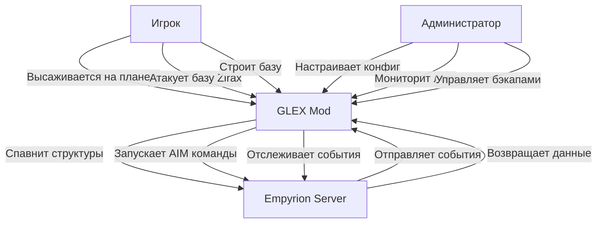

# Техническое задание для проекта GalacticExpansion (GLEX)

**Версия:** 1.0  
**Дата:** 24.01.2026  
**Статус:** Утверждено

---

## 1. Введение и контекст

### 1.1 Общее описание

**GalacticExpansion (GLEX)** — server-side DLL мод для игры Empyrion: Galactic Survival (версия 1.15 Experimental), предназначенный для имитации «живой» захваченной планеты и дальнейшей экспансии фракции Zirax.

Мод реализует динамическую систему, в которой NPC-фракция Zirax:
- Активно строит и развивает базы по стадиям (от посадочной площадки до развитой колонии)
- Встречает игроков патрулями и охраной при высадке на планету
- Симулирует добычу ресурсов и логистические операции
- Атакует и препятствует высадке игроков
- Реагирует на разрушения, причиненные игроками (усиление обороны, откат стадий, перестройка)

### 1.2 Цели проекта

**Основная цель:** Создать иммерсивный геймплей, в котором планета ощущается как действительно захваченная враждебной фракцией, а не просто как набор статичных POI (Points of Interest).

**Вторичные цели:**
- Повысить интерес к PvE-контенту на захваченных планетах
- Создать динамическую угрозу, адаптирующуюся к действиям игроков
- Предоставить визуально заметные AI-активности (логистические корабли, строительство)
- Обеспечить высокую производительность и стабильность на dedicated server

### 1.3 Целевая аудитория

- **Администраторы серверов:** Настраивают мод через конфигурационные файлы
- **Игроки:** Взаимодействуют с динамическим миром, не требуют client-side модификаций
- **Разработчики:** Поддерживают и расширяют функциональность мода

### 1.4 Ограничения проекта

**Технические ограничения:**
- Работает только на dedicated server (не single-player)
- Использует только публичный Empyrion ModAPI (версия для 1.15 Experimental)
- Не требует client-side модов или изменений на стороне клиента
- Работает только в рамках Default Multiplayer сценария

**Функциональные ограничения:**
- ~~Нет прямого управления AI-патрулированием~~ **✅ Частично доступно** через IEntity.Move/MoveForward (базовое управление)
- ~~Нет точного определения высоты поверхности~~ **✅ Доступно** через IPlayfield.GetTerrainHeightAt()
- Ограниченный доступ к данным о ресурсных депозитах планеты (остается симуляцией)
- Нет прямого управления поведением AI через ModAPI (используется встроенный AIM для сложных паттернов)

---

## 2. Термины и определения

### 2.1 Игровые термины Empyrion

| Термин | Описание |
|--------|----------|
| **Playfield** | Отдельный игровой "инстанс" (планета, орбита планеты, солнечная орбита и т.д.) |
| **Entity** | Любая сущность с entityId (структура, корабль, NPC и т.п.), управляемая через API |
| **POI** | Point of Interest — предустановленная структура на планете/в космосе |
| **BA** | Base — стационарная база |
| **CV** | Capital Vessel — большой космический корабль |
| **SV** | Small Vessel — малый корабль (может летать в атмосфере) |
| **HV** | Hover Vessel — наземное транспортное средство |
| **Prefab** | Предварительно созданная структура (blueprint) |
| **Faction** | Игровая фракция (Zirax, Polaris, Pirates, Players и т.д.) |
| **AIM** | AI Manager — встроенная система управления AI-действиями |

### 2.2 Термины проекта

| Термин | Описание |
|--------|----------|
| **Stage** | Стадия развития объекта/колонии (Landing → Yard → Base L1 → Base L2 → ... → Max) |
| **Colony** | Логическая сущность, содержащая: базу, ресурсные точки, охрану, логистику, портал и т.п. |
| **DropShip** | Логистический корабль (SV/CV), который "доставляет" ресурсы/персонал на планету |
| **ConstructionYard** | Стройплощадка — промежуточная стадия между посадкой и полноценной базой |
| **ResourceNode** | Виртуальная точка добычи ресурсов (симуляция, не реальный депозит) |
| **Expansion Cycle** | Цикл расширения на новую планету после достижения максимальной стадии развития |
| **StateStore** | Файл состояния мода (state.json), содержащий всю информацию о симуляции |

### 2.3 Технические термины

| Термин | Описание |
|--------|----------|
| **ModAPI** | Empyrion Mod Application Programming Interface |
| **Game_Event** | Событие от игрового движка (например, вход игрока на playfield) |
| **Game_Request** | Запрос к игровому движку (например, спавн структуры) |
| **SeqNr** | Sequence Number — номер последовательности для сопоставления запроса и ответа |
| **Request_Entity_Spawn** | API-запрос на создание новой сущности |
| **Request_Entity_Destroy** | API-запрос на удаление сущности |
| **Request_ConsoleCommand** | API-запрос на выполнение консольной команды |

---

## 3. Область применения

### 3.1 Режим работы

Мод работает исключительно на **dedicated server** и не требует установки каких-либо модификаций на стороне клиента (client-side).

### 3.2 Совместимость

- **Версия игры:** Empyrion: Galactic Survival v1.15 Experimental
- **Сценарий:** Default Multiplayer (ванильный)
- **Режим сервера:** Dedicated Server
- **Зависимости:** 
  - Empyrion ModAPI (входит в состав игры)
  - .NET Framework 4.8 или выше
  - Дополнительные библиотеки: могут использоваться EmpyrionNetAPIAccess, Newtonsoft.Json

### 3.3 Системные требования

**Минимальные требования сервера:**
- ОС: Windows Server 2016+ или Linux (с Mono/Wine)
- RAM: 16 GB (рекомендуется 32 GB для больших миров)
- CPU: 4 ядра @ 3.0 GHz+
- Место на диске: 500 MB для мода + данные симуляции

---

## 4. Функциональные требования

### FR-001: Инициализация мира

**Приоритет:** Критический (MVP)  
**Категория:** Core

**Описание:**  
При первом запуске мода на сервере необходимо инициализировать мир симуляции.

**Детальные требования:**
1. При первом запуске мод должен создать файл состояния `state.json` в директории мода (если он отсутствует)
2. В конфигурационном файле должно быть задано имя "материнской" планеты через параметр `HomePlayfield` (строка)
3. Для материнской планеты создается первая колония со стадией `LandingPending`
4. Активируется основной жизненный цикл симуляции (simulation loop)
5. Начинается симуляция строительства, добычи ресурсов и экспансии

**Критерии приемки:**
- [ ] Файл `state.json` создается автоматически при первом запуске
- [ ] Параметр `HomePlayfield` корректно читается из конфигурации
- [ ] Первая колония создается с правильными начальными параметрами
- [ ] Simulation loop запускается и работает без ошибок
- [ ] В логах есть четкие записи о процессе инициализации

**Зависимости:** Нет

---

### FR-002: Обнаружение игрока на планете

**Приоритет:** Критический (MVP)  
**Категория:** Player Tracking

**Описание:**  
Мод должен отслеживать присутствие игроков на playfield'ах для активации соответствующих игровых механик.

**Детальные требования:**
1. Подписаться на событие `Event_Player_ChangedPlayfield` от ModAPI
2. При входе игрока на playfield:
   - Определить, есть ли на этом playfield колонии Zirax
   - Если есть — отобразить соответствующие юниты, корабли и постройки согласно текущему состоянию симуляции
   - Активировать патрули и охрану
3. При выходе последнего игрока с playfield:
   - Перейти в режим симуляции (без визуализации)
   - Продолжить обновление состояния колоний

**Критерии приемки:**
- [ ] Событие `Event_Player_ChangedPlayfield` корректно обрабатывается
- [ ] Присутствие игроков отслеживается для каждого playfield
- [ ] Структуры и юниты появляются при входе игрока
- [ ] Симуляция продолжает работать при отсутствии игроков
- [ ] Нет утечек памяти при частых входах/выходах игроков

**Зависимости:** FR-001

---

### FR-003: Лимиты и квоты (настраиваемые)

**Приоритет:** Высокий (MVP)  
**Категория:** Configuration & Performance

**Описание:**  
Мод должен поддерживать настраиваемые лимиты для контроля производительности и игрового баланса.

**Детальные требования:**

Следующие параметры должны быть настраиваемыми через конфигурационный файл:

| Параметр | Описание | Значение по умолчанию (MVP) |
|----------|----------|----------------------------|
| `MaxColoniesPerPlayfield` | Максимальное количество колоний на одном playfield | 1 |
| `MaxActiveAIVessels` | Максимальное количество активных AI-кораблей на планете | 5 |
| `MaxGuardsNearColony` | Максимальное количество охранников возле колонии | 10 |
| `MaxBuildersNearColony` | Максимальное количество строителей возле колонии | 5 |
| `MaxResourceOutposts` | Максимальное количество ресурсных аванпостов | 3 |
| `MaxDroneWavesPerHour` | Максимальное количество волн дронов в час | 4 |
| `MaxAIMCommandsPerMinute` | Максимальное количество AIM-команд в минуту (защита от спама) | 10 |

**Критерии приемки:**
- [ ] Все параметры читаются из конфигурационного файла
- [ ] Некорректные значения заменяются на значения по умолчанию
- [ ] Лимиты соблюдаются во время работы мода
- [ ] Изменение конфигурации применяется после перезапуска сервера
- [ ] В логах есть предупреждения при достижении лимитов

**Зависимости:** FR-001

---

### FR-004: "Посадка SV → исчезновение → стройплощадка"

**Приоритет:** Критический (MVP)  
**Категория:** Core Gameplay

**Описание:**  
Реализация визуального сценария строительства базы через логистический корабль.

**Детальные требования:**

**Шаг 1: Spawn логистического SV/CV в атмосфере**
1. Мод спавнит "логистический" корабль (SV или CV) через `Request_Entity_Spawn` с `EntitySpawnInfo`:
   - `type` = SV или CV (настраивается)
   - `prefabName` = конфигурируемое значение (например, `GLEX_DropShip_T1`)
   - `factionGroup` / `factionId` = Zirax (ID берется из конфигурации)
2. Спавн происходит на высоте `DropShipSpawnAltitude` (конфигурируемая, по умолчанию 500m) над ориентировочной точкой посадки

**Шаг 2: Имитация посадки**

Так как API не гарантирует определение поверхности и нет API для задания маршрута, используются режимы:
- **FlightMode: RealAI** — корабль получает время "полетать" в зоне (N секунд, конфигурируется), после чего исчезает (destroy) и считается доставившим груз
- **FlightMode: CinematicFallback** — корабль появляется, делает круг/зависает (таймер), исчезает

**Шаг 3: Создание стройплощадки**

После "доставки":
1. Спавнится `ConstructionYard` (BA prefab) на выбранной точке через `Request_Entity_Spawn`
2. Рядом может спавниться "склад ресурсов" (малый BA-prefab) или это часть того же префаба

**Шаг 4: Спавн охраны и строителей**

Реализация через:
- `Request_Entity_Spawn` с `entityTypeName` для создания NPC-охранников (`ZiraxMale` и т.п.)
- NPC наследуют фракционность от базы (через настройки спавнеров или прямое назначение фракции)

**Критерии приемки:**
- [ ] Логистический корабль корректно спавнится в атмосфере
- [ ] Корабль существует заданное время и исчезает
- [ ] Стройплощадка появляется после исчезновения корабля
- [ ] NPC-охранники/строители спавнятся с правильной фракцией
- [ ] Весь процесс видим игроку на планете
- [ ] Нет ошибок спавна при отсутствии игроков на планете

**Зависимости:** FR-001, FR-002

---

### FR-005: Стадийное улучшение базы

**Приоритет:** Критический (MVP)  
**Категория:** Core Gameplay

**Описание:**  
База колонии должна проходить через несколько стадий развития от простой стройплощадки до развитой базы.

**Детальные требования:**

**Стадии базы:**
1. `LandingPending` — ожидание посадки логистического корабля
2. `ConstructionYard` — стройплощадка
3. `Base_L1` — базовая база (уровень 1)
4. `Base_L2` — улучшенная база (уровень 2)
5. `Base_L3` — продвинутая база (уровень 3)
6. `Base_Max` — максимальная база (готова к экспансии)

**Механика перехода:**
1. Каждая стадия требует накопления "виртуальных ресурсов"
2. Формула накопления: `resources += productionRate * deltaTime`
3. Параметры для каждой стадии (настраиваются в конфиге):
   - `RequiredResources` — необходимое количество ресурсов для перехода
   - `ProductionRate` — скорость производства ресурсов в час
   - `MinTime` — минимальное время нахождения в стадии (секунды)

**Реализация перехода:**
- **Вариант A (надежный):** Destroy старой структуры + Spawn новой (новый prefabName)
- Вариант B (future): Runtime replace через миссионные механики (не для MVP)

**Критерии приемки:**
- [ ] Все стадии корректно определены в конфигурации
- [ ] Ресурсы накапливаются согласно формуле
- [ ] Переход на следующую стадию происходит автоматически при выполнении условий
- [ ] Старая структура удаляется, новая создается на том же месте
- [ ] Позиция и ориентация сохраняются при переходе
- [ ] В state.json корректно сохраняется текущая стадия
- [ ] Переход виден игрокам (если они на планете)

**Зависимости:** FR-004

---

### FR-006: Патрули/перехват высадки игроков

**Приоритет:** Высокий (MVP)  
**Категория:** Combat & Threat

**Описание:**  
При присутствии игрока на планете мод должен создавать угрозу через патрули и атаки.

**Детальные требования:**

**Типы угроз:**
1. **Патрульные дроны/охрана у базы**
   - Постоянно присутствуют в радиусе `GuardRadius` (конфигурируется, по умолчанию 500m) от базы
   - Количество ограничено `MaxGuardsNearColony`

2. **Волны атак на базу игрока**
   - Активируются при обнаружении базы игрока на планете(нападении на юниты Zirax)
   - Частота ограничена `MaxDroneWavesPerHour`

3. **Дронбазы для усиления обороны**
   - Спавнятся(строятся) при определенных условиях (например, игрок разрушил структуру Zirax)

**Реализация через AIM (AI Manager):**
https://empyrion.fandom.com/wiki/Console_commands_aim

AIM вызывается через `Request_ConsoleCommand`:
- `aim aga <PlayerId> <Range>` — охрана области (вокруг игрока/структуры)
- `aim tdw <PlayerBaseId>` — волна атаки дронов на базу игрока
- `aim adb <Playfield> <X> <Y> <Z>` — спавн дронбазы

**Критерии приемки:**
- [ ] Патрули появляются при входе игрока на планету
- [ ] Количество патрулей не превышает настроенных лимитов
- [ ] Волны атак активируются корректно
- [ ] Частота атак соблюдается (rate limiting)
- [ ] AIM-команды выполняются без ошибок
- [ ] Нет спама консольных команд
- [ ] Угроза масштабируется в зависимости от развития колонии

**Зависимости:** FR-002, FR-005

---

### FR-007: "Ресурсные точки" и добыча

**Приоритет:** Средний (MVP)  
**Категория:** Economy Simulation

**Описание:**  
Симуляция добычи ресурсов через создание добывающих аванпостов.

**Детальные требования:**

**Выбор точки для ресурсного аванпоста:**

Мод выбирает координаты по следующим правилам:
1. На расстоянии от `MinDistanceFromColony` до `MaxDistanceFromColony` от главной базы
2. Минимум `MinDistanceFromPlayerStructures` метров от любой структуры игрока
3. Вне радиуса spawn-protection (если он задан на playfield)
4. Количество ограничено `MaxResourceOutposts`

**Создание аванпоста:**
1. Спавнится добывающее здание (BA prefab, например `GLEX_MinerOutpost_L1`)
2. Аванпост добавляется в state.json с параметрами:
   - `ResourceType` — тип ресурса (Iron, Copper, Promethium и т.д.)
   - `ProductionRate` — скорость добычи (единиц в час)
   - `StorageCapacity` — вместимость хранилища

**Симуляция добычи:**
- Ресурсы накапливаются в виртуальном хранилище аванпоста
- Логистические корабли "забирают" ресурсы и доставляют на главную базу (визуально)
- Ресурсы используются для ускорения перехода между стадиями

**Важное замечание:**  
Точные депозиты руды в ванильной игре модом надежно не считываются, поэтому `ResourceNode` — это геймплейная имитация, а не реальный депозит.

**Критерии приемки:**
- [ ] Алгоритм выбора точек работает корректно
- [ ] Аванпосты спавнятся в допустимых местах
- [ ] Количество аванпостов не превышает лимита
- [ ] Добыча ресурсов симулируется и сохраняется в state.json
- [ ] Логистические корабли визуально "обслуживают" аванпосты
- [ ] Ресурсы влияют на скорость развития колонии

**Зависимости:** FR-004, FR-005

---

### FR-008: Экспансия на новые планеты

**Приоритет:** Низкий (Post-MVP)  
**Категория:** Advanced Gameplay

**Описание:**  
После достижения максимальной стадии развития колония начинает экспансию на новую планету.

**Детальные требования:**

**Условия начала экспансии:**
1. Колония достигла стадии `Base_Max`
2. Прошло минимальное время с момента достижения `Base_Max` (конфигурируется)
3. Включен флаг `ExpansionEnabled` в конфигурации

**Процесс экспансии:**
1. Выбирается целевая планета из списка `ExpansionTargetPlayfields` (конфигурация)
2. Создается логистический CV (больше, чем обычный DropShip)
3. CV "улетает" (визуально существует некоторое время, затем удаляется)
4. После задержки `ExpansionTravelTime` на целевом playfield создается новая колония со стадией `LandingPending`

**Ограничения:**
- Перелет реализуется через таймер (нет реального перемещения между playfield'ами)
- Целевой playfield должен быть загружен (есть игроки) или принудительно загружается

**Критерии приемки:**
- [ ] Экспансия начинается при выполнении условий
- [ ] CV корректно спавнится и "улетает"
- [ ] Новая колония создается на целевой планете
- [ ] Процесс записывается в логи
- [ ] Экспансия может быть отключена через конфигурацию
- [ ] Нет дублирования колоний

**Зависимости:** FR-005, FR-007

---

### FR-009: Портал, верфь, корабль-база

**Приоритет:** Низкий (Post-MVP)  
**Категория:** Content & Lore

**Описание:**  
Добавление контентных сущностей для углубления игрового опыта и лора.

**Детальные требования:**

**Портал:**
- Стадии: `PortalSite_L1`, `PortalSite_L2`, `PortalSite_L3`
- Появляется после достижения `Base_L2`
- Энергопотребление симулируется (лор)
- Визуально представлен BA-префабом с эффектами

**Верфь (Alien Shipyard):**
- BA или CV POI-префаб
- Появляется после достижения `Base_L3`
- Симулирует "производство" AI-кораблей (увеличивает `MaxActiveAIVessels`)

**Корабль-база (Ship Base Landing):**
- CV, который после посадки "превращается" в BA
- Механика: destroy CV + spawn BA на том же месте
- Используется для быстрого развертывания аванпостов

**Критерии приемки:**
- [ ] Все сущности имеют соответствующие префабы
- [ ] Спавн происходит на правильных стадиях
- [ ] Трансформация CV → BA работает корректно
- [ ] Сущности интегрированы в логику симуляции

**Зависимости:** FR-005

---

### FR-010: Метеоритный дождь, разрушающий POI

**Приоритет:** Низкий (Post-MVP)  
**Категория:** Events & Disasters

**Описание:**  
Случайное событие, наносящее урон структурам Zirax.

**Детальные требования:**

**Событие "MeteorStorm":**
1. Происходит случайно с заданной вероятностью (например, 1% в час)
2. Выбирается одна структура Zirax на playfield
3. Наносится "событийный урон":
   - **Вариант A:** Частичное разрушение (замена на "damaged prefab", если доступно)
   - **Вариант B:** Полное уничтожение (destroy) и откат стадии колонии или удаление колонии, см. конфиг.

**Ограничения ModAPI:**
Прямого API для урона конкретным блокам нет, поэтому реализация ограничена заменой префабов или уничтожением структуры целиком.

**Критерии приемки:**
- [ ] Событие происходит с заданной вероятностью
- [ ] Случайно выбирается структура Zirax
- [ ] Урон применяется корректно (destroy или замена префаба)
- [ ] Колония реагирует на урон (откат стадии или перестройка)
- [ ] Событие записывается в логи
- [ ] Игроки видят визуальные эффекты (если на планете)

**Зависимости:** FR-005

---

### FR-011: Реакция на действия игроков (PVE/PVP)

**Приоритет:** Высокий (MVP)  
**Категория:** Player Interaction

**Описание:**  
Мод должен детектировать разрушения, причиненные игроками, и реагировать соответствующим образом.

**Детальные требования:**

**Детектирование разрушений:**
1. Подписка на событие `Event_Statistics` (если доступно) для отслеживания убийств NPC/уничтожения структур
2. Периодическая сверка списков структур через `Request_GlobalStructure_List`
3. Сравнение текущего списка с сохраненным в state.json

**Типы реакций:**

| Событие | Реакция |
|---------|---------|
| Уничтожена стройплощадка | Откат колонии на стадию `LandingPending`, перестройка через N времени |
| Уничтожена база L1-L3 | Откат на предыдущую стадию, либо удаление колонии, см.конфиг, усиление охраны (+50% патрулей) |
| Уничтожен ресурсный аванпост | Создание нового аванпоста в другом месте через N времени |
| Убито много охранников | Спавн дронбазы для усиления (через AIM) |
| Уничтожена база Max | Полная потеря колонии (удаление из state.json) или откат на Base_L3 (настраивается) |

**Критерии приемки:**
- [ ] Разрушения детектируются надежно
- [ ] Реакции соответствуют таблице
- [ ] Колонии восстанавливаются согласно настройкам
- [ ] Усиление обороны работает корректно
- [ ] Нет ложных срабатываний (например, при естественном despawn)
- [ ] Все изменения записываются в state.json

**Зависимости:** FR-002, FR-005, FR-006

---

## 5. Нефункциональные требования

### NFR-001: Производительность

**Требования:**
- Мод не должен создавать заметной нагрузки на сервер при отсутствии игроков на playfield с колониями
- Максимальное количество API-запросов: не более `MaxRequestsPerSecond` (по умолчанию 10)
- Simulation loop должен работать с частотой не более 1 раз в секунду
- Сохранение state.json должно быть асинхронным и не блокировать основной поток

**Критерии приемки:**
- [ ] CPU usage мода < 5% на сервере с 20 игроками
- [ ] Memory usage стабильна (нет утечек памяти)
- [ ] Latency для игроков не увеличивается
- [ ] API-запросы проходят через очередь с rate limiting

---

### NFR-002: Надежность

**Требования:**
- state.json должен записываться атомарно (write temp → rename)
- При ошибке чтения state.json должен создаваться бэкап и новый файл
- Мод должен корректно восстанавливаться после сбоя сервера
- Все критические операции должны иметь try-catch обработку

**Критерии приемки:**
- [ ] Нет потери данных при крашах сервера
- [ ] state.json всегда валиден (парсится без ошибок)
- [ ] Есть автоматическое создание бэкапов
- [ ] Мод не вызывает крашей сервера

---

### NFR-003: Совместимость

**Требования:**
- Мод работает только с Empyrion 1.15 Experimental
- При несовместимой версии игры — мягкий fail с логированием ошибки
- Не должен конфликтовать с другими модами, использующими ModAPI
- Изменения конфигурации применяются после перезапуска сервера

**Критерии приемки:**
- [ ] Проверка версии игры при старте
- [ ] Graceful degradation при несовместимости
- [ ] Нет конфликтов с популярными модами (EWA, Reforged Eden)

---

### NFR-004: Безопасность

**Требования:**
- Whitelist разрешенных консольных команд (только `aim ...`, опционально `say ...`)
- Rate limiting для AIM-команд: не более `MaxAIMCommandsPerMinute`
- Валидация всех входных данных из конфигурации
- Нет выполнения произвольного кода из конфигурации

**Критерии приемки:**
- [ ] Невозможно выполнить неразрешенные команды
- [ ] Rate limiting работает корректно
- [ ] Нет SQL/Command injection уязвимостей
- [ ] Конфигурация проходит валидацию при загрузке

---

### NFR-005: Поддерживаемость

**Требования:**
- Код должен быть хорошо задокументирован (XML-комментарии)
- Логирование всех важных событий и ошибок
- Модульная архитектура с четкими границами
- Конфигурация в читаемом формате (JSON или YAML)

**Критерии приемки:**
- [ ] Все публичные методы имеют XML-комментарии
- [ ] Логирование на разных уровнях (Debug, Info, Warning, Error)
- [ ] Модули слабо связаны (low coupling, high cohesion)
- [ ] Конфигурация документирована с примерами

---

## 6. Ограничения и допущения

### 6.1 Ограничения Empyrion ModAPI

**Известные ограничения:**

1. **Нет прямого управления AI-патрулированием**
   - Используется встроенная система AIM через консольные команды
   - Невозможно задать точные маршруты для кораблей

2. **Нет точного определения высоты поверхности**
   - API не предоставляет информации о топологии планеты
   - Используются эвристические методы (спавн на средней высоте, корректировка)

3. **Ограниченный доступ к ресурсным депозитам**
   - Невозможно получить список и координаты рудных депозитов
   - Ресурсные точки — это симуляция

4. **Нет API для урона конкретным блокам**
   - Можно только уничтожить структуру целиком
   - Частичные разрушения — через замену префабов

5. **Ограничения на частоту запросов**
   - Необходим rate limiting для предотвращения перегрузки API

### 6.2 Допущения

**Архитектурные допущения:**
1. Dedicated server работает непрерывно (или с редкими рестартами)
2. Администратор имеет доступ к файловой системе сервера
3. Игроки не имеют доступа к серверным конфигурационным файлам
4. Playfield'ы загружаются автоматически при наличии на них игроков

**Геймплейные допущения:**
1. Игроки не используют читы для обхода механик мода
2. Администраторы настраивают конфигурацию адекватно (не устанавливают экстремальные значения)
3. Префабы для структур Zirax предварительно подготовлены и размещены в директории игры

---

## 7. Критерии приемки

### 7.1 Критерии приемки MVP

**Основные критерии:**

✓ **Инициализация и запуск:**
- [ ] Мод корректно загружается на dedicated server
- [ ] state.json создается и корректно инициализируется
- [ ] Конфигурация читается без ошибок

✓ **Базовая симуляция:**
- [ ] Первая колония создается на материнской планете
- [ ] Логистический корабль спавнится и "доставляет" груз
- [ ] Стройплощадка создается после доставки
- [ ] База проходит через стадии L1 → L2 → L3 → Max

✓ **Взаимодействие с игроками:**
- [ ] При входе игрока на планету структуры становятся видимыми
- [ ] Патрули/охрана активируются
- [ ] Волны атак на базы игроков работают
- [ ] Разрушения детектируются и вызывают реакции

✓ **Производительность:**
- [ ] Нет заметного влияния на FPS игроков
- [ ] Нет крашей сервера
- [ ] Утечки памяти отсутствуют

✓ **Конфигурация:**
- [ ] Все параметры настраиваются через конфиг
- [ ] Лимиты соблюдаются
- [ ] Изменения применяются после рестарта

### 7.2 Критерии качества кода

- [ ] Код соответствует C# Coding Conventions
- [ ] Все публичные API задокументированы
- [ ] Unit-тесты покрывают критичные модули (> 70%)
- [ ] Integration-тесты проверяют основные сценарии
- [ ] Нет критических предупреждений от Code Analysis

### 7.3 Критерии документации

- [ ] Техническая документация завершена (все 10 документов)
- [ ] README.md содержит инструкции по установке
- [ ] ConfigReference.md описывает все параметры
- [ ] Operations_Runbook.md содержит troubleshooting секцию

---

## 8. Use Case диаграммы

### 8.1 Основные сценарии использования

### 8.2 Use Case: Высадка игрока на захваченную планету

**Актор:** Игрок  
**Предусловия:** Колония Zirax существует на планете  
**Основной сценарий:**

1. Игрок входит на playfield планеты
2. Мод получает событие `Event_Player_ChangedPlayfield`
3. Мод проверяет наличие колоний на playfield
4. Мод активирует структуры колонии (делает их видимыми)
5. Мод спавнит патрули вокруг базы
6. Мод активирует AIM-охрану области
7. Игрок видит активную базу Zirax и патрули

**Постусловия:** Игрок находится под угрозой от AI-противников

### 8.3 Use Case: Разрушение базы игроком

**Актор:** Игрок  
**Предусловия:** Игрок атакует базу Zirax  
**Основной сценарий:**

1. Игрок уничтожает структуру Zirax
2. Мод детектирует отсутствие структуры (через периодические проверки)
3. Мод определяет тип разрушенной структуры
4. Мод инициирует реакцию:
   - Откат стадии колонии (если применимо, по настройкам конфига)
   - Усиление обороны (+50% патрулей)
   - Спавн дронбазы (через AIM)
5. Мод обновляет state.json
6. Мод планирует восстановление структуры

**Постусловия:** Колония реагирует на атаку, игрок сталкивается с усиленной обороной

---

## Приложения

### Приложение A: Ссылки на примеры кодов

**Примеры из репозиториев других модов:**
- `docs/examples/EmpyrionShipBuying-master/` — паттерны работы с ConfigurationManager, ChatCommands, Request_Entity_Spawn
- `docs/examples/EmpyrionStructureCleanUp-master/` — работа с Request_GlobalStructure_List, background tasks
- `docs/examples/zucchini-empyrion-main/` — RequestManager, event-driven архитектура
- `docs/examples/EmpyrionNetAPIAccess-master/` — базовый класс EmpyrionModBase

### Приложение B: Глоссарий ModAPI

**Основные типы данных:**
- `CmdId` — enum идентификаторов команд/событий
- `EntitySpawnInfo` — структура для спавна сущностей
- `IdPositionRotation` — позиция и ориентация сущности
- `GlobalStructureInfo` — информация о структуре (фракция, тип, playfield)
- `ChatInfo` — информация о чат-сообщении

**Основные запросы (Request):**
- `Request_Entity_Spawn` — создание новой сущности
- `Request_Entity_Destroy` — удаление сущности
- `Request_Entity_Teleport` — телепортация сущности
- `Request_GlobalStructure_List` — список всех структур на сервере
- `Request_Player_Info` — информация об игроке
- `Request_ConsoleCommand` — выполнение консольной команды

**Основные события (Event):**
- `Event_Player_ChangedPlayfield` — игрок сменил playfield
- `Event_Statistics` — статистика (убийства, разрушения и т.д.)
- `Event_ChatMessage` — чат-сообщение