# Архитектурный план проекта GalacticExpansion (GLEX)

**Версия:** 1.0  
**Дата:** 24.01.2026  
**Статус:** Утверждено

---

## 1. Архитектурные цели и принципы

### 1.1 Архитектурные цели

**Основные цели:**
1. **Модульность:** Система должна состоять из слабо связанных модулей с четкими границами
2. **Расширяемость:** Новые возможности должны добавляться без изменения существующего кода
3. **Производительность:** Минимальное влияние на производительность сервера
4. **Надежность:** Устойчивость к сбоям, сохранение состояния
5. **Тестируемость:** Возможность тестирования модулей независимо друг от друга

### 1.2 Архитектурные принципы

**SOLID принципы:**
- **Single Responsibility:** Каждый модуль отвечает за одну область функциональности
- **Open/Closed:** Модули открыты для расширения, но закрыты для модификации
- **Liskov Substitution:** Возможность замены реализаций без изменения поведения
- **Interface Segregation:** Интерфейсы специфичны для клиентов
- **Dependency Inversion:** Зависимость от абстракций, а не от конкретных реализаций

**Дополнительные принципы:**
- **Separation of Concerns:** Четкое разделение ответственности между модулями
- **DRY (Don't Repeat Yourself):** Избегание дублирования кода
- **YAGNI (You Aren't Gonna Need It):** Реализация только необходимой функциональности
- **Event-Driven Architecture:** Слабая связь через события
- **Fail-Safe:** Graceful degradation при ошибках

### 1.3 Архитектурный стиль

**Модульный монолит с событийной архитектурой:**
- Единое приложение (DLL) с четко выделенными модулями
- Модули взаимодействуют через события и интерфейсы
- Возможность будущего выделения модулей в отдельные сервисы (если потребуется)

---

## 2. C4 Model: Context Level (Уровень 1 — Контекст)

### 2.1 Диаграмма контекста

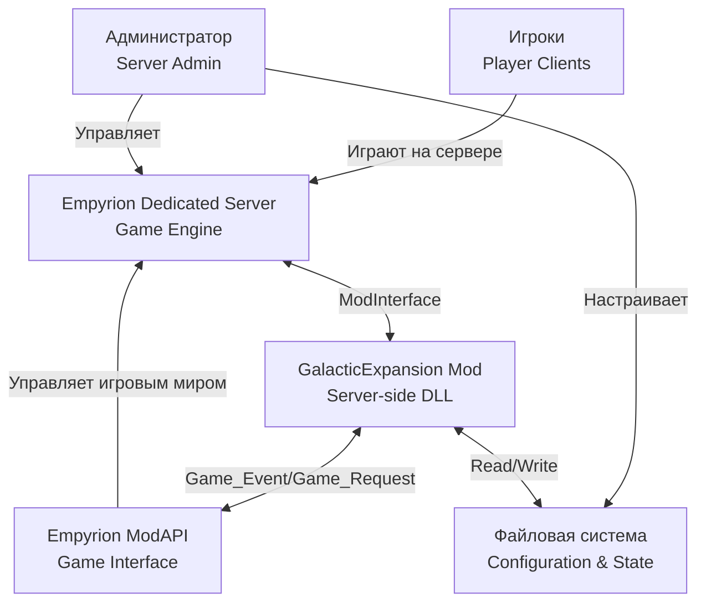

### 2.2 Описание внешних систем

| Система | Описание | Взаимодействие |
|---------|----------|----------------|
| **Empyrion Dedicated Server** | Игровой движок, управляющий игровым миром | Загружает мод через ModInterface, отправляет события, выполняет запросы |
| **Empyrion ModAPI** | API для взаимодействия модов с игрой | Предоставляет методы для спавна, удаления сущностей, получения информации |
| **Файловая система** | Хранение конфигурации и состояния | Чтение конфигурации при старте, запись state.json периодически |
| **Игроки** | Конечные пользователи | Косвенное взаимодействие через игровой мир |
| **Администратор** | Настройка и управление сервером | Изменение конфигурации, мониторинг логов, управление бэкапами |

---

## 3. C4 Model: Container Level (Уровень 2 — Контейнеры)

### 3.1 Диаграмма контейнеров

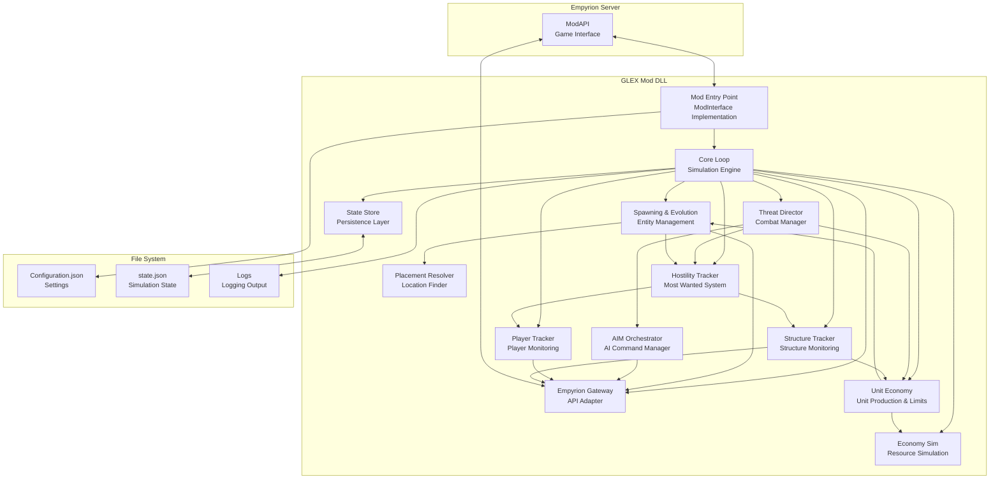

### 3.2 Описание контейнеров

#### 3.2.1 Core Loop (Simulation Engine)

**Назначение:** Главный цикл симуляции, координирующий все модули

**Ответственность:**
- Управление жизненным циклом симуляции
- Обновление состояния колоний
- Планирование действий (строительство, добыча, экспансия)
- Координация работы подсистем

**Технологии:** C#, System.Threading.Timer для периодических обновлений

**Интерфейсы:**
```csharp
// Интерфейс главного движка симуляции
public interface ISimulationEngine
{
    void Start();
    void Stop();
    void Update(float deltaTime);
    void RegisterModule(ISimulationModule module);
}

// Интерфейс для модулей симуляции
public interface ISimulationModule
{
    string ModuleName { get; }
    void OnSimulationUpdate(SimulationContext context);
}
```

---

#### 3.2.2 Empyrion Gateway (API Adapter)

**Назначение:** Адаптер для взаимодействия с Empyrion ModAPI

**Ответственность:**
- Отправка запросов к ModAPI
- Обработка событий от ModAPI
- Управление SeqNr (sequence numbers)
- Очередь запросов и rate limiting
- Retry логика при ошибках

**Технологии:** C#, async/await для асинхронных операций

**Паттерны:** Adapter, Command Queue, Circuit Breaker

**Интерфейсы:**
```csharp
// Основной интерфейс шлюза
public interface IEmpyrionGateway
{
    // Запросы
    Task<T> SendRequestAsync<T>(CmdId requestId, object data, int timeoutMs = 5000);
    
    // События
    event EventHandler<GameEventArgs> GameEventReceived;
    
    // Управление
    void Start();
    void Stop();
}

// Базовые запросы
public interface IEntityOperations
{
    Task<int> SpawnEntityAsync(EntitySpawnInfo spawnInfo);
    Task DestroyEntityAsync(int entityId);
    Task TeleportEntityAsync(IdPositionRotation posRot);
}

public interface IStructureOperations
{
    Task<List<GlobalStructureInfo>> GetAllStructuresAsync();
    Task<GlobalStructureInfo> GetStructureInfoAsync(int entityId);
}
```

---

#### 3.2.3 State Store (Persistence Layer)

**Назначение:** Управление сохранением и загрузкой состояния симуляции

**Ответственность:**
- Загрузка state.json при старте
- Периодическое сохранение состояния
- Атомарная запись (temp file → rename)
- Версионирование и миграции
- Создание бэкапов

**Технологии:** C#, Newtonsoft.Json для сериализации

**Паттерны:** Repository, Unit of Work

**Интерфейсы:**
```csharp
// Интерфейс хранилища состояния
public interface IStateStore
{
    Task<SimulationState> LoadAsync();
    Task SaveAsync(SimulationState state);
    Task<SimulationState> CreateBackupAsync();
    Task<bool> RestoreFromBackupAsync(string backupPath);
}

// Состояние симуляции
public class SimulationState
{
    public int Version { get; set; }
    public DateTime LastUpdate { get; set; }
    public List<Colony> Colonies { get; set; }
    public Dictionary<string, PlayfieldState> Playfields { get; set; }
}
```

---

#### 3.2.4 Spawning & Evolution (Entity Management)

**Назначение:** Управление созданием, удалением и эволюцией сущностей

**Ответственность:**
- Спавн структур (BA, CV, SV)
- Спавн NPC (охранники, строители)
- Удаление сущностей
- Переход между стадиями (Stage Management)
- Управление prefab'ами

**Технологии:** C#, State Machine для стадий

**Паттерны:** Factory, State Pattern, Command Pattern

**Интерфейсы:**
```csharp
// Менеджер спавна сущностей
public interface IEntitySpawner
{
    Task<int> SpawnStructureAsync(string prefabName, PVector3 position, PVector3 rotation, int factionId);
    Task<List<int>> SpawnNPCGroupAsync(string npcType, PVector3 position, int count, int factionId);
    Task DestroyEntityAsync(int entityId);
}

// Менеджер стадий колоний
public interface IStageManager
{
    Task<bool> CanTransitionToNextStage(Colony colony);
    Task TransitionToStageAsync(Colony colony, ColonyStage newStage);
    ColonyStage GetNextStage(ColonyStage currentStage);
}
```

---

#### 3.2.5 AIM Orchestrator (AI Command Manager)

**Назначение:** Управление AI через AIM-команды и прямое управление движением (v1.15+)

**Ответственность:**
- Формирование AIM-команд для сложного поведения
- **Прямое управление движением НПС через IEntity API** ✅ (v1.15+)
- Whitelist разрешенных команд
- Rate limiting (защита от спама)
- Очередь команд
- Логирование всех команд

**Технологии:** C#, Command Pattern, ModAPI v1.15+

**Паттерны:** Command, Chain of Responsibility (для валидации), Strategy (для выбора метода управления)

**Интерфейсы:**
```csharp
// Оркестратор AI-команд
public interface IAIMOrchestrator
{
    // Классические AIM команды (для сложного поведения)
    Task ExecuteGuardAreaAsync(int playerId, int range);
    Task ExecuteDroneWaveAsync(int targetEntityId);
    Task ExecuteSpawnDroneBaseAsync(string playfield, PVector3 position);
    bool IsRateLimitReached();
    
    // Новые методы прямого управления (v1.15+)
    void MoveNPCForward(IEntity npcEntity, float speed);
    void MoveNPCToPosition(IEntity npcEntity, Vector3 targetPosition);
    void StopNPC(IEntity npcEntity);
    void SetNPCPosition(IEntity npcEntity, Vector3 position);
}

// Валидатор команд
public interface ICommandValidator
{
    bool IsCommandAllowed(string command);
    bool CanExecuteNow(string command);
}

// Контроллер простого патрулирования (новое в v1.15+)
public interface ISimplePatrolController
{
    void StartPatrol(IEntity npcEntity, List<Vector3> waypoints, float speed = 2.0f);
    void StopPatrol(IEntity npcEntity);
    void UpdatePatrolLogic(); // Вызывается в Core Loop
}
```

---

#### 3.2.6 Placement Resolver (Location Finder)

**Назначение:** Поиск подходящих мест для спавна структур

**Ответственность:**
- Выбор координат для построек
- Проверка свободного пространства
- Избегание структур игроков
- **Точное определение высоты поверхности через IPlayfield.GetTerrainHeightAt()** ✅ (v1.15+)
- Проверка spawn-protection зон

**Технологии:** C#, алгоритмы поиска, ModAPI v1.15+

**Паттерны:** Strategy (разные стратегии размещения)

**Интерфейсы:**
```csharp
// Поиск мест для размещения
public interface IPlacementResolver
{
    Task<PVector3> FindSuitableLocationAsync(PlacementCriteria criteria);
    Task<bool> IsLocationSuitableAsync(PVector3 position, PlacementCriteria criteria);
    
    // Новые методы (v1.15+)
    float GetTerrainHeight(IPlayfield playfield, float x, float z);
    Task<Vector3> FindLocationAtTerrainAsync(string playfield, float x, float z, float heightOffset = 0);
}

// Критерии размещения
public class PlacementCriteria
{
    public string Playfield { get; set; }
    public float MinDistanceFromPlayers { get; set; }
    public float MinDistanceFromStructures { get; set; }
    public float PreferredAltitude { get; set; } // Теперь может быть точным!
    public float SearchRadius { get; set; }
    public bool UseTerrainHeight { get; set; } = true; // Использовать GetTerrainHeightAt
}
```

---

#### 3.2.7 Player Tracker

**Назначение:** Отслеживание игроков на playfield'ах

**Ответственность:**
- Подписка на `Event_Player_ChangedPlayfield`
- Хранение списка игроков по playfield'ам
- Уведомление других модулей о появлении/уходе игроков

**Интерфейсы:**
```csharp
public interface IPlayerTracker
{
    List<PlayerInfo> GetPlayersOnPlayfield(string playfield);
    bool HasPlayersOnPlayfield(string playfield);
    event EventHandler<PlayerChangedPlayfieldEventArgs> PlayerEntered;
    event EventHandler<PlayerChangedPlayfieldEventArgs> PlayerLeft;
}
```

---

#### 3.2.8 Structure Tracker

**Назначение:** Отслеживание структур на сервере

**Ответственность:**
- Периодический запрос списка структур
- Детектирование создания/уничтожения структур
- Индексация структур по playfield и фракции

**Интерфейсы:**
```csharp
public interface IStructureTracker
{
    Task RefreshStructuresAsync();
    List<GlobalStructureInfo> GetStructuresOnPlayfield(string playfield, int? factionId = null);
    event EventHandler<StructureDestroyedEventArgs> StructureDestroyed;
    event EventHandler<StructureCreatedEventArgs> StructureCreated;
}
```

---

#### 3.2.9 Threat Director

**Назначение:** Управление уровнем угрозы и активация защитных механизмов

**Ответственность:**
- Анализ уровня угрозы для колоний
- Принятие решений о спавне патрулей
- **Программное создание волн атак через IPda.CreateWaveAttack()** ✅ (v1.15+)
- Эскалация угрозы при разрушениях и нападении на юниты колонии

**Интерфейсы:**
```csharp
public interface IThreatDirector
{
    Task UpdateThreatLevelAsync(Colony colony);
    Task ActivateDefensesAsync(Colony colony, ThreatLevel level);
    Task RespondToDestructionAsync(Colony colony, DestructionEvent destructionEvent);
    
    // Новые методы (v1.15+)
    Task<uint> LaunchWaveAttackAsync(Colony colony, int targetEntityId, int waveStrength);
    Task SpawnDefendersAsync(Colony colony, Vector3 spawnPosition, int count);
}

public enum ThreatLevel
{
    None,
    Low,
    Medium,
    High,
    Critical
}

// Данные о волне атаки (v1.15+)
public class WaveAttackData
{
    public string WaveName { get; set; }
    public string TargetEntityId { get; set; }
    public string Faction { get; set; } = "Zirax";
    public int Cost { get; set; } // Сложность волны
}
```

---

#### 3.2.10 Economy Sim

**Назначение:** Симуляция экономики колоний

**Ответственность:**
- Расчет производства ресурсов
- Управление виртуальными ресурсами
- Логистика между аванпостами и базой
- Влияние ресурсов на развитие

**Интерфейсы:**
```csharp
public interface IEconomySimulator
{
    void UpdateProduction(Colony colony, float deltaTime);
    void AddResourceNode(Colony colony, ResourceNode node);
    bool HasEnoughResourcesForUpgrade(Colony colony, ColonyStage targetStage);
    void ConsumeResourcesForUpgrade(Colony colony, ColonyStage targetStage);
}
```

---

#### 3.2.11 Hostility Tracker

**Назначение:** Отслеживание враждебности игроков и управление системой "Most Wanted"

**Ответственность:**
- Учет враждебных действий игроков (убийства NPC, разрушения структур)
- Расчет рангов враждебности (Unknown → Offender → Enemy → Terrorist → Nemesis → Genocider)
- Определение Most Wanted цели для охоты (приоритет онлайн игрокам)
- Снижение враждебности при смерти игрока (5%)
- Определение родной планеты игрока для целевой экспансии
- Интеграция с Threat Director для активации охоты
- Интеграция с Colony Evolution для направленной экспансии

**Интерфейсы:**
```csharp
public interface IHostilityTracker
{
    // Добавление враждебности
    void AddHostility(int playerId, string colonyId, HostilityReason reason, int amount);
    void RecordNPCKill(int playerId, string colonyId, string npcType);
    void RecordStructureDestruction(int playerId, string colonyId, ColonyStage structureStage);
    
    // Запросы данных
    int GetHostilityScore(int playerId, string colonyId);
    WantedRank GetWantedRank(int playerId, string colonyId);
    PlayerHostilityInfo GetMostWantedTarget(Colony colony);
    List<PlayerHostilityInfo> GetTopEnemies(string colonyId, int count = 3);
    
    // Снижение враждебности
    void OnPlayerDeath(int playerId);
    
    // События
    event EventHandler<MostWantedChangedEventArgs> MostWantedChanged;
    event EventHandler<RankChangedEventArgs> RankChanged;
}

// Ранги враждебности
public enum WantedRank
{
    Unknown = 0,        // 0-99 очков
    Offender = 1,       // 100-499 очков
    Enemy = 2,          // 500-999 очков
    Terrorist = 3,      // 1000-1999 очков
    Nemesis = 4,        // 2000-4999 очков
    Genocider = 5       // 5000+ очков
}
```

**Ключевые особенности:**
- **Приоритет онлайн игрокам:** Охота ведется на наиболее враждебного ОНЛАЙН игрока
- **Затухание только при смерти:** Враждебность снижается на 5% ТОЛЬКО при смерти игрока
- **Целевая экспансия:** Колонии направляют экспансию на родную планету Most Wanted врага
- **Персистентность:** Все данные о враждебности сохраняются в state.json

---

#### 3.2.12 Unit Economy Manager

**Назначение:** Управление производством, доступностью и учетом боевых единиц колоний

**Ответственность:**
- Производство юнитов с течением времени (Guards, Vessels, Warships, Drones)
- Учет доступных юнитов в резерве (пул)
- Резервирование юнитов перед спавном
- Регистрация активных юнитов в мире
- Учет потерь юнитов при уничтожении
- Расчет скорости производства (зависит от стадии, аванпостов, специальных структур)
- Пересчет вместимости при изменении стадии базы
- Обработка разрушений (аванпосты, верфь, дронбаза снижают производство)

**Технологии:** C#, integration с Economy Simulator для ресурсов

**Паттерны:** Observer (для событий разрушения), Strategy (различные типы юнитов)

**Интерфейсы:**
```csharp
public interface IUnitEconomyManager
{
    // Проверка доступности
    bool CanSpawnUnit(Colony colony, UnitType type, int count = 1);
    int GetAvailableCount(Colony colony, UnitType type);
    UnitPool GetUnitPool(Colony colony);
    
    // Производство и потребление
    bool ReserveUnits(Colony colony, UnitType type, int count);
    void ProduceUnits(Colony colony, float deltaTime);
    void RegisterActiveUnit(Colony colony, int entityId, UnitType type, string role);
    void RecordUnitLoss(Colony colony, int entityId);
    
    // Управление производством
    float CalculateProductionRate(Colony colony);
    void RecalculateCapacity(Colony colony);
    void InitializeUnitPool(Colony colony);
    
    // Влияние разрушений
    void OnResourceOutpostDestroyed(Colony colony, string outpostId);
    void OnShipyardDestroyed(Colony colony);
    void OnDroneBaseDestroyed(Colony colony);
    void OnColonyUnderAttack(Colony colony, bool isUnderAttack);
}

// Пул доступных юнитов
public class UnitPool
{
    public int AvailableGuards { get; set; }
    public int MaxGuards { get; set; }
    public int AvailablePatrolVessels { get; set; }
    public int MaxPatrolVessels { get; set; }
    public int AvailableWarships { get; set; }
    public int MaxWarships { get; set; }
    public int AvailableDrones { get; set; }
    public int MaxDrones { get; set; }
    public float ProductionRate { get; set; }
    public DateTime LastProductionTime { get; set; }
    public List<ActiveUnit> ActiveUnits { get; set; }
}
```

**Ключевые особенности:**
- **Конечность юнитов:** База имеет ограниченный резерв, который восполняется с течением времени
- **Стратегическая глубина:** Разрушение аванпостов/верфи реально ослабляет колонию надолго
- **Ощущение победы:** Игрок видит последствия своих действий (база обескровлена, не может защищаться)
- **Балансировка:** Скорость производства настраивается через конфигурацию

---

## 4. C4 Model: Component Level (Уровень 3 — Компоненты)

### 4.1 Core Loop — детальная структура

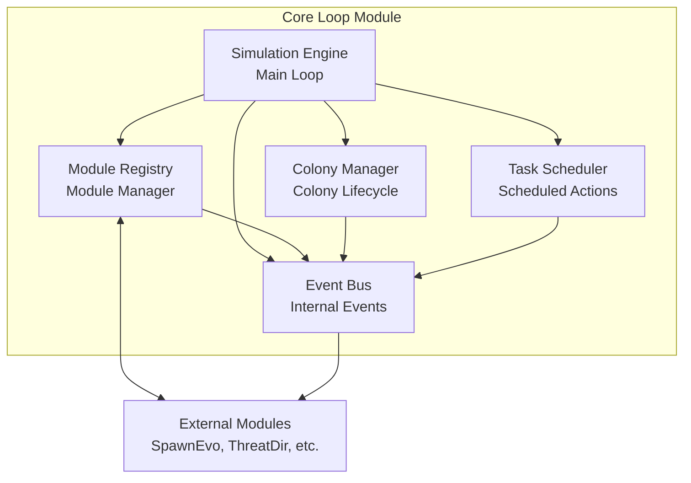

**Компоненты Core Loop:**

1. **Simulation Engine** — главный цикл, управляющий временем симуляции
2. **Module Registry** — реестр зарегистрированных модулей
3. **Event Bus** — внутренняя шина событий для межмодульного взаимодействия
4. **Colony Manager** — управление жизненным циклом колоний
5. **Task Scheduler** — планировщик отложенных задач (например, "построить аванпост через 30 минут")

---

### 4.2 Empyrion Gateway — детальная структура

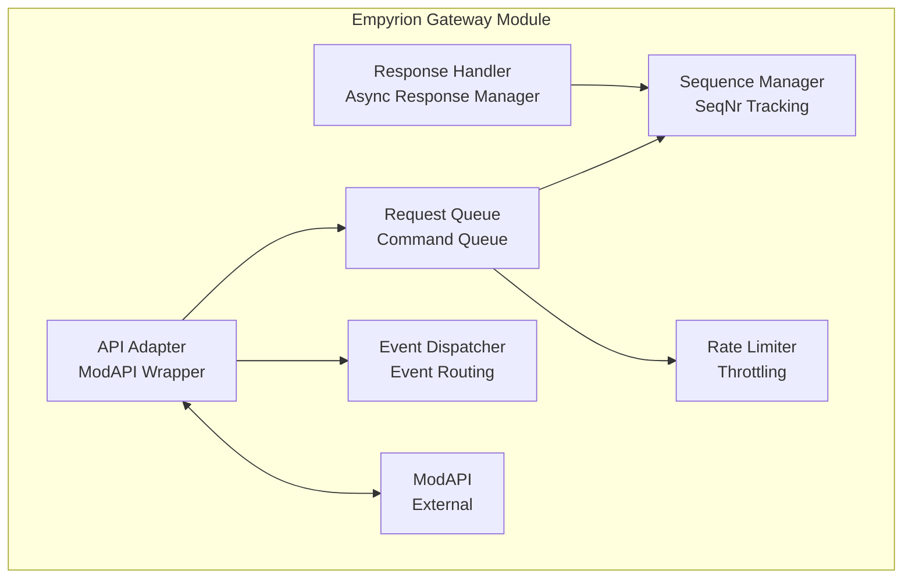

**Компоненты Gateway:**

1. **API Adapter** — обертка над ModAPI
2. **Request Queue** — очередь запросов с приоритетами
3. **Response Handler** — обработка асинхронных ответов
4. **Event Dispatcher** — маршрутизация событий к подписчикам
5. **Sequence Manager** — управление SeqNr для сопоставления запрос-ответ
6. **Rate Limiter** — ограничение частоты запросов

---

### 4.3 Spawning & Evolution — детальная структура

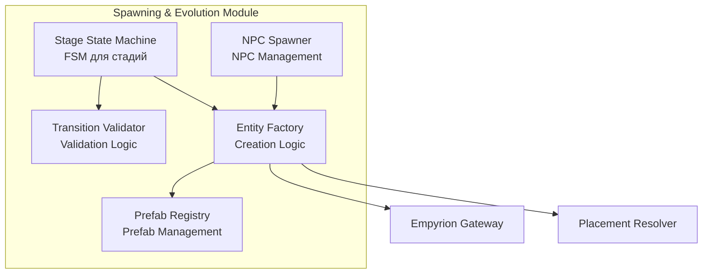

**Компоненты Spawning & Evolution:**

1. **Entity Factory** — фабрика для создания сущностей
2. **Prefab Registry** — реестр доступных префабов
3. **Stage State Machine** — конечный автомат для стадий колоний
4. **Transition Validator** — валидация переходов между стадиями
5. **NPC Spawner** — специализированный спавнер для NPC

---

## 5. Паттерны взаимодействия

### 5.1 Паттерн: Request-Response через Gateway

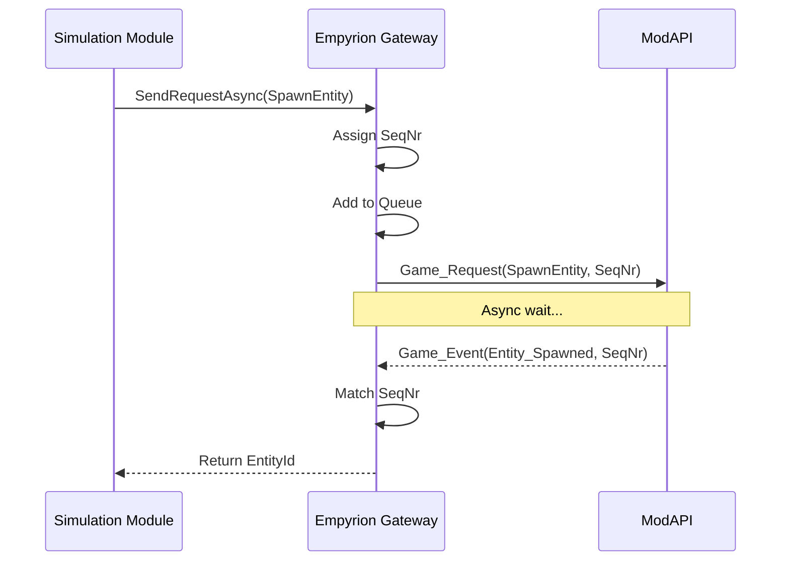

**Описание:**
1. Модуль отправляет асинхронный запрос через Gateway
2. Gateway назначает уникальный SeqNr
3. Запрос добавляется в очередь
4. Gateway отправляет запрос к ModAPI
5. ModAPI асинхронно возвращает ответ с тем же SeqNr
6. Gateway сопоставляет ответ с запросом и возвращает результат

---

### 5.2 Паттерн: Event-Driven Communication

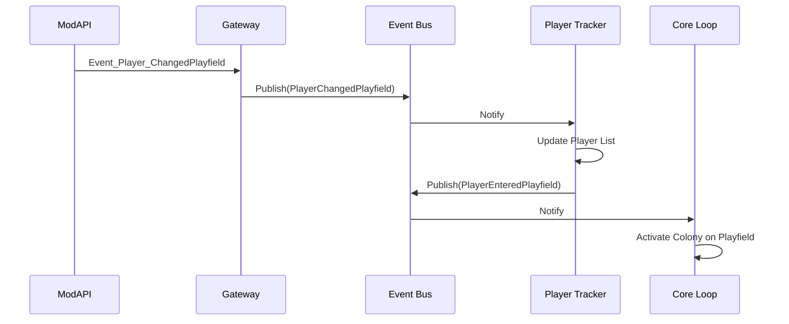

**Описание:**
1. ModAPI отправляет событие в Gateway
2. Gateway публикует событие на внутренней шине
3. Подписчики получают уведомления
4. Модули могут публиковать производные события
5. Слабая связь между модулями

---

### 5.3 Паттерн: Colony Stage Transition

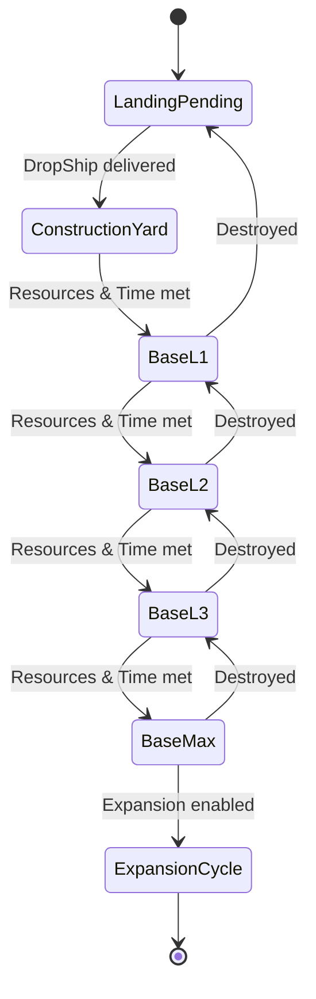

**Описание конечного автомата стадий:**
- Прямые переходы при накоплении ресурсов и времени
- Откаты при разрушении структур
- Экспансия на новую планету при достижении BaseMax

---

## 6. Стратегия обработки ошибок

### 6.1 Уровни обработки ошибок

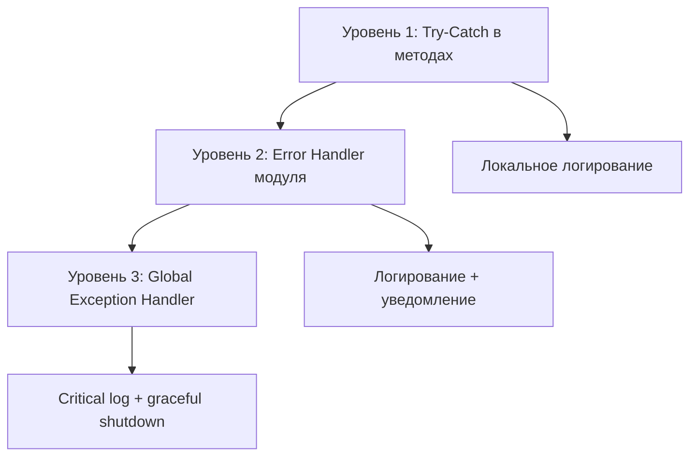

### 6.2 Стратегии по типам ошибок

| Тип ошибки | Стратегия | Пример |
|------------|-----------|--------|
| **API Timeout** | Retry с exponential backoff | Запрос не вернулся за 5с → retry через 2с, 4с, 8с |
| **Entity не найден** | Skip и log warning | Попытка удалить несуществующую структуру → skip |
| **Конфигурация невалидна** | Use defaults + log error | Некорректное значение в конфиге → использовать default |
| **State.json поврежден** | Restore from backup | Не удалось распарсить → восстановить из бэкапа |
| **ModAPI недоступен** | Circuit breaker pattern | После 5 ошибок подряд → отключить модуль на 60с |
| **Critical error** | Graceful shutdown | Невосстановимая ошибка → сохранить state → остановить мод |

---

## 7. Масштабируемость и производительность

### 7.1 Оптимизации производительности

**Периодичность операций:**

| Операция | Частота | Условие |
|----------|---------|---------|
| Simulation loop tick | 1 раз в секунду | Всегда |
| Structure list refresh | 1 раз в 10 секунд | Есть игроки на сервере |
| State.json save | 1 раз в минуту | Есть изменения |
| Player tracking update | По событию | Event_Player_ChangedPlayfield |
| AIM command | Не более 10 в минуту | Rate limit |

**Асинхронные операции:**
- Все API-запросы асинхронные (async/await)
- Сохранение state.json в отдельном потоке
- Background задачи для долгих операций

**Кэширование:**
- Список структур кэшируется на 10 секунд
- Информация об игроках кэшируется до события смены playfield
- Prefab registry загружается один раз при старте

---

### 7.2 Масштабируемость

**Горизонтальное масштабирование (будущее):**
Архитектура модульного монолита позволяет в будущем выделить модули в отдельные процессы/сервисы:
- Core Loop → Simulation Service
- Empyrion Gateway → API Gateway Service
- State Store → Database Service

**Текущие ограничения:**
- 1 мод на 1 dedicated server
- Максимум ~100 колоний на сервер (практически)
- Рекомендуется не более 10 активных playfield'ов с колониями

---

## 8. Безопасность

### 8.1 Модель угроз

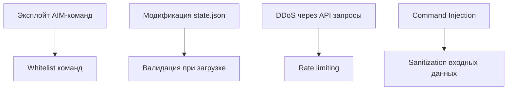

### 8.2 Защитные механизмы

1. **Whitelist консольных команд:**
   - Только `aim aga`, `aim tdw`, `aim adb` разрешены
   - Валидация параметров команд

2. **Rate Limiting:**
   - Максимум 10 AIM команд в минуту
   - Максимум 10 API запросов в секунду
   - Circuit breaker при превышении лимитов

3. **Валидация данных:**
   - Проверка всех параметров из конфигурации
   - Санитизация строковых параметров
   - Проверка диапазонов числовых значений

4. **Изоляция файловой системы:**
   - Запись только в директорию мода
   - Чтение конфигурации только из разрешенных путей

---

## 9. Качественные атрибуты

### 9.1 Карта качественных атрибутов

| Атрибут | Приоритет | Метрика | Целевое значение |
|---------|-----------|---------|------------------|
| **Производительность** | Высокий | CPU usage | < 5% на сервере с 20 игроками |
| **Надежность** | Критический | MTBF | > 7 дней работы без сбоев |
| **Модифицируемость** | Высокий | Time to add feature | < 2 дней для простой feature |
| **Тестируемость** | Средний | Code coverage | > 70% для критичных модулей |
| **Расширяемость** | Высокий | Lines of code changed | < 100 LOC для добавления нового типа колонии |
| **Безопасность** | Высокий | Vulnerabilities | 0 критичных уязвимостей |

---

## 10. Технологические решения

### 10.1 Технологический стек

| Компонент | Технология | Версия | Назначение |
|-----------|------------|--------|------------|
| **Язык** | C# | 8.0+ | Основной язык разработки |
| **Framework** | .NET Framework | 4.8 | Совместимость с Empyrion |
| **Сериализация** | Newtonsoft.Json | 13.0+ | JSON для state и конфигурации |
| **Логирование** | NLog или Serilog | Latest | Структурированное логирование |
| **DI Container** | Autofac (опционально) | Latest | Dependency Injection |
| **Тестирование** | xUnit + Moq | Latest | Unit и Integration тесты |

### 10.2 Внешние зависимости

**Обязательные:**
- **Empyrion ModAPI** — входит в состав игры
- **Eleon.Modding.dll** — интерфейсы ModAPI

**Опциональные (могут использоваться):**
- **EmpyrionNetAPIAccess** — базовый класс для модов, упрощающий работу с API
- **EmpyrionNetAPITools** — вспомогательные утилиты (ChatCommands, ConfigurationManager)

---

## 11. Решения по развертыванию

### 11.1 Структура развертывания

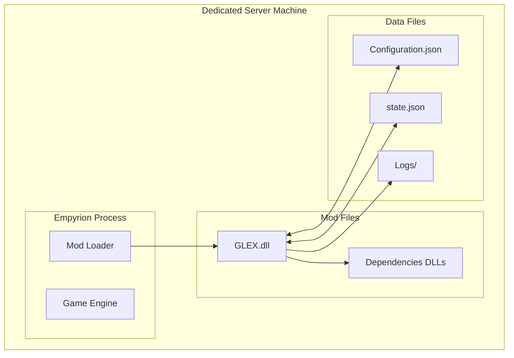

**Путь установки:**
```
[EmpyrionRoot]/Content/Mods/GalacticExpansion/
├── GalacticExpansion.dll
├── Newtonsoft.Json.dll
├── [Другие зависимости]
└── Configuration.json

[EmpyrionRoot]/Saves/Games/[SaveGameName]/Mods/GalacticExpansion/
├── state.json
├── state.json.backup
└── Logs/
    └── GLEX_[date].log
```

---

## 12. Связь с другими документами

- **[01_Техническое_задание.md](01_Техническое_задание.md)** — функциональные требования, реализуемые данной архитектурой
- **[03_Технический_проект.md](03_Технический_проект.md)** — детальная реализация компонентов
- **[04_Modular_Development_Plan.md](04_Modular_Development_Plan.md)** — порядок разработки модулей
- **[09_Testing_Strategy.md](09_Testing_Strategy.md)** — стратегия тестирования архитектуры