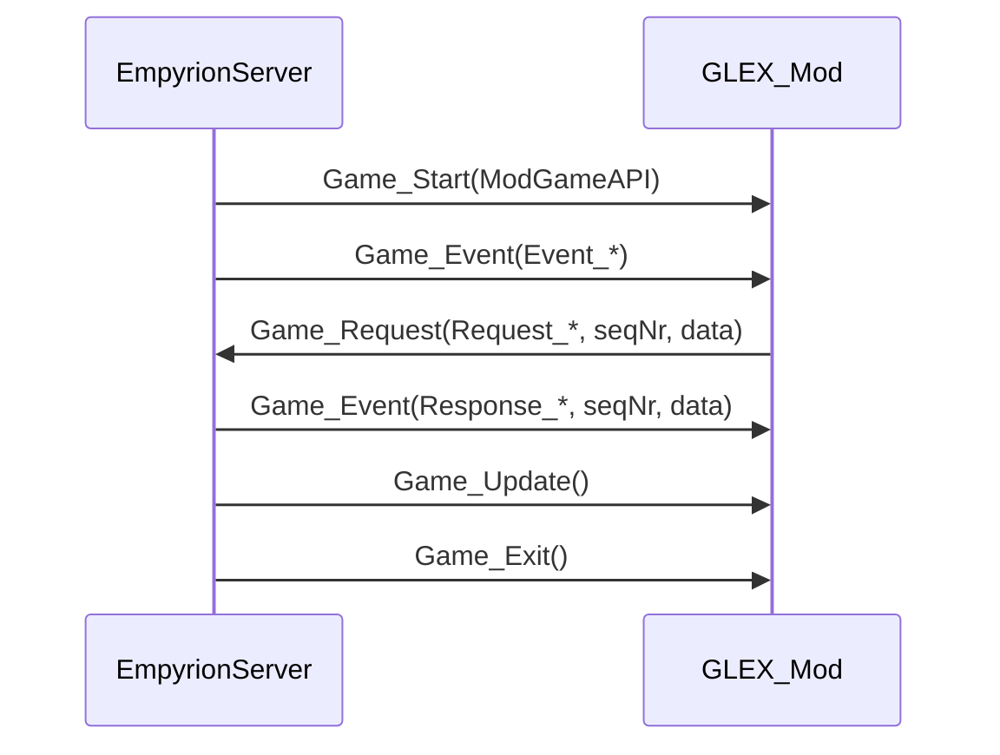

# Архитектурный план (GLEX)

**Назначение**: описать архитектуру GLEX на уровне контекста/контейнеров/компонентов (упрощённый C4).  
**Аудитория**: разработчики.  
**Статус**: draft.  
**Связанные документы**: [`00_Modular_Development_Plan.md`](00_Modular_Development_Plan.md), [`03_Технический_проект.md`](03_Технический_проект.md).  

## Контекст (Context)

- **Empyrion Dedicated Server**
  - загружает Mod DLL через `ModInterface`;
  - отправляет события в `Game_Event`.
- **GLEX Mod DLL**
  - получает события (`Game_Event`);
  - отправляет запросы (`Game_Request`).

## Потоки (events/requests) — концептуально

**Комментарий**: ключевая сложность ModAPI — `object data`: тип известен только после проверки `CmdId`. Поэтому GLEX должен иметь строгий слой “шлюза”/адаптера, чтобы не размножать касты и ошибки по всему коду.

## Контейнеры (Containers)

Согласно черновику `docs/00_наброски проекта.md` и принятым модулям:

1) **SimulationEngine**
   - тик/таймер;
   - обновление симуляции;
   - планирование действий.

2) **EmpyrionGateway**
   - адаптер для `Game_Request`/`Game_Event`;
   - очередь запросов, rate limit;
   - сопоставление ответов по `seqNr`;
   - retry/dedup (по необходимости).

3) **StateStore**
   - загрузка/сохранение `state.json`;
   - миграции версий схемы.

4) **SpawningAndEvolution**
   - `EntitySpawner` (`Request_NewEntityId` → `Request_Entity_Spawn`);
   - `EntityDestroyer` (`Request_Entity_Destroy*`);
   - `StageManager` (FSM стадий).

5) **AimOrchestrator**
   - безопасная отправка `aim ...` через `Request_ConsoleCommand`;
   - whitelist, rate limit, аудит.

6) **PlacementResolver**
   - выбор координат;
   - эвристики “поверхности/безопасных координат”;
   - фоллбеки (если нет надёжного API).

## Компоненты (Components)

- `PlayerTracker`: слушает `Event_Player_ChangedPlayfield`, держит контекст присутствия игроков.
- `StructureTracker`: периодически получает списки/инфо по структурам, детектит разрушения ключевых сущностей.
- `ThreatDirector`: определяет, когда создавать патрули/волны/угрозы.
- `EconomySim`: виртуальные ресурсы/производство/логистика.
- `ExpansionPlanner`: выбирает следующую планету/цель экспансии.

## Нефункциональные требования (NFR)

Из черновика:

- **Производительность**: не спамить API — очередь запросов и rate limit.
- **Надёжность**: `state.json` пишется атомарно (`tmp → rename`).
- **Совместимость**: целимся в Empyrion v1.15 Experimental; при несовместимости — мягкий fail + лог.
- **Безопасность**: белый список консольных команд (в первую очередь `aim ...`).
