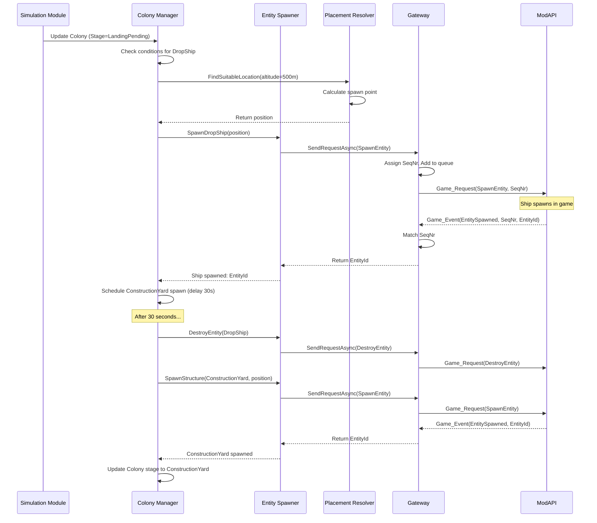
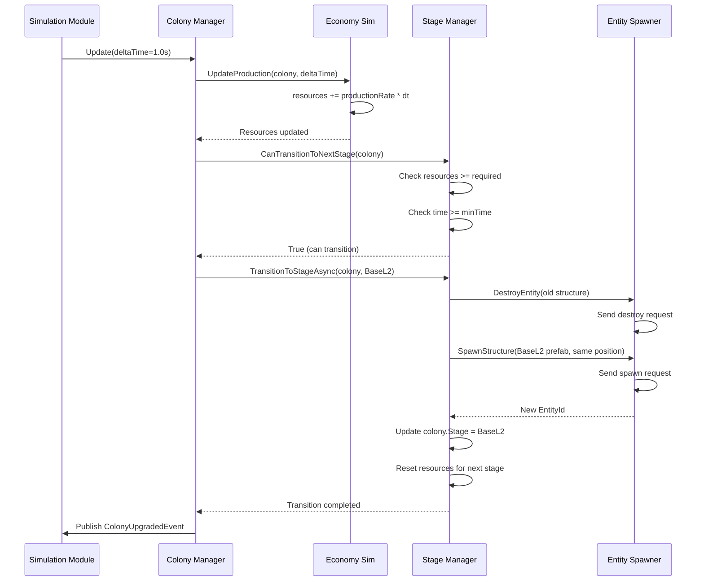

# Технический проект GalacticExpansion (GLEX)

**Версия:** 1.0  
**Дата:** 24.01.2026  
**Статус:** Утверждено

---

## 1. Обзор технического стека

### 1.1 Основной стек

| Технология | Версия | Назначение | Обоснование |
|------------|--------|------------|-------------|
| **C#** | 8.0+ | Основной язык | Совместимость с Empyrion, современные возможности языка |
| **.NET Framework** | 4.8 | Runtime | Требование Empyrion Dedicated Server |
| **Newtonsoft.Json** | 13.0.3+ | JSON сериализация | Работа с state.json и конфигурацией |
| **NLog** | 5.0+ | Логирование | Гибкое конфигурируемое логирование |
| **xUnit** | 2.6+ | Unit-тестирование | Современный тестовый фреймворк |
| **Moq** | 4.20+ | Мокирование | Изоляция зависимостей в тестах |

### 1.2 Внешние зависимости

**Обязательные (предоставляются Empyrion):**
- `Eleon.Modding.dll` — интерфейсы ModAPI
- `Mif.dll` — ModInterface Framework (если используется)

**Опциональные (включаются в мод):**
- `EmpyrionNetAPIAccess.dll` — базовый класс EmpyrionModBase
- `EmpyrionNetAPITools.dll` — вспомогательные утилиты (ChatCommands, ConfigurationManager)

### 1.3 Структура проекта

```
GalacticExpansion/
├── src/
│   ├── GalacticExpansion.Core/          # Основная логика
│   │   ├── Simulation/                  # Симуляция
│   │   ├── Gateway/                     # Empyrion Gateway
│   │   ├── State/                       # State Store
│   │   ├── Spawning/                    # Spawning & Evolution
│   │   ├── AIM/                         # AIM Orchestrator
│   │   ├── Placement/                   # Placement Resolver
│   │   ├── Tracking/                    # Player/Structure Tracking
│   │   ├── Threat/                      # Threat Director
│   │   └── Economy/                     # Economy Simulation
│   │
│   ├── GalacticExpansion.Models/        # Модели данных
│   │   ├── Colony.cs
│   │   ├── SimulationState.cs
│   │   └── Configuration.cs
│   │
│   └── GalacticExpansion/               # Точка входа (DLL)
│       ├── ModMain.cs                   # ModInterface реализация
│       └── DependencyInjection.cs       # DI конфигурация
│
├── tests/
│   ├── GalacticExpansion.Tests.Unit/    # Unit-тесты
│   └── GalacticExpansion.Tests.Integration/ # Integration-тесты
│
└── docs/
    └── architecture/                     # Документация
```

---

## 2. Детализация модулей

### 2.1 Core Loop & Simulation Engine

#### 2.1.1 Классовая структура

```csharp
/// <summary>
/// Главный движок симуляции, управляющий жизненным циклом и координацией модулей
/// Паттерн: Singleton (через DI), Observer (для модулей)
/// </summary>
public class SimulationEngine : ISimulationEngine, IDisposable
{
    private readonly ILogger<SimulationEngine> _logger;
    private readonly IModuleRegistry _moduleRegistry;
    private readonly IEventBus _eventBus;
    private readonly IStateStore _stateStore;
    
    private Timer _simulationTimer;
    private SimulationState _currentState;
    private bool _isRunning;
    
    // Интервал обновления симуляции (по умолчанию 1 секунда)
    private const int SimulationTickIntervalMs = 1000;
    
    public SimulationEngine(
        ILogger<SimulationEngine> logger,
        IModuleRegistry moduleRegistry,
        IEventBus eventBus,
        IStateStore stateStore)
    {
        _logger = logger ?? throw new ArgumentNullException(nameof(logger));
        _moduleRegistry = moduleRegistry ?? throw new ArgumentNullException(nameof(moduleRegistry));
        _eventBus = eventBus ?? throw new ArgumentNullException(nameof(eventBus));
        _stateStore = stateStore ?? throw new ArgumentNullException(nameof(stateStore));
    }
    
    /// <summary>
    /// Запуск симуляции
    /// Загружает состояние из StateStore и активирует таймер обновлений
    /// </summary>
    public async Task StartAsync()
    {
        _logger.LogInformation("Starting Simulation Engine...");
        
        // Загрузка состояния
        _currentState = await _stateStore.LoadAsync();
        if (_currentState == null)
        {
            _logger.LogWarning("No saved state found, initializing new simulation");
            _currentState = InitializeNewSimulation();
        }
        
        // Инициализация модулей
        await _moduleRegistry.InitializeAllModulesAsync(_currentState);
        
        // Запуск таймера симуляции
        _simulationTimer = new Timer(
            OnSimulationTick, 
            null, 
            SimulationTickIntervalMs, 
            SimulationTickIntervalMs
        );
        
        _isRunning = true;
        _logger.LogInformation("Simulation Engine started successfully");
    }
    
    /// <summary>
    /// Остановка симуляции
    /// Сохраняет текущее состояние и останавливает все модули
    /// </summary>
    public async Task StopAsync()
    {
        _logger.LogInformation("Stopping Simulation Engine...");
        
        _isRunning = false;
        _simulationTimer?.Change(Timeout.Infinite, Timeout.Infinite);
        
        // Сохранение состояния перед остановкой
        await _stateStore.SaveAsync(_currentState);
        
        // Остановка всех модулей
        await _moduleRegistry.ShutdownAllModulesAsync();
        
        _logger.LogInformation("Simulation Engine stopped");
    }
    
    /// <summary>
    /// Обработчик тика симуляции
    /// Вызывается каждую секунду (или согласно настроенному интервалу)
    /// </summary>
    private void OnSimulationTick(object state)
    {
        if (!_isRunning) return;
        
        try
        {
            // Создание контекста для обновления
            var context = new SimulationContext
            {
                CurrentState = _currentState,
                DeltaTime = SimulationTickIntervalMs / 1000f, // В секундах
                CurrentTime = DateTime.UtcNow
            };
            
            // Обновление всех зарегистрированных модулей
            _moduleRegistry.UpdateAllModules(context);
            
            // Публикация события "тик симуляции"
            _eventBus.Publish(new SimulationTickEvent(context));
            
            // Периодическое сохранение (каждую минуту, если есть изменения)
            if (_currentState.IsDirty && 
                (DateTime.UtcNow - _currentState.LastSaveTime).TotalMinutes >= 1)
            {
                _ = Task.Run(async () =>
                {
                    await _stateStore.SaveAsync(_currentState);
                    _currentState.LastSaveTime = DateTime.UtcNow;
                    _currentState.IsDirty = false;
                });
            }
        }
        catch (Exception ex)
        {
            _logger.LogError(ex, "Error during simulation tick");
            // Не останавливаем симуляцию при ошибках в тике
        }
    }
    
    /// <summary>
    /// Инициализация новой симуляции при первом запуске
    /// </summary>
    private SimulationState InitializeNewSimulation()
    {
        var state = new SimulationState
        {
            Version = SimulationState.CurrentVersion,
            CreatedAt = DateTime.UtcNow,
            LastUpdate = DateTime.UtcNow,
            Colonies = new List<Colony>(),
            Playfields = new Dictionary<string, PlayfieldState>()
        };
        
        // Публикация события инициализации
        _eventBus.Publish(new SimulationInitializedEvent(state));
        
        return state;
    }
    
    public void Dispose()
    {
        _simulationTimer?.Dispose();
    }
}
```

#### 2.1.2 Module Registry

```csharp
/// <summary>
/// Реестр модулей симуляции
/// Паттерн: Registry, Mediator
/// </summary>
public class ModuleRegistry : IModuleRegistry
{
    private readonly List<ISimulationModule> _modules = new List<ISimulationModule>();
    private readonly ILogger<ModuleRegistry> _logger;
    
    public ModuleRegistry(ILogger<ModuleRegistry> logger)
    {
        _logger = logger ?? throw new ArgumentNullException(nameof(logger));
    }
    
    /// <summary>
    /// Регистрация модуля симуляции
    /// Модули должны быть зарегистрированы до запуска симуляции
    /// </summary>
    public void RegisterModule(ISimulationModule module)
    {
        if (module == null) throw new ArgumentNullException(nameof(module));
        
        if (_modules.Any(m => m.ModuleName == module.ModuleName))
        {
            _logger.LogWarning($"Module {module.ModuleName} is already registered");
            return;
        }
        
        _modules.Add(module);
        _logger.LogInformation($"Registered module: {module.ModuleName}");
    }
    
    /// <summary>
    /// Инициализация всех зарегистрированных модулей
    /// </summary>
    public async Task InitializeAllModulesAsync(SimulationState state)
    {
        _logger.LogInformation($"Initializing {_modules.Count} modules...");
        
        foreach (var module in _modules)
        {
            try
            {
                await module.InitializeAsync(state);
                _logger.LogInformation($"Module {module.ModuleName} initialized");
            }
            catch (Exception ex)
            {
                _logger.LogError(ex, $"Failed to initialize module {module.ModuleName}");
                throw;
            }
        }
    }
    
    /// <summary>
    /// Обновление всех модулей в рамках тика симуляции
    /// </summary>
    public void UpdateAllModules(SimulationContext context)
    {
        foreach (var module in _modules)
        {
            try
            {
                module.OnSimulationUpdate(context);
            }
            catch (Exception ex)
            {
                _logger.LogError(ex, $"Error updating module {module.ModuleName}");
                // Продолжаем обновление других модулей
            }
        }
    }
    
    /// <summary>
    /// Остановка всех модулей
    /// </summary>
    public async Task ShutdownAllModulesAsync()
    {
        _logger.LogInformation("Shutting down all modules...");
        
        // Останавливаем в обратном порядке регистрации
        foreach (var module in _modules.AsEnumerable().Reverse())
        {
            try
            {
                await module.ShutdownAsync();
                _logger.LogInformation($"Module {module.ModuleName} shutdown complete");
            }
            catch (Exception ex)
            {
                _logger.LogError(ex, $"Error shutting down module {module.ModuleName}");
            }
        }
    }
}
```

#### 2.1.3 Event Bus

```csharp
/// <summary>
/// Внутренняя шина событий для слабо связанного взаимодействия модулей
/// Паттерн: Publish-Subscribe, Mediator
/// </summary>
public class EventBus : IEventBus
{
    private readonly ConcurrentDictionary<Type, List<object>> _subscriptions 
        = new ConcurrentDictionary<Type, List<object>>();
    private readonly ILogger<EventBus> _logger;
    
    public EventBus(ILogger<EventBus> logger)
    {
        _logger = logger ?? throw new ArgumentNullException(nameof(logger));
    }
    
    /// <summary>
    /// Подписка на событие определенного типа
    /// </summary>
    public void Subscribe<TEvent>(Action<TEvent> handler) where TEvent : IEvent
    {
        var eventType = typeof(TEvent);
        
        var handlers = _subscriptions.GetOrAdd(eventType, _ => new List<object>());
        
        lock (handlers)
        {
            handlers.Add(handler);
        }
        
        _logger.LogDebug($"Subscribed to event {eventType.Name}");
    }
    
    /// <summary>
    /// Публикация события
    /// Синхронно вызывает все подписанные обработчики
    /// </summary>
    public void Publish<TEvent>(TEvent eventData) where TEvent : IEvent
    {
        var eventType = typeof(TEvent);
        
        if (!_subscriptions.TryGetValue(eventType, out var handlers))
        {
            _logger.LogTrace($"No subscribers for event {eventType.Name}");
            return;
        }
        
        List<object> handlersCopy;
        lock (handlers)
        {
            handlersCopy = new List<object>(handlers);
        }
        
        _logger.LogDebug($"Publishing event {eventType.Name} to {handlersCopy.Count} subscribers");
        
        foreach (var handler in handlersCopy)
        {
            try
            {
                ((Action<TEvent>)handler).Invoke(eventData);
            }
            catch (Exception ex)
            {
                _logger.LogError(ex, $"Error in event handler for {eventType.Name}");
                // Продолжаем вызывать другие обработчики
            }
        }
    }
    
    /// <summary>
    /// Асинхронная публикация события
    /// Обработчики выполняются параллельно
    /// </summary>
    public async Task PublishAsync<TEvent>(TEvent eventData) where TEvent : IEvent
    {
        var eventType = typeof(TEvent);
        
        if (!_subscriptions.TryGetValue(eventType, out var handlers))
        {
            return;
        }
        
        List<object> handlersCopy;
        lock (handlers)
        {
            handlersCopy = new List<object>(handlers);
        }
        
        var tasks = handlersCopy.Select(handler =>
            Task.Run(() =>
            {
                try
                {
                    ((Action<TEvent>)handler).Invoke(eventData);
                }
                catch (Exception ex)
                {
                    _logger.LogError(ex, $"Error in async event handler for {eventType.Name}");
                }
            })
        );
        
        await Task.WhenAll(tasks);
    }
}
```

---

### 2.2 Empyrion Gateway (API Adapter)

#### 2.2.1 Gateway Interface & Implementation

```csharp
/// <summary>
/// Шлюз для взаимодействия с Empyrion ModAPI
/// Паттерн: Adapter, Facade
/// </summary>
public class EmpyrionGateway : IEmpyrionGateway, IDisposable
{
    private readonly ModGameAPI _gameAPI;
    private readonly ILogger<EmpyrionGateway> _logger;
    private readonly IRequestQueue _requestQueue;
    private readonly ISequenceManager _sequenceManager;
    private readonly IRateLimiter _rateLimiter;
    
    // События от игры
    public event EventHandler<GameEventArgs> GameEventReceived;
    
    private bool _isInitialized;
    
    public EmpyrionGateway(
        ModGameAPI gameAPI,
        ILogger<EmpyrionGateway> logger,
        IRequestQueue requestQueue,
        ISequenceManager sequenceManager,
        IRateLimiter rateLimiter)
    {
        _gameAPI = gameAPI ?? throw new ArgumentNullException(nameof(gameAPI));
        _logger = logger ?? throw new ArgumentNullException(nameof(logger));
        _requestQueue = requestQueue ?? throw new ArgumentNullException(nameof(requestQueue));
        _sequenceManager = sequenceManager ?? throw new ArgumentNullException(nameof(sequenceManager));
        _rateLimiter = rateLimiter ?? throw new ArgumentNullException(nameof(rateLimiter));
    }
    
    /// <summary>
    /// Инициализация шлюза
    /// Запускает обработку очереди запросов
    /// </summary>
    public void Start()
    {
        if (_isInitialized)
        {
            _logger.LogWarning("Gateway already initialized");
            return;
        }
        
        _requestQueue.Start();
        _isInitialized = true;
        
        _logger.LogInformation("Empyrion Gateway started");
    }
    
    /// <summary>
    /// Остановка шлюза
    /// Завершает обработку текущих запросов
    /// </summary>
    public void Stop()
    {
        if (!_isInitialized) return;
        
        _requestQueue.Stop();
        _isInitialized = false;
        
        _logger.LogInformation("Empyrion Gateway stopped");
    }
    
    /// <summary>
    /// Отправка запроса к ModAPI с ожиданием ответа
    /// Паттерн: Command, Promise
    /// </summary>
    public async Task<TResponse> SendRequestAsync<TResponse>(
        CmdId requestId, 
        object data, 
        int timeoutMs = 5000)
    {
        if (!_isInitialized)
        {
            throw new InvalidOperationException("Gateway is not initialized");
        }
        
        // Проверка rate limit
        if (!_rateLimiter.AllowRequest())
        {
            _logger.LogWarning($"Rate limit exceeded for request {requestId}");
            throw new RateLimitExceededException($"Rate limit exceeded for {requestId}");
        }
        
        // Получение SeqNr
        var seqNr = _sequenceManager.GetNextSequence();
        
        // Создание promise для асинхронного ожидания
        var responsePromise = new TaskCompletionSource<TResponse>();
        
        // Регистрация ожидания ответа
        _sequenceManager.RegisterResponse<TResponse>(seqNr, responsePromise, timeoutMs);
        
        // Добавление запроса в очередь
        var request = new GameRequest
        {
            CmdId = requestId,
            SeqNr = seqNr,
            Data = data
        };
        
        _requestQueue.Enqueue(request, () =>
        {
            try
            {
                _logger.LogDebug($"Sending request {requestId} with SeqNr {seqNr}");
                _gameAPI.Game_Request(requestId, seqNr, data);
            }
            catch (Exception ex)
            {
                _logger.LogError(ex, $"Error sending request {requestId}");
                responsePromise.TrySetException(ex);
            }
        });
        
        // Ожидание ответа
        return await responsePromise.Task;
    }
    
    /// <summary>
    /// Обработка события от игры
    /// Вызывается игровым движком
    /// </summary>
    public void OnGameEvent(CmdId eventId, ushort seqNr, object data)
    {
        try
        {
            _logger.LogTrace($"Received event {eventId} with SeqNr {seqNr}");
            
            // Проверка, это ответ на запрос или чистое событие
            if (_sequenceManager.IsAwaitingResponse(seqNr))
            {
                _sequenceManager.CompleteResponse(seqNr, data);
            }
            else
            {
                // Это обычное событие, не ответ на запрос
                GameEventReceived?.Invoke(this, new GameEventArgs
                {
                    EventId = eventId,
                    SeqNr = seqNr,
                    Data = data
                });
            }
        }
        catch (Exception ex)
        {
            _logger.LogError(ex, $"Error handling game event {eventId}");
        }
    }
    
    public void Dispose()
    {
        Stop();
    }
}
```

#### 2.2.2 Request Queue

```csharp
/// <summary>
/// Очередь запросов с приоритетами
/// Паттерн: Queue, Priority Queue
/// </summary>
public class RequestQueue : IRequestQueue
{
    private readonly PriorityQueue<QueuedRequest, int> _queue 
        = new PriorityQueue<QueuedRequest, int>();
    private readonly SemaphoreSlim _semaphore = new SemaphoreSlim(0);
    private readonly CancellationTokenSource _cancellationTokenSource = new CancellationTokenSource();
    private readonly ILogger<RequestQueue> _logger;
    
    private Task _processingTask;
    
    // Интервал между запросами (для rate limiting на уровне очереди)
    private const int MinRequestIntervalMs = 50;
    
    public RequestQueue(ILogger<RequestQueue> logger)
    {
        _logger = logger ?? throw new ArgumentNullException(nameof(logger));
    }
    
    /// <summary>
    /// Запуск обработки очереди
    /// </summary>
    public void Start()
    {
        _processingTask = Task.Run(ProcessQueueAsync, _cancellationTokenSource.Token);
        _logger.LogInformation("Request queue processing started");
    }
    
    /// <summary>
    /// Остановка обработки очереди
    /// </summary>
    public void Stop()
    {
        _cancellationTokenSource.Cancel();
        _semaphore.Release(); // Разблокировка ожидания
        
        try
        {
            _processingTask?.Wait(5000);
        }
        catch (Exception ex)
        {
            _logger.LogWarning(ex, "Error waiting for queue processing to stop");
        }
        
        _logger.LogInformation("Request queue processing stopped");
    }
    
    /// <summary>
    /// Добавление запроса в очередь
    /// </summary>
    /// <param name="request">Запрос</param>
    /// <param name="action">Действие для выполнения запроса</param>
    /// <param name="priority">Приоритет (меньше = выше приоритет)</param>
    public void Enqueue(GameRequest request, Action action, int priority = 5)
    {
        lock (_queue)
        {
            _queue.Enqueue(new QueuedRequest
            {
                Request = request,
                Action = action,
                EnqueuedAt = DateTime.UtcNow
            }, priority);
        }
        
        _semaphore.Release(); // Сигнал о новом элементе в очереди
    }
    
    /// <summary>
    /// Обработка очереди запросов
    /// </summary>
    private async Task ProcessQueueAsync()
    {
        while (!_cancellationTokenSource.Token.IsCancellationRequested)
        {
            try
            {
                // Ожидание нового элемента в очереди
                await _semaphore.WaitAsync(_cancellationTokenSource.Token);
                
                QueuedRequest queuedRequest;
                lock (_queue)
                {
                    if (_queue.Count == 0) continue;
                    queuedRequest = _queue.Dequeue();
                }
                
                // Выполнение запроса
                try
                {
                    queuedRequest.Action.Invoke();
                    
                    var waitTime = DateTime.UtcNow - queuedRequest.EnqueuedAt;
                    if (waitTime.TotalMilliseconds > 1000)
                    {
                        _logger.LogWarning(
                            $"Request {queuedRequest.Request.CmdId} waited {waitTime.TotalMilliseconds:F0}ms in queue");
                    }
                }
                catch (Exception ex)
                {
                    _logger.LogError(ex, $"Error executing request {queuedRequest.Request.CmdId}");
                }
                
                // Задержка между запросами для rate limiting
                await Task.Delay(MinRequestIntervalMs, _cancellationTokenSource.Token);
            }
            catch (OperationCanceledException)
            {
                // Нормальная остановка
                break;
            }
            catch (Exception ex)
            {
                _logger.LogError(ex, "Unexpected error in request queue processing");
            }
        }
    }
}

/// <summary>
/// Запрос в очереди
/// </summary>
internal class QueuedRequest
{
    public GameRequest Request { get; set; }
    public Action Action { get; set; }
    public DateTime EnqueuedAt { get; set; }
}
```

#### 2.2.3 Sequence Manager

```csharp
/// <summary>
/// Менеджер sequence numbers для сопоставления запросов и ответов
/// Паттерн: Correlation Identifier
/// </summary>
public class SequenceManager : ISequenceManager
{
    private ushort _currentSeq = 0;
    private readonly ConcurrentDictionary<ushort, PendingResponse> _pendingResponses 
        = new ConcurrentDictionary<ushort, PendingResponse>();
    private readonly ILogger<SequenceManager> _logger;
    
    private readonly object _seqLock = new object();
    
    public SequenceManager(ILogger<SequenceManager> logger)
    {
        _logger = logger ?? throw new ArgumentNullException(nameof(logger));
    }
    
    /// <summary>
    /// Получение следующего sequence number
    /// Thread-safe
    /// </summary>
    public ushort GetNextSequence()
    {
        lock (_seqLock)
        {
            _currentSeq++;
            if (_currentSeq == 0) _currentSeq = 1; // Избегаем 0
            return _currentSeq;
        }
    }
    
    /// <summary>
    /// Регистрация ожидания ответа
    /// </summary>
    public void RegisterResponse<TResponse>(
        ushort seqNr, 
        TaskCompletionSource<TResponse> promise,
        int timeoutMs)
    {
        var pending = new PendingResponse
        {
            SeqNr = seqNr,
            Promise = promise,
            RegisteredAt = DateTime.UtcNow
        };
        
        _pendingResponses[seqNr] = pending;
        
        // Установка таймаута
        _ = Task.Delay(timeoutMs).ContinueWith(t =>
        {
            if (_pendingResponses.TryRemove(seqNr, out var timedOut))
            {
                ((TaskCompletionSource<TResponse>)timedOut.Promise).TrySetException(
                    new TimeoutException($"Request with SeqNr {seqNr} timed out after {timeoutMs}ms")
                );
                
                _logger.LogWarning($"Request SeqNr {seqNr} timed out");
            }
        });
    }
    
    /// <summary>
    /// Проверка, ожидается ли ответ для данного SeqNr
    /// </summary>
    public bool IsAwaitingResponse(ushort seqNr)
    {
        return _pendingResponses.ContainsKey(seqNr);
    }
    
    /// <summary>
    /// Завершение ожидания ответа
    /// </summary>
    public void CompleteResponse(ushort seqNr, object data)
    {
        if (_pendingResponses.TryRemove(seqNr, out var pending))
        {
            var responseTime = DateTime.UtcNow - pending.RegisteredAt;
            _logger.LogDebug($"Response for SeqNr {seqNr} received in {responseTime.TotalMilliseconds:F0}ms");
            
            // Установка результата в promise
            var promiseType = pending.Promise.GetType();
            var resultType = promiseType.GetGenericArguments()[0];
            
            try
            {
                var setResultMethod = promiseType.GetMethod("TrySetResult");
                setResultMethod.Invoke(pending.Promise, new[] { Convert.ChangeType(data, resultType) });
            }
            catch (Exception ex)
            {
                _logger.LogError(ex, $"Error setting result for SeqNr {seqNr}");
                var setExceptionMethod = promiseType.GetMethod("TrySetException", new[] { typeof(Exception) });
                setExceptionMethod.Invoke(pending.Promise, new object[] { ex });
            }
        }
    }
}

/// <summary>
/// Информация об ожидающем ответа запросе
/// </summary>
internal class PendingResponse
{
    public ushort SeqNr { get; set; }
    public object Promise { get; set; } // TaskCompletionSource<T>
    public DateTime RegisteredAt { get; set; }
}
```

---

### 2.3 State Store (Persistence Layer)

#### 2.3.1 State Store Implementation

```csharp
/// <summary>
/// Хранилище состояния симуляции
/// Паттерн: Repository
/// </summary>
public class StateStore : IStateStore
{
    private readonly ILogger<StateStore> _logger;
    private readonly string _stateFilePath;
    private readonly string _backupDirectory;
    
    private readonly SemaphoreSlim _saveSemaphore = new SemaphoreSlim(1, 1);
    
    public StateStore(
        ILogger<StateStore> logger,
        IConfiguration configuration)
    {
        _logger = logger ?? throw new ArgumentNullException(nameof(logger));
        
        var modPath = configuration.GetValue<string>("ModDataPath");
        _stateFilePath = Path.Combine(modPath, "state.json");
        _backupDirectory = Path.Combine(modPath, "backups");
        
        // Создание директории бэкапов
        Directory.CreateDirectory(_backupDirectory);
    }
    
    /// <summary>
    /// Загрузка состояния из файла
    /// </summary>
    public async Task<SimulationState> LoadAsync()
    {
        _logger.LogInformation($"Loading state from {_stateFilePath}");
        
        if (!File.Exists(_stateFilePath))
        {
            _logger.LogWarning("State file does not exist");
            return null;
        }
        
        try
        {
            var json = await File.ReadAllTextAsync(_stateFilePath);
            var state = JsonConvert.DeserializeObject<SimulationState>(json, GetJsonSettings());
            
            if (state == null)
            {
                _logger.LogError("Failed to deserialize state (result is null)");
                return await TryRestoreFromBackupAsync();
            }
            
            // Проверка версии и миграция при необходимости
            if (state.Version < SimulationState.CurrentVersion)
            {
                _logger.LogInformation($"Migrating state from version {state.Version} to {SimulationState.CurrentVersion}");
                state = await MigrateStateAsync(state);
            }
            
            _logger.LogInformation($"State loaded successfully: {state.Colonies.Count} colonies");
            return state;
        }
        catch (Exception ex)
        {
            _logger.LogError(ex, "Error loading state");
            return await TryRestoreFromBackupAsync();
        }
    }
    
    /// <summary>
    /// Сохранение состояния в файл
    /// Использует атомарную запись (temp file → rename)
    /// </summary>
    public async Task SaveAsync(SimulationState state)
    {
        if (state == null) throw new ArgumentNullException(nameof(state));
        
        // Только один поток может сохранять одновременно
        await _saveSemaphore.WaitAsync();
        
        try
        {
            _logger.LogDebug("Saving state...");
            
            state.LastUpdate = DateTime.UtcNow;
            
            var json = JsonConvert.SerializeObject(state, Formatting.Indented, GetJsonSettings());
            
            // Атомарная запись: сначала во временный файл
            var tempFile = _stateFilePath + ".tmp";
            await File.WriteAllTextAsync(tempFile, json);
            
            // Затем переименование (атомарная операция в Windows/Linux)
            if (File.Exists(_stateFilePath))
            {
                File.Replace(tempFile, _stateFilePath, null);
            }
            else
            {
                File.Move(tempFile, _stateFilePath);
            }
            
            _logger.LogDebug("State saved successfully");
        }
        catch (Exception ex)
        {
            _logger.LogError(ex, "Error saving state");
            throw;
        }
        finally
        {
            _saveSemaphore.Release();
        }
    }
    
    /// <summary>
    /// Создание бэкапа текущего состояния
    /// </summary>
    public async Task<SimulationState> CreateBackupAsync()
    {
        _logger.LogInformation("Creating backup...");
        
        var state = await LoadAsync();
        if (state == null) return null;
        
        var backupFileName = $"state_backup_{DateTime.UtcNow:yyyyMMdd_HHmmss}.json";
        var backupPath = Path.Combine(_backupDirectory, backupFileName);
        
        var json = JsonConvert.SerializeObject(state, Formatting.Indented, GetJsonSettings());
        await File.WriteAllTextAsync(backupPath, json);
        
        _logger.LogInformation($"Backup created: {backupPath}");
        
        // Очистка старых бэкапов (хранить только последние 10)
        await CleanOldBackupsAsync(10);
        
        return state;
    }
    
    /// <summary>
    /// Восстановление из бэкапа
    /// </summary>
    public async Task<bool> RestoreFromBackupAsync(string backupPath)
    {
        _logger.LogInformation($"Restoring from backup: {backupPath}");
        
        if (!File.Exists(backupPath))
        {
            _logger.LogError($"Backup file not found: {backupPath}");
            return false;
        }
        
        try
        {
            // Создание бэкапа текущего состояния перед восстановлением
            if (File.Exists(_stateFilePath))
            {
                var failedStateBackup = _stateFilePath + ".failed_" + DateTime.UtcNow.Ticks;
                File.Copy(_stateFilePath, failedStateBackup);
                _logger.LogInformation($"Current state backed up to: {failedStateBackup}");
            }
            
            // Копирование бэкапа в основной файл
            File.Copy(backupPath, _stateFilePath, overwrite: true);
            
            // Проверка, что восстановленный файл корректный
            var restoredState = await LoadAsync();
            if (restoredState != null)
            {
                _logger.LogInformation("State restored successfully from backup");
                return true;
            }
            
            _logger.LogError("Restored state is invalid");
            return false;
        }
        catch (Exception ex)
        {
            _logger.LogError(ex, "Error restoring from backup");
            return false;
        }
    }
    
    /// <summary>
    /// Попытка восстановления из последнего бэкапа
    /// </summary>
    private async Task<SimulationState> TryRestoreFromBackupAsync()
    {
        _logger.LogWarning("Attempting to restore from latest backup...");
        
        var backupFiles = Directory.GetFiles(_backupDirectory, "state_backup_*.json")
            .OrderByDescending(f => f)
            .ToList();
        
        foreach (var backupFile in backupFiles)
        {
            try
            {
                _logger.LogInformation($"Trying backup: {Path.GetFileName(backupFile)}");
                
                var json = await File.ReadAllTextAsync(backupFile);
                var state = JsonConvert.DeserializeObject<SimulationState>(json, GetJsonSettings());
                
                if (state != null)
                {
                    _logger.LogInformation($"Successfully restored from backup: {Path.GetFileName(backupFile)}");
                    return state;
                }
            }
            catch (Exception ex)
            {
                _logger.LogWarning(ex, $"Failed to restore from backup: {Path.GetFileName(backupFile)}");
            }
        }
        
        _logger.LogError("All backup restore attempts failed");
        return null;
    }
    
    /// <summary>
    /// Очистка старых бэкапов
    /// </summary>
    private async Task CleanOldBackupsAsync(int keepCount)
    {
        await Task.Run(() =>
        {
            var backupFiles = Directory.GetFiles(_backupDirectory, "state_backup_*.json")
                .OrderByDescending(f => f)
                .Skip(keepCount)
                .ToList();
            
            foreach (var oldBackup in backupFiles)
            {
                try
                {
                    File.Delete(oldBackup);
                    _logger.LogDebug($"Deleted old backup: {Path.GetFileName(oldBackup)}");
                }
                catch (Exception ex)
                {
                    _logger.LogWarning(ex, $"Failed to delete old backup: {Path.GetFileName(oldBackup)}");
                }
            }
        });
    }
    
    /// <summary>
    /// Миграция состояния между версиями
    /// </summary>
    private async Task<SimulationState> MigrateStateAsync(SimulationState oldState)
    {
        // Создание бэкапа перед миграцией
        var migrationBackup = Path.Combine(_backupDirectory, 
            $"state_pre_migration_v{oldState.Version}_{DateTime.UtcNow.Ticks}.json");
        var json = JsonConvert.SerializeObject(oldState, Formatting.Indented, GetJsonSettings());
        await File.WriteAllTextAsync(migrationBackup, json);
        
        // Применение миграций
        var currentVersion = oldState.Version;
        while (currentVersion < SimulationState.CurrentVersion)
        {
            currentVersion++;
            _logger.LogInformation($"Applying migration to version {currentVersion}");
            
            switch (currentVersion)
            {
                case 2:
                    oldState = MigrateToVersion2(oldState);
                    break;
                    
                // Добавлять новые миграции здесь
                
                default:
                    _logger.LogWarning($"No migration defined for version {currentVersion}");
                    break;
            }
            
            oldState.Version = currentVersion;
        }
        
        _logger.LogInformation($"Migration completed to version {currentVersion}");
        return oldState;
    }
    
    /// <summary>
    /// Пример миграции на версию 2
    /// </summary>
    private SimulationState MigrateToVersion2(SimulationState state)
    {
        // Пример: добавление нового поля в колонии
        foreach (var colony in state.Colonies)
        {
            if (colony.ThreatLevel == 0)
            {
                colony.ThreatLevel = 1; // Значение по умолчанию
            }
        }
        
        return state;
    }
    
    /// <summary>
    /// Настройки JSON сериализации
    /// </summary>
    private JsonSerializerSettings GetJsonSettings()
    {
        return new JsonSerializerSettings
        {
            TypeNameHandling = TypeNameHandling.Auto,
            NullValueHandling = NullValueHandling.Ignore,
            DefaultValueHandling = DefaultValueHandling.Include,
            Converters = new List<JsonConverter>
            {
                new Newtonsoft.Json.Converters.StringEnumConverter()
            }
        };
    }
}
```

---

## 3. Sequence-диаграммы основных сценариев

### 3.1 Сценарий: Спавн логистического корабля и создание базы



### 3.2 Сценарий: Переход колонии на следующую стадию



---

## 4. Структуры данных и форматы

### 4.1 Simulation State (state.json)

```json
{
  "Version": 1,
  "CreatedAt": "2026-01-24T10:00:00Z",
  "LastUpdate": "2026-01-24T12:30:00Z",
  "Colonies": [
    {
      "Id": "col_001",
      "Playfield": "Akua",
      "FactionId": 2,
      "Stage": "BaseL2",
      "Position": {
        "X": 1000.5,
        "Y": 150.0,
        "Z": -500.3
      },
      "Rotation": {
        "X": 0,
        "Y": 45,
        "Z": 0
      },
      "MainStructureId": 12345,
      "Resources": {
        "VirtualResources": 5000,
        "ProductionRate": 100.0
      },
      "ResourceNodes": [
        {
          "Id": "rn_001",
          "Type": "Iron",
          "Position": { "X": 1200, "Y": 145, "Z": -600 },
          "StructureId": 12350,
          "ProductionRate": 50.0
        }
      ],
      "Guards": [
        { "EntityId": 12360, "Type": "ZiraxMale" }
      ],
      "ThreatLevel": 2,
      "LastUpgradeTime": "2026-01-24T11:00:00Z"
    }
  ],
  "Playfields": {
    "Akua": {
      "Name": "Akua",
      "HasPlayers": true,
      "LastPlayerActivity": "2026-01-24T12:29:00Z",
      "ColonyIds": ["col_001"]
    }
  }
}
```

### 4.2 Configuration.json

```json
{
  "Version": "1.0",
  "LogLevel": "Information",
  
  "Simulation": {
    "TickIntervalMs": 1000,
    "SaveIntervalMinutes": 1
  },
  
  "HomePlayfield": "Akua",
  
  "Limits": {
    "MaxColoniesPerPlayfield": 1,
    "MaxActiveAIVessels": 5,
    "MaxGuardsNearColony": 10,
    "MaxBuildersNearColony": 5,
    "MaxResourceOutposts": 3,
    "MaxDroneWavesPerHour": 4,
    "MaxAIMCommandsPerMinute": 10,
    "MaxRequestsPerSecond": 10
  },
  
  "Zirax": {
    "FactionId": 2,
    "DropShips": [
      {
        "PrefabName": "GLEX_DropShip_T1",
        "Type": "SV",
        "SpawnAltitude": 500.0,
        "FlightDuration": 30
      }
    ],
    "Stages": [
      {
        "Stage": "ConstructionYard",
        "PrefabName": "GLEX_ConstructionYard",
        "RequiredResources": 0,
        "ProductionRate": 100.0,
        "MinTimeSeconds": 600
      },
      {
        "Stage": "BaseL1",
        "PrefabName": "GLEX_Base_L1",
        "RequiredResources": 1000,
        "ProductionRate": 150.0,
        "MinTimeSeconds": 1800
      }
    ]
  },
  
  "AIM": {
    "AllowedCommands": ["aim aga", "aim tdw", "aim adb"],
    "RateLimitPerMinute": 10
  },
  
  "Placement": {
    "MinDistanceFromPlayers": 500.0,
    "MinDistanceFromPlayerStructures": 1000.0,
    "SearchRadius": 2000.0,
    "MaxPlacementAttempts": 10
  }
}
```

---

## 5. Алгоритмы

### 5.1 Алгоритм поиска места для размещения структуры

```csharp
/// <summary>
/// Алгоритм поиска подходящего места для размещения структуры
/// Использует спиральный поиск от центральной точки
/// </summary>
public class PlacementResolver : IPlacementResolver
{
    private readonly IEmpyrionGateway _gateway;
    private readonly ILogger<PlacementResolver> _logger;
    
    public async Task<PVector3> FindSuitableLocationAsync(PlacementCriteria criteria)
    {
        _logger.LogInformation($"Finding suitable location on {criteria.Playfield}");
        
        // Получение списка существующих структур на playfield
        var structures = await _gateway.GetStructuresOnPlayfieldAsync(criteria.Playfield);
        
        // Спиральный поиск
        var center = criteria.PreferredLocation ?? PVector3.Zero;
        var searchRadius = criteria.SearchRadius;
        var stepSize = 50f; // Шаг поиска в метрах
        
        for (float radius = 0; radius < searchRadius; radius += stepSize)
        {
            var angleStep = stepSize / radius; // Адаптивный шаг угла
            if (angleStep > MathF.PI / 4) angleStep = MathF.PI / 4; // Минимум 8 точек на круг
            
            for (float angle = 0; angle < 2 * MathF.PI; angle += angleStep)
            {
                var testPosition = new PVector3(
                    center.X + radius * MathF.Cos(angle),
                    criteria.PreferredAltitude,
                    center.Z + radius * MathF.Sin(angle)
                );
                
                if (await IsLocationSuitableAsync(testPosition, structures, criteria))
                {
                    _logger.LogInformation($"Found suitable location: {testPosition}");
                    return testPosition;
                }
            }
        }
        
        _logger.LogWarning("No suitable location found in search radius");
        throw new PlacementException("No suitable location found");
    }
    
    private async Task<bool> IsLocationSuitableAsync(
        PVector3 position, 
        List<GlobalStructureInfo> structures,
        PlacementCriteria criteria)
    {
        // Проверка минимальной дистанции от других структур
        foreach (var structure in structures)
        {
            var distance = Vector3.Distance(position.ToVector3(), structure.Position.ToVector3());
            
            // Проверка дистанции от структур игроков
            if (structure.FactionId != criteria.FactionId && 
                distance < criteria.MinDistanceFromPlayerStructures)
            {
                return false;
            }
        }
        
        // Проверка дистанции от игроков (если есть критерий)
        if (criteria.MinDistanceFromPlayers > 0)
        {
            var players = await _gateway.GetPlayersOnPlayfieldAsync(criteria.Playfield);
            foreach (var player in players)
            {
                var distance = Vector3.Distance(position.ToVector3(), player.Position.ToVector3());
                if (distance < criteria.MinDistanceFromPlayers)
                {
                    return false;
                }
            }
        }
        
        // Дополнительные проверки (spawn-protection зоны и т.д.) могут быть добавлены здесь
        
        return true;
    }
}
```

### 5.2 Алгоритм расчета уровня угрозы

```csharp
/// <summary>
/// Алгоритм расчета уровня угрозы для колонии
/// Учитывает близость игроков, количество разрушений, время с последней атаки
/// нападение игрока на юниты и строения колонии.
/// При нападении на патрули, охрану и др юнитов, высылать подмогу.
/// </summary>
public ThreatLevel CalculateThreatLevel(Colony colony, SimulationContext context)
{
    var score = 0f;
    
    // Фактор 1: Близость игроков
    var nearbyPlayers = context.GetPlayersNearPosition(colony.Position, 1000f);
    score += nearbyPlayers.Count * 10f;
    
    // Фактор 2: Недавние разрушения
    var recentDestructions = colony.DestructionEvents
        .Where(e => (context.CurrentTime - e.Timestamp).TotalMinutes < 30)
        .Count();
    score += recentDestructions * 20f;
    
    // Фактор 3: Время с последней атаки (затухание угрозы)
    var timeSinceLastAttack = (context.CurrentTime - colony.LastAttackTime).TotalMinutes;
    if (timeSinceLastAttack < 60)
    {
        score += (60 - timeSinceLastAttack) * 0.5f;
    }
    
    // Фактор 4: Ценность колонии (более развитые = выше угроза)
    score += (int)colony.Stage * 5f;
    
    // Преобразование score в уровень угрозы
    if (score < 20) return ThreatLevel.None;
    if (score < 40) return ThreatLevel.Low;
    if (score < 70) return ThreatLevel.Medium;
    if (score < 100) return ThreatLevel.High;
    return ThreatLevel.Critical;
}
```

---

## 6. Связь с другими документами

- **[01_Техническое_задание.md](01_Техническое_задание.md)** — реализуемые функциональные требования
- **[02_Архитектурный_план.md](02_Архитектурный_план.md)** — высокоуровневая архитектура системы
- **[04_Modular_Development_Plan.md](04_Modular_Development_Plan.md)** — порядок реализации модулей
- **[05_Схема_данных.md](05_Схема_данных.md)** — детальная схема данных
- **[09_Testing_Strategy.md](09_Testing_Strategy.md)** — стратегия тестирования реализации