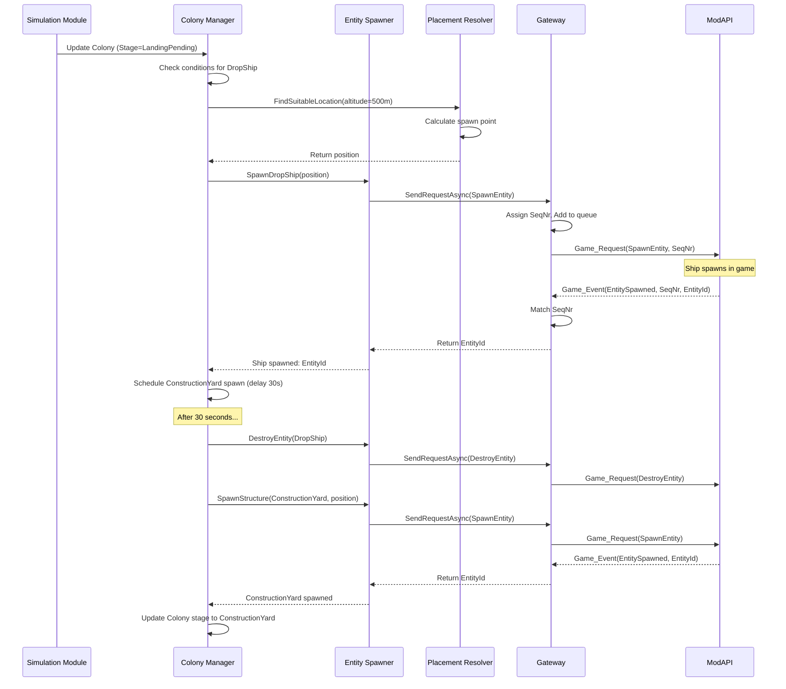
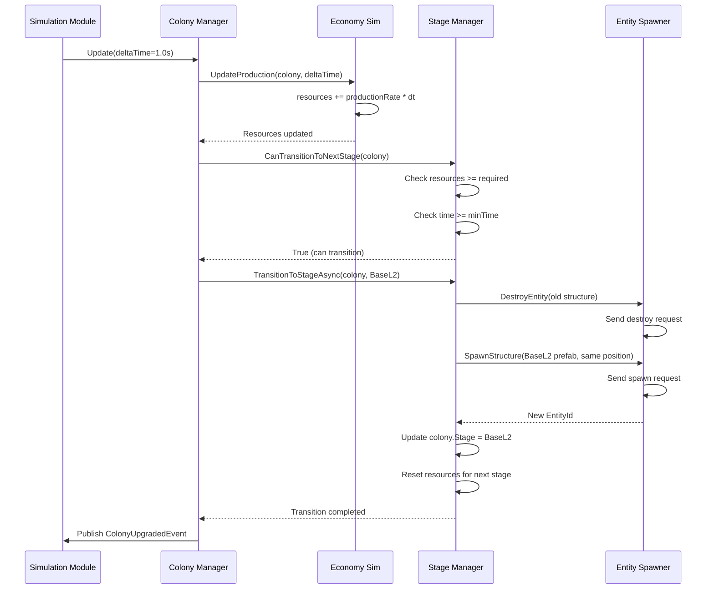

# Технический проект GalacticExpansion (GLEX)

**Версия:** 1.0  
**Дата:** 24.01.2026  
**Статус:** Утверждено

---

## 1. Обзор технического стека

### 1.1 Основной стек

| Технология | Версия | Назначение | Обоснование |
|------------|--------|------------|-------------|
| **C#** | 8.0+ | Основной язык | Совместимость с Empyrion, современные возможности языка |
| **.NET Framework** | 4.8 | Runtime | Требование Empyrion Dedicated Server |
| **Newtonsoft.Json** | 13.0.3+ | JSON сериализация | Работа с state.json и конфигурацией |
| **NLog** | 5.0+ | Логирование | Гибкое конфигурируемое логирование |
| **xUnit** | 2.6+ | Unit-тестирование | Современный тестовый фреймворк |
| **Moq** | 4.20+ | Мокирование | Изоляция зависимостей в тестах |

### 1.2 Внешние зависимости

**Обязательные (предоставляются Empyrion):**
- `ModApi.dll` — интерфейсы ModAPI
- `Mif.dll` — ModInterface Framework (если используется)

**Опциональные (включаются в мод):**
- `EmpyrionNetAPIAccess.dll` — базовый класс EmpyrionModBase
- `EmpyrionNetAPITools.dll` — вспомогательные утилиты (ChatCommands, ConfigurationManager)

### 1.3 Структура проекта

```
GalacticExpansion/
├── src/
│   ├── GalacticExpansion.Core/          # Основная логика
│   │   ├── Simulation/                  # Симуляция
│   │   ├── Gateway/                     # Empyrion Gateway
│   │   ├── State/                       # State Store
│   │   ├── Spawning/                    # Spawning & Evolution
│   │   ├── AIM/                         # AIM Orchestrator
│   │   ├── Placement/                   # Placement Resolver
│   │   ├── Tracking/                    # Player/Structure Tracking
│   │   ├── Threat/                      # Threat Director
│   │   └── Economy/                     # Economy Simulation
│   │
│   ├── GalacticExpansion.Models/        # Модели данных
│   │   ├── Colony.cs
│   │   ├── SimulationState.cs
│   │   └── Configuration.cs
│   │
│   └── GalacticExpansion/               # Точка входа (DLL)
│       ├── ModMain.cs                   # ModInterface реализация
│       └── DependencyInjection.cs       # DI конфигурация
│
├── tests/
│   ├── GalacticExpansion.Tests.Unit/    # Unit-тесты
│   └── GalacticExpansion.Tests.Integration/ # Integration-тесты
│
└── docs/
    └── architecture/                     # Документация
```

---

## 2. Детализация модулей

**Важно:** Детальная реализация всех модулей находится в `docs/architecture/modules/`. Ниже приведены только основные архитектурные решения и ссылки.

### 2.1 Core Loop & Simulation Engine

**Паттерны:** Singleton (через DI), Observer, Mediator

**Компоненты:**
1. **SimulationEngine** — главный движок симуляции с таймером тиков (1 раз в секунду)
2. **ModuleRegistry** — реестр модулей с приоритетами обновления
3. **EventBus** — внутренняя шина событий (Pub-Sub)

**Детали:** См. [Module_01_Core_Loop.md](modules/Module_01_Core_Loop.md)

---

### 2.2 Empyrion Gateway (API Adapter)

**Паттерны:** Adapter, Facade, Command Queue

**Компоненты:**
1. **EmpyrionGateway** — адаптер для ModAPI
2. **RequestQueue** — очередь запросов с приоритетами
3. **SequenceManager** — correlation identifier для сопоставления запрос-ответ
4. **RateLimiter** — token bucket limiter (10 req/sec)

**Детали:** См. [Module_02_EmpyrionGateway.md](modules/Module_02_EmpyrionGateway.md)

---

### 2.3 State Store (Persistence)

**Паттерны:** Repository, Unit of Work

**Ключевые особенности:**
- Атомарная запись (temp file → rename)
- Версионирование и миграции схемы
- Автоматическое восстановление из бэкапов
- Хранение последних 10 бэкапов

**Детали:** См. [Module_03_StateStore.md](modules/Module_03_StateStore.md)

---

### 2.4 Entity Spawner

**Паттерны:** Factory

**Основные операции:**
- Спавн структур (BA, CV, SV)
- Спавн NPC с расстановкой
- Точное определение высоты рельефа (v1.15+)
- Batch удаление

**Детали:** См. [Module_04_Entity_Spawner.md](modules/Module_04_Entity_Spawner.md)

---

### 2.5 AIM Orchestrator

**Паттерны:** Command, Chain of Responsibility

**Функции:**
- Whitelist консольных команд
- Rate limiting (10 команд/мин)
- Прямое управление NPC через IEntity API (v1.15+)
- Простое патрулирование

**Детали:** См. [Module_05_AIM_Orchestrator.md](modules/Module_05_AIM_Orchestrator.md)

---

### 2.6 Placement Resolver

**Паттерны:** Strategy

**Алгоритм:** Спиральный поиск от центральной точки

**Проверки:**
- Дистанция от игроков
- Дистанция от структур
- Spawn-protection зоны
- Точная высота рельефа (v1.15+)

**Детали:** См. [Module_06_Placement_Resolver.md](modules/Module_06_Placement_Resolver.md)

---

### 2.7 Colony Evolution (Stage Manager)

**Паттерны:** State Machine

**Стадии:** LandingPending → ConstructionYard → BaseL1 → BaseL2 → BaseL3 → BaseMax → Expansion

**Функции:**
- Переходы при накоплении ресурсов
- Откаты при разрушениях
- Защита от авто-удаления (Touch)
- Инициализация через DropShip

**Детали:** См. [Module_07_Colony_Evolution.md](modules/Module_07_Colony_Evolution.md)

---

### 2.8 Player Tracker

**Функции:**
- Отслеживание игроков по playfield'ам
- События входа/выхода
- Поиск игроков рядом с позицией

**Детали:** См. [Module_08_Player_Tracker.md](modules/Module_08_Player_Tracker.md)

---

### 2.9 Structure Tracker

**Функции:**
- Периодическое обновление списка структур (10 сек)
- Детектирование создания/уничтожения
- Индексация по playfield и фракции

**Детали:** См. [Module_09_Structure_Tracker.md](modules/Module_09_Structure_Tracker.md)

---

### 2.10 Threat Director

**Функции:**
- Расчет уровня угрозы (None/Low/Medium/High/Critical)
- Спавн защитников
- Волны атак через IPda.CreateWaveAttack() (v1.15+)
- Rate limiting волн (5 минут между)

**Детали:** См. [Module_10_Threat_Director.md](modules/Module_10_Threat_Director.md)

---

### 2.11 Economy Simulator

**Функции:**
- Виртуальные ресурсы (не реальные игровые)
- Производство с бонусами от аванпостов
- Проверка условий для апгрейда
- Расчет времени до следующей стадии

**Детали:** См. [Module_11_Economy_Simulator.md](modules/Module_11_Economy_Simulator.md)

---

## 3. Sequence-диаграммы основных сценариев

### 3.1 Сценарий: Спавн логистического корабля и создание базы



### 3.2 Сценарий: Переход колонии на следующую стадию



---

## 4. Структуры данных и форматы

### 4.1 Simulation State (state.json)

```json
{
  "Version": 1,
  "CreatedAt": "2026-01-24T10:00:00Z",
  "LastUpdate": "2026-01-24T12:30:00Z",
  "Colonies": [
    {
      "Id": "col_001",
      "Playfield": "Akua",
      "FactionId": 2,
      "Stage": "BaseL2",
      "Position": {
        "X": 1000.5,
        "Y": 150.0,
        "Z": -500.3
      },
      "Rotation": {
        "X": 0,
        "Y": 45,
        "Z": 0
      },
      "MainStructureId": 12345,
      "Resources": {
        "VirtualResources": 5000,
        "ProductionRate": 100.0
      },
      "ResourceNodes": [
        {
          "Id": "rn_001",
          "Type": "Iron",
          "Position": { "X": 1200, "Y": 145, "Z": -600 },
          "StructureId": 12350,
          "ProductionRate": 50.0
        }
      ],
      "Guards": [
        { "EntityId": 12360, "Type": "ZiraxMale" }
      ],
      "ThreatLevel": 2,
      "LastUpgradeTime": "2026-01-24T11:00:00Z"
    }
  ],
  "Playfields": {
    "Akua": {
      "Name": "Akua",
      "HasPlayers": true,
      "LastPlayerActivity": "2026-01-24T12:29:00Z",
      "ColonyIds": ["col_001"]
    }
  }
}
```

### 4.2 Configuration.json

```json
{
  "Version": "1.0",
  "LogLevel": "Information",
  
  "Simulation": {
    "TickIntervalMs": 1000,
    "SaveIntervalMinutes": 1
  },
  
  "HomePlayfield": "Akua",
  
  "Limits": {
    "MaxColoniesPerPlayfield": 1,
    "MaxActiveAIVessels": 5,
    "MaxGuardsNearColony": 10,
    "MaxBuildersNearColony": 5,
    "MaxResourceOutposts": 3,
    "MaxDroneWavesPerHour": 4,
    "MaxAIMCommandsPerMinute": 10,
    "MaxRequestsPerSecond": 10
  },
  
  "Zirax": {
    "FactionId": 2,
    "DropShips": [
      {
        "PrefabName": "GLEX_DropShip_T1",
        "Type": "SV",
        "SpawnAltitude": 500.0,
        "FlightDuration": 30
      }
    ],
    "Stages": [
      {
        "Stage": "ConstructionYard",
        "PrefabName": "GLEX_ConstructionYard",
        "RequiredResources": 0,
        "ProductionRate": 100.0,
        "MinTimeSeconds": 600
      },
      {
        "Stage": "BaseL1",
        "PrefabName": "GLEX_Base_L1",
        "RequiredResources": 1000,
        "ProductionRate": 150.0,
        "MinTimeSeconds": 1800
      }
    ]
  },
  
  "AIM": {
    "AllowedCommands": ["aim aga", "aim tdw", "aim adb"],
    "RateLimitPerMinute": 10
  },
  
  "Placement": {
    "MinDistanceFromPlayers": 500.0,
    "MinDistanceFromPlayerStructures": 1000.0,
    "SearchRadius": 2000.0,
    "MaxPlacementAttempts": 10
  }
}
```

---

## 5. Ключевые алгоритмы

**Детальные реализации находятся в соответствующих модулях.**

### 5.1 Поиск места для размещения структуры

**Алгоритм:** Спиральный поиск от центральной точки

**Шаги:**
1. Получить список существующих структур на playfield
2. Спиральный поиск от центра с шагом 50м
3. Для каждой точки: проверка дистанций от игроков и структур
4. Точное определение высоты рельефа через `IPlayfield.GetTerrainHeightAt()` (v1.15+)
5. Возврат первой подходящей позиции

**Детали:** См. [Module_06_Placement_Resolver.md](modules/Module_06_Placement_Resolver.md)

---

### 5.2 Расчет уровня угрозы

**Факторы:**
1. Близость игроков (вес: 10-20 за игрока)
2. Недавние разрушения (вес: 20 за разрушение за 30 мин)
3. Затухание угрозы со временем
4. Ценность колонии (стадия × 5)

**Пороги:**
- Score < 10 → None
- Score < 30 → Low
- Score < 60 → Medium
- Score < 100 → High
- Score >= 100 → Critical

**Детали:** См. [Module_10_Threat_Director.md](modules/Module_10_Threat_Director.md)

---

## 6. Связь с другими документами

- **[01_Техническое_задание.md](01_Техническое_задание.md)** — реализуемые функциональные требования
- **[02_Архитектурный_план.md](02_Архитектурный_план.md)** — высокоуровневая архитектура системы
- **[04_Modular_Development_Plan.md](04_Modular_Development_Plan.md)** — порядок реализации модулей
- **[05_Схема_данных.md](05_Схема_данных.md)** — детальная схема данных
- **[09_Testing_Strategy.md](09_Testing_Strategy.md)** — стратегия тестирования реализации