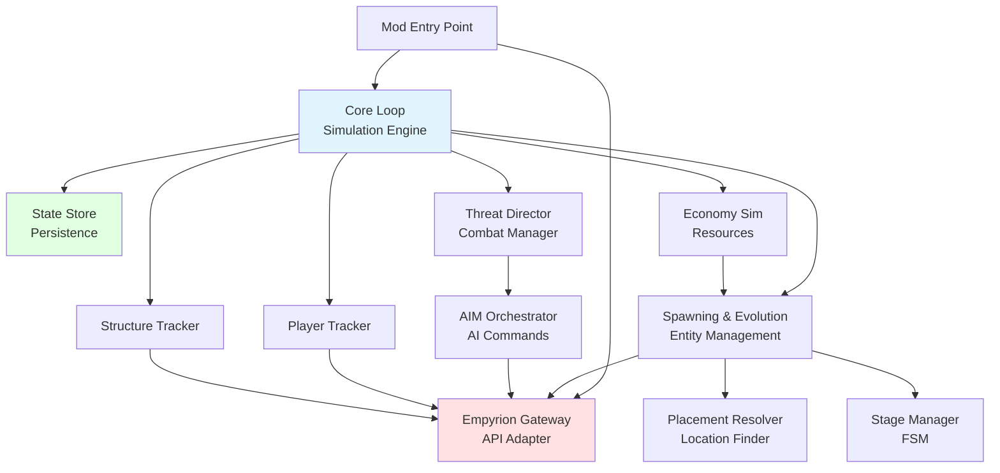
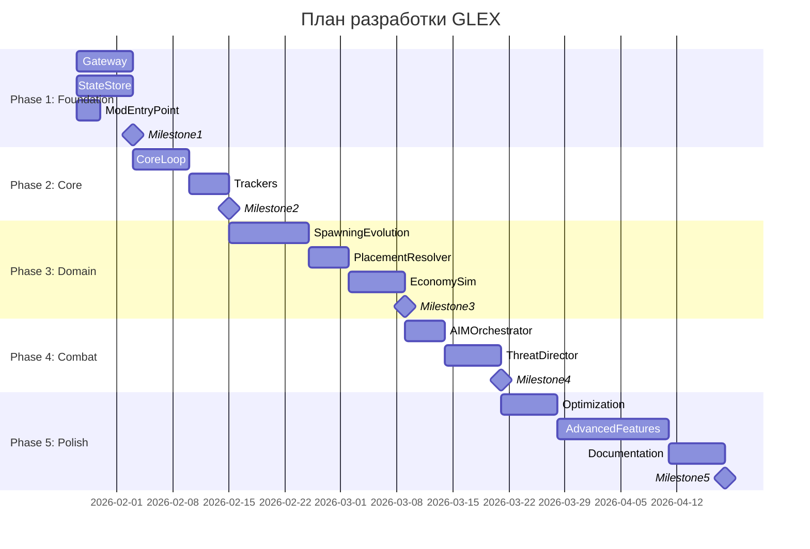

# План модульной разработки GalacticExpansion (GLEX)

**Версия:** 1.0  
**Дата:** 24.01.2026  
**Статус:** Утверждено

---

## 1. Философия модульного монолита

### 1.1 Обоснование подхода

Проект GLEX использует архитектуру **модульного монолита** — единого приложения (DLL) с четко выделенными функциональными модулями.

**Преимущества подхода:**

1. **Снижение когнитивной нагрузки:** Разработчики и AI-ассистенты фокусируются на конкретной бизнес-области
2. **Упрощение разработки:** Четкие границы между модулями минимизируют непреднамеренные зависимости
3. **Обеспечение гибкости:** В будущем любой модуль может быть относительно легко выделен в отдельный микросервис
4. **Тестируемость:** Модули тестируются независимо друг от друга
5. **Параллельная разработка:** Разные модули могут разрабатываться параллельно

### 1.2 Принципы модульного дизайна

**Основные принципы:**

- **Слабая связь (Low Coupling):** Модули взаимодействуют через четкие интерфейсы и события
- **Высокая связность (High Cohesion):** Весь код, относящийся к одной области, находится в одном модуле
- **Независимость:** Модули не зависят от деталей реализации друг друга
- **Заменяемость:** Реализация модуля может быть заменена без влияния на другие модули

---

## 2. Карта модулей и зависимостей

### 2.1 Граф зависимостей модулей



### 2.2 Категории модулей

| Категория | Модули | Описание |
|-----------|--------|----------|
| **Foundation (Фундамент)** | Gateway, StateStore | Базовые сервисы, необходимые для всех остальных модулей |
| **Core (Ядро)** | Core Loop, Event Bus | Центральная логика симуляции и координация |
| **Domain (Домен)** | SpawnEvo, EcoSim, ThreatDir | Бизнес-логика специфичных областей |
| **Infrastructure (Инфраструктура)** | PlayerTracker, StructTracker | Отслеживание состояния игрового мира |
| **Integration (Интеграция)** | AIM Orchestrator, Placement | Интеграция с внешними системами |

---

## 3. Порядок разработки (Phases)

### Phase 1: Foundation — Закладка фундамента (Недели 1-2)

**Цель:** Создать базовую инфраструктуру для работы мода

**Модули:**

#### 1.1 Empyrion Gateway (Приоритет: Критический)

**Задачи:**
- [ ] Реализовать базовый Gateway с отправкой запросов
- [ ] Реализовать Sequence Manager для сопоставления запросов и ответов
- [ ] Реализовать Request Queue с приоритетами
- [ ] Реализовать Rate Limiter
- [ ] Создать интерфейсы IEntityOperations, IStructureOperations

**Критерии готовности:**
- Успешная отправка и получение ответа от ModAPI
- Работающий timeout для запросов
- Rate limiting работает корректно
- Unit-тесты покрывают основные сценарии

**Зависимости:** Нет

**Время:** 1 неделя

---

#### 1.2 State Store (Приоритет: Критический)

**Задачи:**
- [ ] Реализовать загрузку state.json
- [ ] Реализовать атомарную запись state.json
- [ ] Реализовать создание и восстановление из бэкапов
- [ ] Реализовать базовую миграционную систему
- [ ] Создать модели данных (SimulationState, Colony и т.д.)

**Критерии готовности:**
- Корректная сериализация/десериализация JSON
- Нет потери данных при сбое
- Бэкапы создаются автоматически
- Unit-тесты для миграций

**Зависимости:** Нет

**Время:** 1 неделя

---

#### 1.3 Mod Entry Point (Приоритет: Критический)

**Задачи:**
- [ ] Реализовать ModInterface
- [ ] Настроить Dependency Injection
- [ ] Реализовать lifecycle управление (Init, Shutdown)
- [ ] Настроить логирование (NLog)
- [ ] Создать конфигурационную систему

**Критерии готовности:**
- Мод загружается на dedicated server без ошибок
- Логирование работает
- Конфигурация читается корректно
- Graceful shutdown без крашей

**Зависимости:** Нет

**Время:** 3 дня

---

**Milestone 1: Foundation Complete**

**Критерии:**
- [x] Мод загружается и корректно инициализируется
- [x] Gateway отправляет и получает ответы от API
- [x] State Store читает и пишет файлы
- [x] Нет критичных багов
- [x] Code coverage > 60%

---

### Phase 2: Core — Ядро симуляции (Недели 3-4)

**Цель:** Реализовать основной цикл симуляции и базовую логику

**Модули:**

#### 2.1 Core Loop & Simulation Engine (Приоритет: Критический)

**Задачи:**
- [ ] Реализовать SimulationEngine с таймером
- [ ] Реализовать Module Registry
- [ ] Реализовать Event Bus
- [ ] Реализовать Colony Manager
- [ ] Создать базовый SimulationContext

**Критерии готовности:**
- Simulation loop работает с частотой 1 tick/second
- Модули регистрируются и обновляются
- События публикуются и обрабатываются
- Состояние сохраняется периодически
- Integration тесты проходят

**Зависимости:** Phase 1 (Gateway, StateStore)

**Время:** 1 неделя

---

#### 2.2 Player Tracker & Structure Tracker (Приоритет: Высокий)

**Задачи:**
- [ ] Реализовать PlayerTracker с подпиской на Event_Player_ChangedPlayfield
- [ ] Реализовать StructureTracker с периодическим Request_GlobalStructure_List
- [ ] Реализовать детектирование создания/уничтожения структур
- [ ] Создать события PlayerEnteredPlayfield, StructureDestroyed

**Критерии готовности:**
- Корректное отслеживание игроков на playfield'ах
- Детектирование разрушений работает
- События публикуются своевременно
- Unit и Integration тесты

**Зависимости:** Phase 1 (Gateway), 2.1 (CoreLoop)

**Время:** 5 дней

---

**Milestone 2: Core Complete**

**Критерии:**
- [x] Симуляция работает непрерывно без крашей
- [x] Игроки и структуры отслеживаются корректно
- [x] События обрабатываются
- [x] Логи показывают нормальную работу

---

### Phase 3: Domain — Бизнес-логика (Недели 5-7)

**Цель:** Реализовать основную геймплейную функциональность

**Модули:**

#### 3.1 Spawning & Evolution (Приоритет: Критический)

**Задачи:**
- [ ] Реализовать Entity Spawner для структур
- [ ] Реализовать NPC Spawner
- [ ] Реализовать Entity Destroyer
- [ ] Реализовать Stage Manager с FSM
- [ ] Реализовать Prefab Registry
- [ ] Создать логику переходов между стадиями

**Критерии готовности:**
- Структуры спавнятся на правильных позициях
- NPC спавнятся с корректной фракцией
- Переходы между стадиями работают
- Старые структуры удаляются, новые создаются
- Все стадии от LandingPending до BaseMax реализованы

**Зависимости:** Phase 2 (CoreLoop, Trackers)

**Время:** 1.5 недели

---

#### 3.2 Placement Resolver (Приоритет: Высокий)

**Задачи:**
- [ ] Реализовать алгоритм спирального поиска места
- [ ] Реализовать проверки дистанций
- [ ] Реализовать эвристику определения высоты
- [ ] Создать PlacementCriteria систему
- [ ] Добавить валидацию найденных мест

**Критерии готовности:**
- Места находятся корректно
- Структуры не спавнятся поверх игроков
- Алгоритм завершается за приемлемое время (< 5с)
- Unit-тесты для алгоритма поиска

**Зависимости:** Phase 1 (Gateway)

**Время:** 5 дней

---

#### 3.3 Economy Sim (Приоритет: Средний)

**Задачи:**
- [ ] Реализовать систему виртуальных ресурсов
- [ ] Реализовать расчет производства (resources += rate * dt)
- [ ] Реализовать Resource Nodes
- [ ] Создать логику спавна ресурсных аванпостов
- [ ] Интегрировать с Stage Manager (влияние ресурсов на переходы)

**Критерии готовности:**
- Ресурсы накапливаются согласно формуле
- Аванпосты спавнятся в правильных местах
- Ресурсы влияют на скорость развития
- Сохранение и загрузка ресурсных данных

**Зависимости:** 3.1 (SpawnEvo), 3.2 (Placement)

**Время:** 1 неделя

---

**Milestone 3: Basic Gameplay Complete**

**Критерии:**
- [x] Колонии спавнятся и проходят через стадии
- [x] Логистические корабли появляются и исчезают
- [x] Базы улучшаются от L1 до L3
- [x] Ресурсные аванпосты создаются
- [x] Все видно игрокам на планете

---

### Phase 4: Combat & Threats — Боевая система (Недели 8-9)

**Цель:** Реализовать систему угроз и боевых взаимодействий

**Модули:**

#### 4.1 AIM Orchestrator (Приоритет: Высокий)

**Задачи:**
- [ ] Реализовать Command Validator с whitelist
- [ ] Реализовать Rate Limiter для AIM команд
- [ ] Реализовать обертки для aim aga, aim tdw, aim adb
- [ ] Создать очередь AIM команд
- [ ] Добавить подробное логирование команд

**Критерии готовности:**
- AIM команды выполняются корректно
- Whitelist работает, запрещенные команды блокируются
- Rate limit соблюдается
- Нет спама в консоль
- Security тесты проходят

**Зависимости:** Phase 1 (Gateway)

**Время:** 5 дней

---

#### 4.2 Threat Director (Приоритет: Высокий)

**Задачи:**
- [ ] Реализовать алгоритм расчета уровня угрозы
- [ ] Реализовать активацию патрулей при входе игрока
- [ ] Реализовать систему волн атак
- [ ] Реализовать эскалацию при разрушениях
- [ ] Создать систему cooldown для атак

**Критерии готовности:**
- Патрули появляются при входе игрока
- Волны атак активируются корректно
- Усиление обороны работает при разрушениях
- Лимиты соблюдаются
- Балансировка настраивается через конфиг

**Зависимости:** 4.1 (AIMOrch), Phase 2 (Trackers)

**Время:** 1 неделя

---

**Milestone 4: Combat System Complete**

**Критерии:**
- [x] Игроки встречают сопротивление при высадке
- [x] Волны атак происходят на базы игроков
- [x] Разрушения вызывают реакции
- [x] Баланс настраивается и работает адекватно

---

### Phase 5: Polish & Extensions — Полировка и расширения (Недели 10-12)

**Цель:** Доработка, оптимизация и добавление дополнительных возможностей

**Задачи:**

#### 5.1 Optimization & Performance

**Задачи:**
- [ ] Профилирование производительности
- [ ] Оптимизация алгоритмов (если требуется)
- [ ] Оптимизация частоты API-запросов
- [ ] Тестирование под нагрузкой (100+ игроков)
- [ ] Мониторинг потребления памяти

**Критерии готовности:**
- CPU usage < 5% при 20 игроках
- Нет утечек памяти при длительной работе
- Latency игроков не увеличивается
- Load tests проходят успешно

**Время:** 1 неделя

---

#### 5.2 Advanced Features (Post-MVP)

**Опциональные возможности:**
- [ ] Экспансия на новые планеты (FR-008)
- [ ] Порталы и верфи (FR-009)
- [ ] Метеоритные дожди (FR-010)
- [ ] Дополнительные типы колоний
- [ ] Кастомизация префабов через конфиг

**Критерии готовности:**
- Каждая feature полностью реализована
- Интеграционные тесты проходят
- Документация обновлена

**Время:** 2 недели (опционально)

---

#### 5.3 Documentation & Tooling

**Задачи:**
- [ ] Обновление всей документации
- [ ] Создание Admin Guide
- [ ] Создание примеров конфигурации
- [ ] Создание troubleshooting guide
- [ ] Видео-демонстрация работы мода

**Время:** 1 неделя

---

**Milestone 5: Release Candidate**

**Критерии:**
- [x] Все функции MVP реализованы
- [x] Нет критичных багов
- [x] Производительность соответствует требованиям
- [x] Документация завершена
- [x] Готов к тестированию на production сервере

---

## 4. Критерии готовности модулей

### 4.1 Definition of Done (DoD) для модуля

Модуль считается готовым, когда:

**Код:**
- [ ] Все задачи модуля реализованы
- [ ] Код соответствует C# coding conventions
- [ ] Все публичные API задокументированы (XML-комментарии)
- [ ] Нет критичных warnings от code analyzer

**Тесты:**
- [ ] Unit-тесты покрывают > 70% кода модуля
- [ ] Integration-тесты для основных сценариев написаны
- [ ] Все тесты проходят (green)
- [ ] Нет flaky tests

**Документация:**
- [ ] Создан файл в docs/architecture/modules/
- [ ] Описаны интерфейсы и основные классы
- [ ] Приведены примеры использования
- [ ] Обновлена архитектурная документация

**Качество:**
- [ ] Code review пройден (или self-review для AI-assisted development)
- [ ] Нет known issues или они задокументированы
- [ ] Логирование на правильных уровнях
- [ ] Обработка ошибок реализована

---

### 4.2 Entry Criteria для начала разработки модуля

Можно начинать разработку модуля, когда:

1. **Все зависимости готовы** (согласно графу зависимостей)
2. **Интерфейсы зависимостей определены** (можно использовать моки для тестирования)
3. **Требования четко определены** (есть ссылка на FR из ТЗ)
4. **Архитектурный дизайн завершен** (модуль описан в архитектурном плане)

---

## 5. Интеграционные точки

### 5.1 Интеграция между модулями

**Gateway ↔ Domain Modules:**
```csharp
// Все домен-модули используют Gateway для взаимодействия с игрой
public class EntitySpawner
{
    private readonly IEmpyrionGateway _gateway;
    
    public async Task<int> SpawnStructureAsync(...)
    {
        return await _gateway.SendRequestAsync<int>(
            CmdId.Request_Entity_Spawn, 
            spawnInfo
        );
    }
}
```

**Core Loop ↔ Simulation Modules:**
```csharp
// Модули регистрируются в Core Loop и получают обновления
public class EconomySimulator : ISimulationModule
{
    public void OnSimulationUpdate(SimulationContext context)
    {
        foreach (var colony in context.CurrentState.Colonies)
        {
            UpdateProduction(colony, context.DeltaTime);
        }
    }
}
```

**Event Bus ↔ All Modules:**
```csharp
// Модули взаимодействуют через события
_eventBus.Subscribe<PlayerEnteredPlayfieldEvent>(e =>
{
    ActivateDefenses(e.Playfield);
});
```

---

### 5.2 Критические интеграционные тесты

**Test 1: Full Colony Lifecycle**
```
Создание колонии → DropShip → ConstructionYard → BaseL1 → BaseL2 → BaseL3 → BaseMax
```

**Test 2: Player Interaction**
```
Игрок входит на планету → Патрули активируются → Игрок атакует базу → Усиление обороны
```

**Test 3: Resource System**
```
Создание аванпоста → Добыча ресурсов → Накопление → Ускорение апгрейда
```

**Test 4: State Persistence**
```
Создание колоний → Сохранение → Остановка → Загрузка → Проверка состояния
```

---

## 6. Риски и митигация

### 6.1 Технические риски

| Риск | Вероятность | Влияние | Митигация |
|------|-------------|---------|-----------|
| **ModAPI нестабилен** | Средняя | Высокое | Extensive error handling, retry logic, circuit breaker |
| **Проблемы производительности** | Средняя | Высокое | Раннее профилирование, load tests, оптимизация алгоритмов |
| **Сложность размещения структур** | Высокая | Среднее | Эвристики, fallback стратегии, конфигурируемые параметры |
| **Баланс геймплея** | Высокая | Среднее | Конфигурируемость всех параметров, тестирование на test сервере |

### 6.2 Организационные риски

| Риск | Вероятность | Влияние | Митигация |
|------|-------------|---------|-----------|
| **Изменение требований** | Средняя | Среднее | Модульная архитектура, гибкость в дизайне |
| **Недостаток времени** | Средняя | Высокое | Приоритизация MVP, post-MVP features опциональны |
| **Сложность интеграции** | Низкая | Высокое | Четкие интерфейсы, Integration tests на каждом этапе |

---

## 7. Timeline Summary



**Общий срок разработки MVP:** 8 недель (до Milestone 4)  
**Полный срок с расширениями:** 12 недель (до Milestone 5)

---

## 8. Связь с другими документами

- **[01_Техническое_задание.md](01_Техническое_задание.md)** — функциональные требования для реализации
- **[02_Архитектурный_план.md](02_Архитектурный_план.md)** — архитектура модулей
- **[03_Технический_проект.md](03_Технический_проект.md)** — детальная реализация модулей
- **[09_Testing_Strategy.md](09_Testing_Strategy.md)** — стратегия тестирования на каждом этапе