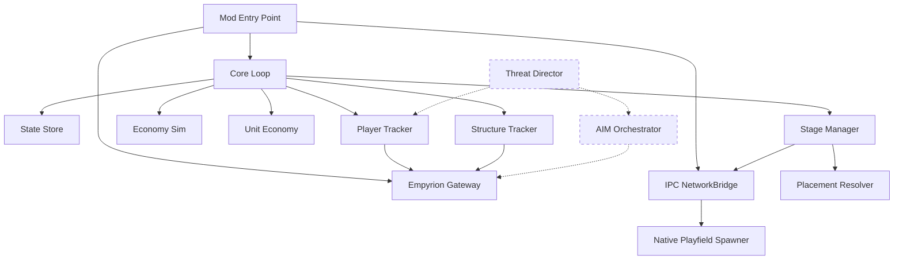

# План модульной разработки GalacticExpansion (GLEX)

**Версия:** 2.0  
**Дата:** 02.10.2026  
**Статус:** Актуализирован по коду и проверке в игре  
**Опора:** `memory-bank/activeContext.md`, `memory-bank/progress.md`, `11_Colony_Virtualization.md`, `12_Multi_Process_IPC_Architecture.md`, `projectbrief.md` (MVP)

Календарь версии 1.0 (недели с 27.01.2026) снят. Ниже — фактическое состояние на 02.10.2026 и порядок оставшейся работы.

---

## 0. Сводка

| Фаза | Статус | Что это значит сейчас |
|------|--------|------------------------|
| 1. Foundation | Закрыта | Мод грузится, Gateway и State Store работают |
| 2. Core | Закрыта | Симуляция, события, трекеры игроков и структур |
| 3. Domain | Частично | Виртуальная колония, экономика в памяти, материализация префаба стадии |
| 3.5. IPC и рельеф | Закрыта | Спавн структуры идёт Dedi → PfServer, Y считает `GetTerrainHeightAt` |
| 3-остаток | Открыт | Смена и откат префаба в мире, видимый корабль, аванпосты |
| 4. Combat | Не начата | AIM Orchestrator и Threat Director |
| 5. Polish | Не начата | Нагрузка, транспорт, экспансия, порталы, метеоры |

**Подтверждено в игре (02.10.2026):** `BA_ZiraxOutpost` материализуется и стоит на земле.  
**Unit-тесты на эту дату:** 167/167.

**Ближайший код:** IPC-удаление сущности, затем проверка смены префаба стадии в игре. После этого — Phase 4.

---

## 1. Философия модульного монолита

Проект — одна DLL с границами модулей. В рантайме Empyrion поднимает её в двух процессах: dedicated и playfield-сервер. Спавн структур и чтение рельефа живут в playfield-процессе. Dedicated держит симуляцию и шлёт команды по IPC.

Принципы:

- Модули связаны интерфейсами и `EventBus`.
- Код одной области лежит в одном модуле.
- Реализацию модуля можно заменить, не переписывая соседей.
- На dedicated нет `EntitySpawner`. Физический спавн — `IPCEntitySpawner` → `NativePlayfieldSpawner`.

---

## 2. Карта модулей


```mermaid
graph TB
    ModEntry[Mod Entry Point]

    CoreLoop[Core Loop]
    Gateway[Empyrion Gateway]
    StateStore[State Store]
    IPC[IPC NetworkBridge]

    SpawnEvo[Stage Manager]
    Placement[Placement Resolver]
    EcoSim[Economy Sim]
    UnitEco[Unit Economy]

    PfSpawn[Native Playfield Spawner]

    AIMOrch[AIM Orchestrator]
    ThreatDir[Threat Director]

    PlayerTracker[Player Tracker]
    StructTracker[Structure Tracker]

    ModEntry --> CoreLoop
    ModEntry --> Gateway
    ModEntry --> IPC

    CoreLoop --> StateStore
    CoreLoop --> PlayerTracker
    CoreLoop --> StructTracker
    CoreLoop --> SpawnEvo
    CoreLoop --> EcoSim
    CoreLoop --> UnitEco

    SpawnEvo --> IPC
    SpawnEvo --> Placement
    IPC --> PfSpawn

    PlayerTracker --> Gateway
    StructTracker --> Gateway

    ThreatDir -.-> AIMOrch
    AIMOrch -.-> Gateway
    ThreatDir -.-> PlayerTracker

    style AIMOrch stroke-dasharray: 5 5
    style ThreatDir stroke-dasharray: 5 5
```

Пунктир — модули, которых в коде ещё нет. Модели `AIMSettings` и `ThreatSettings` в конфигурации уже есть.

| Категория | Модули | Состояние |
|-----------|--------|-----------|
| Foundation | Gateway, State Store, Mod Entry | В игре |
| Core | Simulation Engine, Event Bus, Colony Manager | В игре |
| Domain | Stage Manager, Economy, Unit Economy, Placement | Код есть; видимая смена базы и аванпосты — нет |
| IPC | NetworkBridge, EmpyrionModChannel, NativePlayfieldSpawner | В игре для спавна структуры |
| Infrastructure | Player Tracker, Structure Tracker | В игре |
| Combat | AIM Orchestrator, Threat Director, Hostility Tracker | Только документы и секции конфига |

---

## 3. Порядок разработки

### Phase 1: Foundation — закрыта

#### 1.1 Empyrion Gateway

- [x] Отправка запросов и сопоставление ответов (`SequenceManager`)
- [x] Очередь и rate limit
- [x] `TryCompleteResponse`: `data == null` не роняет разбор (`Event_Ok`)

Спавн сущности через Gateway на dedicated игру не материализует: ответ `Event_Ok` без entity id. Рабочий спавн описан в Phase 3.5.

#### 1.2 State Store

- [x] Чтение и атомарная запись `state.json`, бэкапы
- [x] Модели `SimulationState`, `Colony` и связанные типы

Во время тика состояние берётся из памяти `SimulationEngine`. `LoadAsync` на каждом тике не вызывается. Запись — автосохранение раз в 60 секунд и при остановке.

#### 1.3 Mod Entry Point

- [x] `ModInterface`, жизненный цикл, NLog, конфигурация
- [x] Раздельная инициализация dedicated и playfield-сервера

**Milestone 1 — выполнен.** Мод инициализируется, Gateway ходит в API, состояние пишется на диск.

---

### Phase 2: Core — закрыта

#### 2.1 Core Loop

- [x] `SimulationEngine`, реестр модулей, `EventBus`, `ColonyManager`, `SimulationContext`
- [x] Старт симуляции в конце инициализации dedicated, без ожидания игрока
- [x] `ColonyTickModule`: виртуальная колония на домашнем playfield, если колоний ещё нет

Из `Game_Update` запрещены `.Result`, `.Wait()` и `.GetAwaiter().GetResult()` на async-методах игры: это deadlock на главном потоке Unity. Материализация уходит в `Task.Run` с паузой 3 секунды и флагом «уже выполняется».

#### 2.2 Player Tracker и Structure Tracker

- [x] Игроки по `Event_Player_ChangedPlayfield`
- [x] Структуры по `Request_GlobalStructure_List`
- [x] События входа на playfield и создания/уничтожения структур

**Milestone 2 — выполнен.** Симуляция идёт, игроки и структуры отслеживаются, события публикуются.

---

### Phase 3: Domain — частично закрыта

#### 3.1 Spawning и стадии

- [x] `StageManager`: проверка перехода, виртуальный переход, материализация префаба текущей стадии
- [x] Префаб берётся из `Zirax.Stages`, где `Stage` равен `colony.Stage.ToString()`
- [x] Имя префаба — файл в `Content/Prefabs` без `.epb`. Рабочий конфиг: стадии `BA_ZiraxOutpost`
- [x] Начисление стартовых ресурсов при создании колонии (эквивалент доставки груза в данных)
- [x] Протокол `SpawnNPC` в IPC
- [ ] Удаление старой структуры при апгрейде материализованной колонии
- [ ] Откат стадии с заменой префаба в мире
- [ ] Охранники стадии, подтверждённые в игре
- [ ] Видимый логистический корабль: появление, «доставка», исчезновение (FR-004)

`TransitionToNextStageAsync` для уже материализованной колонии вызывает `DestroyEntityAsync`. На dedicated `IPCEntitySpawner` этот метод завершает ошибкой: маршрута удаления через IPC нет. Пока этот вызов стоит в переходе, смена префаба в мире не завершается.

`DowngradeColonyAsync` меняет стадию в состоянии и обнуляет `MainStructureId`. Новый префаб предыдущей стадии не ставится.

Виртуальная колония стадии меняет в памяти. В мире при материализации появляется префаб той стадии, на которой колония была в момент спавна.

#### 3.2 Placement Resolver

- [x] Поиск точки и проверки дистанций до игроков и чужих структур
- [x] Критерии из конфига (`MinDistanceFromPlayers`, `MinDistanceFromPlayerStructures`, `SearchRadius`)
- [x] Итоговая высота структуры считается на playfield-сервере, не в resolver

При сбое поиска `MaterializeColonyAsync` подставляет запасную точку `(0, 100, 0)`. В запрос спавна с привязкой к рельефу уходят X и Z. Y из этой точки в `SpawnPrefab` не передаётся.

#### 3.3 Economy и юниты

- [x] Виртуальные ресурсы: производство от стадии и `deltaTime`
- [x] Списание ресурсов при переходе стадии
- [x] `UnitEconomyManager`: производство, вместимость, учёт потери юнита, штраф за потерю аванпоста в данных
- [ ] Появление ресурсных аванпостов в мире (FR-007)
- [ ] Связка разрушения аванпоста в игре с `OnResourceOutpostDestroyed`

`AddResourceNode` меняет бонус производства. Цикл колонии сам узлы не создаёт и структуры аванпостов не спавнит.

**Milestone 3 — не закрыт.** Закрыто:

- [x] Колония живёт в состоянии до прихода игрока и материализуется структурой текущей стадии
- [x] Эта структура стоит на земле (`BA_ZiraxOutpost`, 02.10.2026)
- [x] Ресурсы и стадия копятся в памяти

Открыто:

- [ ] Игрок видит смену базы от стройплощадки к L1–L3 и обратно после разрушения
- [ ] Логистический корабль появляется и исчезает
- [ ] Ресурсные аванпосты стоят на планете

---

### Phase 3.5: IPC и высота рельефа — закрыта

Этой фазы в версии 1.0 не было. Она стала обязательной: ModAPI-спавн с dedicated сущность не создаёт.

- [x] Канал `INetwork` только из `EmpyrionModChannel` (сборка `GalacticExpansion.dll`)
- [x] `DeserializeMessage` читает поле `type`, затем конкретный класс
- [x] `PlayfieldReadyNotification`: playfield-сервер сообщает, что спавнер готов
- [x] `SpawnStructure`: dedicated шлёт X/Z, `SnapToTerrain=true`, `HeightOffset=0.5`
- [x] Playfield-сервер: `Y = GetTerrainHeightAt(x, z) + offset`, затем `SpawnPrefab`
- [x] Ошибка чтения рельефа отменяет спавн
- [x] На dedicated `EntitySpawner` не создаётся

Цепочка, которая уже работает:

```
Dedi: MaterializeColonyAsync
  → префаб стадии из Zirax.Stages
  → IPC SpawnStructure (snap, X/Z, hoff=0.5)
PfServer: GetTerrainHeightAt → Y → SpawnPrefab
```

Документы: [12_Multi_Process_IPC_Architecture.md](12_Multi_Process_IPC_Architecture.md), [11_Colony_Virtualization.md](11_Colony_Virtualization.md).

---

### Phase 3-остаток: видимая эволюция базы

Цель — довести FR-004, FR-005 и FR-007 до того, что видит игрок. Боевая фаза опирается на базу, которую можно снести и отстроить.

#### 3.4 IPC Destroy и смена префаба

- [ ] Сообщение удаления сущности Dedi → PfServer и ответ с результатом
- [ ] `DestroyEntityAsync` / `DestroyEntitiesAsync` на dedicated идут через этот канал
- [ ] `TransitionToNextStageAsync` удаляет старый префаб и ставит префаб новой стадии на тех же X/Z с привязкой к рельефу
- [ ] `DowngradeColonyAsync` так же ставит префаб предыдущей стадии
- [ ] Проверка в игре: апгрейд и откат меняют постройку, колония не зависает после исключения

Зависимости: Phase 3.5.

#### 3.5 Видимая логистика (FR-004)

- [ ] Корабль или капсула появляется у точки колонии, затем исчезает
- [ ] После этого в мире есть структура стадии (уже умеет Phase 3.5)
- [ ] Лимиты и интервал берутся из конфига

Сейчас при создании колонии в состояние сразу пишется запас ресурсов на стройплощадку и BaseL1 с коэффициентом 1.1. Отдельной сущности корабля нет.

Зависимости: 3.4, если корабль надо убирать тем же IPC.

#### 3.6 Ресурсные аванпосты (FR-007)

- [ ] На стадиях, где `CanCreateResourceOutposts`, спавнится префаб из `Zirax.ResourceOutposts`
- [ ] Узел пишется в `colony.ResourceNodes` и поднимает производство
- [ ] Разрушение структуры аванпоста снимает узел и режет производство юнитов
- [ ] Число аванпостов не выше `MaxResourceOutposts`
- [ ] Имена префабов есть в `Content/Prefabs` (дефолты загрузчика `BA_MiningOutpost_Zirax_*` в ванильной игре отсутствуют; рабочий пример другого префаба — `BA_ZiraxSkyminer`)

Зависимости: 3.2, 3.4, 3.5 по желанию порядка с логистикой.

---

### Phase 4: Combat — не начата

Цель MVP из `projectbrief.md`: патруль при высадке, волны на базу игрока, усиление после разрушений.

#### 4.1 AIM Orchestrator

- [ ] Валидатор команд и whitelist
- [ ] Очередь и rate limit на `Request_ConsoleCommand`
- [ ] Обёртки `aim aga`, `aim tdw`, `aim adb`
- [ ] Журнал каждой команды

Критерий: запрещённая команда не уходит в консоль, лимит из `AIM` в конфиге соблюдается.

Зависимости: Gateway. Модуля в `src/` нет.

#### 4.2 Threat Director

- [ ] Уровень угрозы от присутствия игрока и разрушений
- [ ] Патруль при входе игрока на playfield колонии
- [ ] Волны и cooldown
- [ ] Усиление обороны после `StructureDestroyed`
- [ ] Параметры только из конфига `ThreatDirector`

Зависимости: 4.1, трекеры, спавн NPC через IPC (протокол уже есть).

#### 4.3 Hostility Tracker

Документ модуля есть (`Module_12_Hostility_Tracker.md`). Кода нет.

- [ ] Накопление враждебности игрока
- [ ] Выбор цели «Most Wanted»
- [ ] Связка с Threat Director

**Milestone 4 — не начат.**

- [ ] Игрок встречает патруль при высадке
- [ ] Волна приходит на базу игрока
- [ ] Разрушение колонии видимо откатывает стадию и усиливает ответ
- [ ] Баланс крутится конфигом без правки кода

---

### Phase 5: Polish и расширения — не начата

Вне первого релиза, пока Milestone 4 открыт.

#### 5.1 Нагрузка

- [ ] Профиль CPU и памяти на длинной сессии
- [ ] Частота запросов ModAPI под лимитом dedicated
- [ ] Цель из ТЗ: CPU ниже 5% при 20 игроках, сессия дольше 24 часов без падения мода

#### 5.2 После MVP

- [ ] Transport Manager — доставка юнитов кораблём вместо мгновенного спавна (`Module_14`)
- [ ] Экспансия на новую планету (FR-008)
- [ ] Портал и верфь (FR-009)
- [ ] Метеоритный дождь (FR-010)
- [ ] Дополнительные типы колоний
- [ ] Смена префабов только конфигом, без новой сборки (имена уже читаются из `Zirax.Stages`)

#### 5.3 Документы эксплуатации

- [ ] Admin Guide и примеры рабочего `Configuration.json` (префабы, которые есть на сервере)
- [ ] Troubleshooting по IPC, рельефу и префабам

**Milestone 5 — не начат.**

---

## 4. Критерии готовности модуля

Модуль готов, когда:

- Задачи раздела закрыты, публичные API имеют XML-комментарии на русском.
- Unit-тесты на логику модуля зелёные; интеграционные — на сценарий модуля.
- Поведение, которое видит игрок (спавн, удаление, патруль), проверено на dedicated, а не только тестом.
- Ошибки логируются, известный обход записан в `progress.md`.
- Для спавна и удаления соблюдены инварианты IPC из `systemPatterns.md`.

Начинать модуль можно, когда готовы его зависимости из графа выше и интерфейсы этих зависимостей уже можно подменить в тесте.

---

## 5. Интеграции, которые уже обязательны

**Спавн структуры**

```csharp
// Dedicated: только X/Z и привязка к земле.
await entitySpawner.SpawnStructureAtTerrainAsync(
    playfield, prefabName, x, z, factionId, heightOffset: 0.5f);
```

Playfield-сервер поднимает Y сам. Повторный спавн берёт X и Z из `colony.Position`. Поле Y там может остаться запасным.

**Тик колонии**

`ColonyManager.UpdateColonyAsync` обновляет производство, юниты и проверяет переход стадии. Физический touch структур — только если `IsVirtual == false`.

**События**

Модули подписываются на `EventBus` (`PlayerEnteredPlayfield`, `StructureDestroyed`, `StageTransition`). Threat Director, когда появится, входит так же.

### Сценарии, которые ещё нужно прогнать в игре

1. Апгрейд материализованной колонии меняет префаб, старый id исчезает.
2. Разрушение базы откатывает стадию и ставит предыдущий префаб.
3. Игрок входит на планету — появляется патруль.
4. Аванпост увеличивает производство; его уничтожение уменьшает производство.
5. Рестарт dedicated поднимает те же колонии из `state.json`.

---

## 6. Риски

| Риск | Состояние | Что делать |
|------|-----------|------------|
| Спавн через Gateway на dedicated не создаёт сущность | Уже случилось | Только IPC и `SpawnPrefab` на playfield-сервере |
| `GetResult` в `Game_Update` вешает сервер | Уже случилось | `Task.Run`, пауза, флаг занятости |
| `INetwork` из другой сборки молча теряет пакет | Уже случилось | Вызовы только из `EmpyrionModChannel` |
| Смена стадии вызывает `DestroyEntityAsync` на dedicated | Открыто | Phase 3.4 |
| Имени префаба нет в `Content/Prefabs` | `SpawnPrefab` возвращает -1 | В конфиге сервера только существующие имена |
| Рельеф не читается | Спавн отменяется | Лог PfServer, повтор на следующем цикле материализации |
| Баланс боя | Ещё не на чем мерить | Все числа в конфиге, правка без пересборки логики |

---

## 7. Что делать дальше

Порядок такой, потому что патруль и откат из MVP бессмысленны, пока базу нельзя заменить в мире.

1. **IPC Destroy** и перевод `Transition` / `Downgrade` на удаление плюс спавн префаба стадии. Проверка в игре.
2. **Phase 4:** AIM Orchestrator, затем Threat Director (патруль, волна, ответ на разрушение).
3. **Видимый логистический корабль** (FR-004).
4. **Аванпосты в мире** (FR-007).
5. Нагрузка и функции Phase 5.

Пункты 3 и 4 можно поменять местами, если сначала нужен экономический геймплей, а не картинка доставки.

---

## 8. Связанные документы

- [01_Техническое_задание.md](01_Техническое_задание.md) — FR-001…FR-011
- [02_Архитектурный_план.md](02_Архитектурный_план.md)
- [03_Технический_проект.md](03_Технический_проект.md)
- [09_Testing_Strategy.md](09_Testing_Strategy.md)
- [11_Colony_Virtualization.md](11_Colony_Virtualization.md)
- [12_Multi_Process_IPC_Architecture.md](12_Multi_Process_IPC_Architecture.md)
- `docs/architecture/modules/` — контракты модулей, часть из них описывает ещё не написанный код
