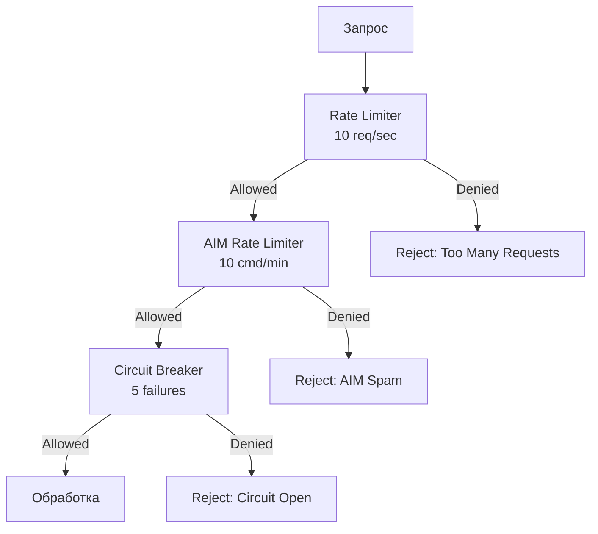

# Анализ безопасности и Abuse Cases GalacticExpansion (GLEX)

**Версия:** 1.0  
**Дата:** 24.01.2026  
**Статус:** Утверждено

---

## 1. Модель угроз

### 1.1 Категории угроз

| Категория | Описание | Вероятность | Влияние |
|-----------|----------|-------------|---------|
| **Command Injection** | Выполнение произвольных консольных команд через эксплойт | Средняя | Критическое |
| **Resource Exhaustion** | DDoS через спам API-запросов | Средняя | Высокое |
| **Data Corruption** | Модификация state.json злоумышленником | Низкая | Высокое |
| **Configuration Abuse** | Использование экстремальных значений в конфиге | Средняя | Среднее |
| **AIM Spam** | Спам AIM-команд для перегрузки сервера | Высокая | Среднее |

---

## 2. Abuse-кейсы и контрмеры

### 2.1 Abuse Case 1: Command Injection через AIM

**Сценарий:**
Злоумышленник пытается выполнить произвольные команды через параметры AIM-команд.

**Пример атаки:**
```csharp
// Попытка инжекта
string maliciousCommand = "aim aga 100 500; shutdown";
```

**Контрмеры:**

1. **Whitelist команд:**
```csharp
private static readonly HashSet<string> AllowedCommands = new HashSet<string>
{
    "aim aga",
    "aim tdw",
    "aim adb"
};

public bool IsCommandAllowed(string command)
{
    var baseCommand = command.Split(' ')[0] + " " + command.Split(' ')[1];
    return AllowedCommands.Contains(baseCommand);
}
```

2. **Санитизация параметров:**
```csharp
public string SanitizeAIMCommand(string command)
{
    // Удаление специальных символов
    command = Regex.Replace(command, @"[;|&<>]", "");
    
    // Валидация структуры
    if (!Regex.IsMatch(command, @"^aim (aga|tdw|adb) \d+( \d+)*$"))
    {
        throw new SecurityException("Invalid AIM command format");
    }
    
    return command;
}
```

3. **Логирование всех команд:**
```csharp
_logger.LogWarning($"AIM command executed: {command} by {context}");
```

---

### 2.2 Abuse Case 2: API Request Flooding

**Сценарий:**
Внешний процесс отправляет тысячи запросов к ModAPI через эксплойт мода.

**Контрмеры:**

1. **Token Bucket Rate Limiter:**
```csharp
public class RateLimiter
{
    private readonly int _capacity;
    private readonly int _refillRate;
    private int _tokens;
    private DateTime _lastRefill;
    
    public bool AllowRequest()
    {
        RefillTokens();
        
        if (_tokens > 0)
        {
            _tokens--;
            return true;
        }
        
        return false; // Rate limit exceeded
    }
    
    private void RefillTokens()
    {
        var now = DateTime.UtcNow;
        var elapsed = (now - _lastRefill).TotalSeconds;
        var tokensToAdd = (int)(elapsed * _refillRate);
        
        _tokens = Math.Min(_capacity, _tokens + tokensToAdd);
        _lastRefill = now;
    }
}
```

2. **Circuit Breaker:**
```csharp
public class CircuitBreaker
{
    private int _failureCount = 0;
    private DateTime _lastFailureTime;
    private CircuitState _state = CircuitState.Closed;
    
    public bool AllowRequest()
    {
        if (_state == CircuitState.Open)
        {
            if ((DateTime.UtcNow - _lastFailureTime).TotalSeconds > 60)
            {
                _state = CircuitState.HalfOpen;
            }
            else
            {
                return false; // Circuit is open
            }
        }
        
        return true;
    }
    
    public void RecordFailure()
    {
        _failureCount++;
        _lastFailureTime = DateTime.UtcNow;
        
        if (_failureCount >= 5)
        {
            _state = CircuitState.Open;
            _logger.LogWarning("Circuit breaker opened due to failures");
        }
    }
}
```

---

### 2.3 Abuse Case 3: State.json Modification

**Сценарий:**
Администратор с плохими намерениями модифицирует state.json для получения преимущества.

**Контрмеры:**

1. **Валидация при загрузке:**
```csharp
public async Task<SimulationState> LoadAndValidateAsync()
{
    var state = await LoadAsync();
    
    // Проверка целостности
    if (state.Colonies.Count > 100)
    {
        _logger.LogWarning("Suspicious colony count, limiting to 10");
        state.Colonies = state.Colonies.Take(10).ToList();
    }
    
    // Проверка диапазонов
    foreach (var colony in state.Colonies)
    {
        if (colony.Resources.VirtualResources > 1000000)
        {
            _logger.LogWarning($"Suspicious resource amount for {colony.Id}, resetting");
            colony.Resources.VirtualResources = 0;
        }
    }
    
    return state;
}
```

2. **Checksumming (опционально):**
```json
{
  "Version": 1,
  "Checksum": "sha256_hash_of_data",
  "Data": { ... }
}
```

---

### 2.4 Abuse Case 4: Configuration Extremes

**Сценарий:**
Администратор устанавливает экстремальные значения (например, `MaxGuardsNearColony: 10000`).

**Контрмеры:**

1. **Hard Limits:**
```csharp
public void ValidateAndClamp(Configuration config)
{
    // Hard limit: максимум 50 охранников
    if (config.Limits.MaxGuardsNearColony > 50)
    {
        _logger.LogWarning($"MaxGuardsNearColony {config.Limits.MaxGuardsNearColony} exceeds hard limit, clamping to 50");
        config.Limits.MaxGuardsNearColony = 50;
    }
    
    // Минимальный интервал тика
    if (config.Simulation.TickIntervalMs < 500)
    {
        _logger.LogWarning("TickIntervalMs too low, setting to 500ms");
        config.Simulation.TickIntervalMs = 500;
    }
}
```

---

### 2.5 Abuse Case 5: Prefab Name Injection

**Сценарий:**
Злоумышленник пытается указать системный путь вместо имени префаба.

**Контрмеры:**

1. **Path Sanitization:**
```csharp
public string SanitizePrefabName(string prefabName)
{
    // Удаление путей
    prefabName = Path.GetFileName(prefabName);
    
    // Удаление расширений
    prefabName = Path.GetFileNameWithoutExtension(prefabName);
    
    // Whitelist символов
    if (!Regex.IsMatch(prefabName, @"^[a-zA-Z0-9_-]+$"))
    {
        throw new SecurityException($"Invalid prefab name: {prefabName}");
    }
    
    return prefabName;
}
```

---

## 3. Rate Limiting и защита от спама

### 3.1 Многоуровневая защита



### 3.2 Реализация

```csharp
public class RequestPipeline
{
    private readonly IRateLimiter _globalRateLimiter;
    private readonly IRateLimiter _aimRateLimiter;
    private readonly ICircuitBreaker _circuitBreaker;
    
    public async Task<TResult> ExecuteAsync<TResult>(
        Func<Task<TResult>> action,
        RequestType type)
    {
        // Level 1: Global rate limit
        if (!_globalRateLimiter.AllowRequest())
        {
            throw new RateLimitExceededException("Global rate limit exceeded");
        }
        
        // Level 2: Type-specific rate limit
        if (type == RequestType.AIM && !_aimRateLimiter.AllowRequest())
        {
            throw new RateLimitExceededException("AIM rate limit exceeded");
        }
        
        // Level 3: Circuit breaker
        if (!_circuitBreaker.AllowRequest())
        {
            throw new CircuitBreakerOpenException("Circuit breaker is open");
        }
        
        // Execute
        try
        {
            var result = await action();
            _circuitBreaker.RecordSuccess();
            return result;
        }
        catch (Exception ex)
        {
            _circuitBreaker.RecordFailure();
            throw;
        }
    }
}
```

---

## 4. Whitelist консольных команд

### 4.1 Разрешенные команды

**Только AIM-команды:**
- `aim aga <playerId> <range>` — Guard Area
- `aim tdw <entityId>` — Trigger Drone Wave
- `aim adb <playfield> <x> <y> <z>` — Add Drone Base

**Запрещены все остальные**, включая:
- `shutdown`
- `restart`
- `destroy`
- `spawn`
- Любые пользовательские команды

### 4.2 Реализация whitelist

```csharp
public class CommandValidator : ICommandValidator
{
    private static readonly Dictionary<string, CommandSignature> AllowedCommands = new()
    {
        ["aim aga"] = new CommandSignature 
        { 
            Pattern = @"^aim aga \d+ \d+$",
            ParamTypes = new[] { typeof(int), typeof(int) }
        },
        ["aim tdw"] = new CommandSignature 
        { 
            Pattern = @"^aim tdw \d+$",
            ParamTypes = new[] { typeof(int) }
        },
        ["aim adb"] = new CommandSignature 
        { 
            Pattern = @"^aim adb \w+ -?\d+\.?\d* -?\d+\.?\d* -?\d+\.?\d*$",
            ParamTypes = new[] { typeof(string), typeof(float), typeof(float), typeof(float) }
        }
    };
    
    public bool IsCommandAllowed(string command)
    {
        var baseCommand = GetBaseCommand(command);
        
        if (!AllowedCommands.ContainsKey(baseCommand))
        {
            _logger.LogWarning($"Command not in whitelist: {baseCommand}");
            return false;
        }
        
        var signature = AllowedCommands[baseCommand];
        if (!Regex.IsMatch(command, signature.Pattern))
        {
            _logger.LogWarning($"Command doesn't match pattern: {command}");
            return false;
        }
        
        return true;
    }
    
    private string GetBaseCommand(string command)
    {
        var parts = command.Split(' ', 3);
        return parts.Length >= 2 ? $"{parts[0]} {parts[1]}" : parts[0];
    }
}
```

---

## 5. Аудит безопасности

### 5.1 Чеклист безопасности

**Перед релизом:**
- [ ] Все AIM-команды проходят через whitelist
- [ ] Rate limiting настроен и протестирован
- [ ] Circuit breaker реагирует на failures
- [ ] Валидация конфигурации работает
- [ ] Санитизация prefab names реализована
- [ ] Логирование всех критичных операций включено
- [ ] Security unit-тесты проходят

### 5.2 Security Unit Tests

```csharp
[Fact]
public void CommandValidator_RejectsNonWhitelistedCommand()
{
    var validator = new CommandValidator();
    
    Assert.False(validator.IsCommandAllowed("shutdown"));
    Assert.False(validator.IsCommandAllowed("aim xxx 123"));
    Assert.False(validator.IsCommandAllowed("aim aga 123; shutdown"));
}

[Fact]
public void RateLimiter_BlocksExcessiveRequests()
{
    var limiter = new RateLimiter(capacity: 10, refillRate: 1);
    
    // Exhaust tokens
    for (int i = 0; i < 10; i++)
    {
        Assert.True(limiter.AllowRequest());
    }
    
    // Next request should be blocked
    Assert.False(limiter.AllowRequest());
}

[Fact]
public void PrefabSanitizer_RejectsPathTraversal()
{
    var sanitizer = new PrefabSanitizer();
    
    Assert.Throws<SecurityException>(() =>
        sanitizer.SanitizePrefabName("../../system32/cmd.exe")
    );
}
```

---

## 6. Рекомендации по безопасной эксплуатации

### 6.1 Для администраторов

1. **Не давайте доступ к файлам мода обычным игрокам**
2. **Регулярно проверяйте логи на подозрительную активность**
3. **Используйте рекомендуемые значения конфигурации**
4. **Не отключайте rate limiting**
5. **Делайте бэкапы state.json перед изменениями**

### 6.2 Мониторинг подозрительной активности

**Признаки атаки в логах:**
```
[WARN] Rate limit exceeded for AIM commands (100 attempts in 1 minute)
[WARN] Command not in whitelist: shutdown
[ERROR] Multiple circuit breaker failures
[WARN] Suspicious colony count: 500
```