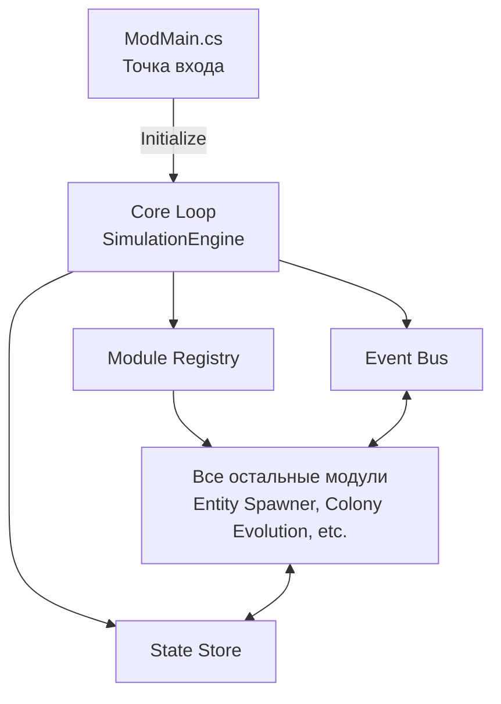
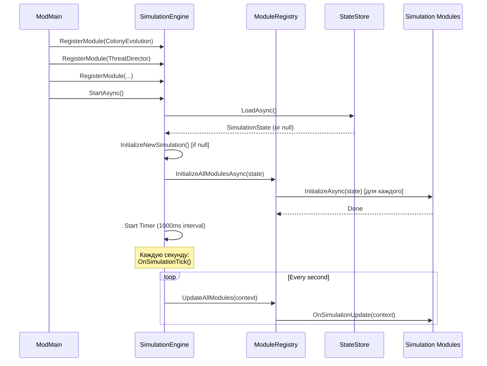

# Модуль: Core Loop & Simulation Engine

**Приоритет разработки:** 1 (Критический - разрабатывается первым)  
**Зависимости:** Module_03 (StateStore)  
**Статус:** 🟢 Спецификация готова

---

## 1. Назначение модуля

Core Loop — это **сердце симуляции**, главный координатор всех модулей. Запускает периодические обновления (тики), управляет жизненным циклом системы и обеспечивает связь между модулями через EventBus.

---

## 2. Архитектурный контекст



---

## 3. Интерфейсы

### 3.1 Основной интерфейс движка

```csharp
/// <summary>
/// Главный движок симуляции
/// </summary>
public interface ISimulationEngine
{
    /// <summary>
    /// Запуск симуляции
    /// Загружает состояние из StateStore, инициализирует модули, запускает таймер тиков
    /// </summary>
    Task StartAsync();
    
    /// <summary>
    /// Остановка симуляции
    /// Сохраняет состояние, останавливает все модули
    /// </summary>
    Task StopAsync();
    
    /// <summary>
    /// Регистрация модуля симуляции
    /// Должна быть выполнена ДО вызова StartAsync()
    /// </summary>
    void RegisterModule(ISimulationModule module);
    
    /// <summary>
    /// Текущее состояние симуляции (readonly)
    /// </summary>
    SimulationState State { get; }
    
    /// <summary>
    /// Статус работы симуляции
    /// </summary>
    bool IsRunning { get; }
}
```

### 3.2 Интерфейс модуля

```csharp
/// <summary>
/// Базовый интерфейс для всех модулей симуляции
/// </summary>
public interface ISimulationModule
{
    /// <summary>
    /// Уникальное имя модуля (для логирования)
    /// </summary>
    string ModuleName { get; }
    
    /// <summary>
    /// Приоритет обновления (0 = первый, 100 = последний)
    /// Модули с меньшим приоритетом обновляются раньше
    /// </summary>
    int UpdatePriority { get; }
    
    /// <summary>
    /// Инициализация модуля при старте симуляции
    /// </summary>
    Task InitializeAsync(SimulationState state);
    
    /// <summary>
    /// Обновление модуля каждый тик симуляции (1 раз в секунду)
    /// </summary>
    void OnSimulationUpdate(SimulationContext context);
    
    /// <summary>
    /// Остановка модуля
    /// </summary>
    Task ShutdownAsync();
}
```

### 3.3 Контекст симуляции

```csharp
/// <summary>
/// Контекст для обновления модулей
/// Передается в OnSimulationUpdate()
/// </summary>
public class SimulationContext
{
    /// <summary>
    /// Текущее состояние симуляции (можно изменять)
    /// </summary>
    public SimulationState CurrentState { get; set; }
    
    /// <summary>
    /// Время с последнего тика (в секундах)
    /// </summary>
    public float DeltaTime { get; set; }
    
    /// <summary>
    /// Текущее серверное время (UTC)
    /// </summary>
    public DateTime CurrentTime { get; set; }
    
    /// <summary>
    /// Номер тика с момента запуска
    /// </summary>
    public long TickNumber { get; set; }
}
```

---

## 4. Реализация

### 4.1 SimulationEngine (ключевые методы)

```csharp
public class SimulationEngine : ISimulationEngine
{
    private Timer _simulationTimer;
    private SimulationState _currentState;
    private bool _isRunning;
    private const int SimulationTickIntervalMs = 1000;
    
    public async Task StartAsync()
    {
        // ШАГ 1: Загрузка состояния
        _currentState = await _stateStore.LoadAsync() ?? InitializeNewSimulation();
        
        // ШАГ 2: Инициализация модулей
        await _moduleRegistry.InitializeAllModulesAsync(_currentState);
        
        // ШАГ 3: Запуск таймера тиков
        _simulationTimer = new Timer(OnSimulationTick, null, SimulationTickIntervalMs, SimulationTickIntervalMs);
        _isRunning = true;
        
        _eventBus.Publish(new SimulationStartedEvent { Timestamp = DateTime.UtcNow });
    }
    
    public async Task StopAsync()
    {
        _isRunning = false;
        _simulationTimer?.Change(Timeout.Infinite, Timeout.Infinite);
        
        await _stateStore.SaveAsync(_currentState);
        await _moduleRegistry.ShutdownAllModulesAsync();
    }
    
    private void OnSimulationTick(object state)
    {
        if (!_isRunning) return;
        
        var context = new SimulationContext
        {
            CurrentState = _currentState,
            DeltaTime = 1.0f,
            CurrentTime = DateTime.UtcNow,
            TickNumber = ++_tickNumber
        };
        
        _moduleRegistry.UpdateAllModules(context);
        
        // Периодическое сохранение (раз в минуту)
        if (_currentState.IsDirty && (DateTime.UtcNow - _currentState.LastSaveTime).TotalMinutes >= 1)
            _ = Task.Run(() => _stateStore.SaveAsync(_currentState));
    }
}
```

---

## 5. Module Registry & Event Bus

### 5.1 Module Registry (реализация в 03_Технический_проект.md)

**Основная логика:**
- Хранит список зарегистрированных модулей
- Сортирует по `UpdatePriority` при инициализации
- Вызывает `OnSimulationUpdate()` для каждого модуля в порядке приоритета

### 5.2 Event Bus (реализация в 03_Технический_проект.md)

**Основная логика:**
- Паттерн Pub-Sub для слабой связи модулей
- Синхронные и асинхронные события
- Thread-safe

---

## 6. Последовательность запуска



---

## 7. Порядок обновления модулей (UpdatePriority)

| Приоритет | Модуль | Причина |
|-----------|--------|---------|
| **10** | Player Tracker | Детектирование игроков должно быть первым |
| **20** | Structure Tracker | Детектирование разрушений |
| **30** | Economy Simulator | Производство ресурсов |
| **40** | Colony Evolution | Проверка условий апгрейда |
| **50** | Threat Director | Реакция на события |
| **60** | AIM Orchestrator | Управление AI |

---

## 8. Тестирование

```csharp
[Fact]
public async Task SimulationEngine_StartsAndStops_Successfully()
{
    // Arrange
    var engine = CreateSimulationEngine();
    engine.RegisterModule(new TestModule("Module1"));
    
    // Act
    await engine.StartAsync();
    Assert.True(engine.IsRunning);
    
    await Task.Delay(3000);  // Ждем 3 тика
    
    await engine.StopAsync();
    
    // Assert
    Assert.False(engine.IsRunning);
}

[Fact]
public async Task SimulationEngine_UpdatesModules_EveryTick()
{
    // Arrange
    var moduleMock = new Mock<ISimulationModule>();
    int updateCount = 0;
    
    moduleMock.Setup(m => m.OnSimulationUpdate(It.IsAny<SimulationContext>()))
        .Callback(() => updateCount++);
    
    var engine = CreateSimulationEngine();
    engine.RegisterModule(moduleMock.Object);
    
    // Act
    await engine.StartAsync();
    await Task.Delay(5500);  // ~5 тиков
    await engine.StopAsync();
    
    // Assert
    Assert.InRange(updateCount, 4, 6);  // Примерно 5 тиков
}
```

---

## 9. Чеклист разработчика

**Этап 1: Базовый движок (2 дня)**
- [ ] Реализовать `ISimulationEngine`
- [ ] Реализовать `SimulationEngine` с Timer
- [ ] Загрузка/сохранение состояния
- [ ] Unit-тесты

**Этап 2: Module Registry (1 день)**
- [ ] Реализовать `IModuleRegistry`
- [ ] Сортировка по приоритету
- [ ] Инициализация/остановка модулей

**Этап 3: Event Bus (1 день)**
- [ ] Реализовать `IEventBus`
- [ ] Pub-Sub механизм
- [ ] Thread-safety

**Этап 4: Интеграция (1 день)**
- [ ] Интеграция с ModMain
- [ ] Тестирование на реальном сервере
- [ ] Логирование и мониторинг

---

## 10. Известные проблемы

### 10.1 Проблема: Длительная обработка тика блокирует таймер

**Решение:** Использовать асинхронные обновления или пропускать тики при перегрузке

### 10.2 Проблема: Исключение в одном модуле останавливает все

**Решение:** Try-catch вокруг каждого `OnSimulationUpdate()` в Registry

---

## 11. Связь с другими документами

- **[Module_03_StateStore.md](Module_03_StateStore.md)** — загрузка/сохранение состояния
- **[02_Архитектурный_план.md](../02_Архитектурный_план.md)** — архитектурный контекст

---

**Последнее обновление:** 28.01.2026
