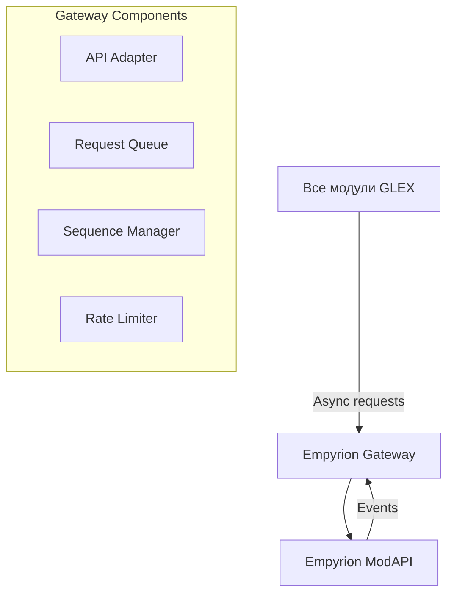
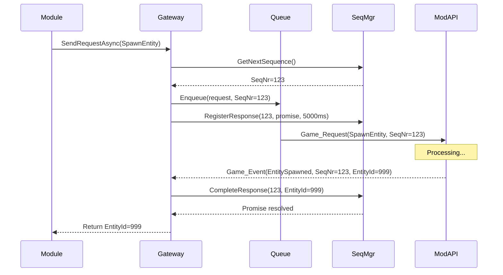

# Модуль: Empyrion Gateway

**Приоритет разработки:** 1 (Критический - базовая инфраструктура)  
**Зависимости:** Нет (базовый модуль)  
**Статус:** 🟢 Спецификация готова

---

## 1. Назначение

Empyrion Gateway — это **адаптер для взаимодействия с Empyrion ModAPI**. Обеспечивает надежную отправку запросов, обработку событий, управление sequence numbers, очередь запросов и rate limiting.

**Ключевая роль:** Изолирует всю систему от прямого взаимодействия с ModAPI, предоставляя удобный async/await интерфейс.

---

## 2. Архитектура



---

## 3. Интерфейсы

### 3.1 Основной интерфейс

```csharp
/// <summary>
/// Шлюз для взаимодействия с Empyrion ModAPI
/// </summary>
public interface IEmpyrionGateway
{
    // === Запросы ===
    
    /// <summary>
    /// Отправка асинхронного запроса к ModAPI
    /// </summary>
    Task<T> SendRequestAsync<T>(CmdId requestId, object data, int timeoutMs = 5000);
    
    // === События ===
    
    /// <summary>
    /// Событие получения данных от игры
    /// </summary>
    event EventHandler<GameEventArgs> GameEventReceived;
    
    // === Управление ===
    
    void Start();
    void Stop();
}
```

### 3.2 Расширенные интерфейсы (v1.15+)

```csharp
/// <summary>
/// Прямое управление сущностями (v1.15+)
/// </summary>
public interface IEntityControl
{
    void MoveEntityForward(IEntity entity, float speed);
    void StopEntity(IEntity entity);
    void SetEntityPosition(IEntity entity, Vector3 position);
}

/// <summary>
/// Операции с playfield (v1.15+)
/// </summary>
public interface IPlayfieldOperations
{
    // Точная высота рельефа (решена проблема с эвристиками!)
    float GetTerrainHeightAt(IPlayfield playfield, float x, float z);
    
    // Блокировка устройств
    Task<bool> LockStructureDeviceAsync(int structureId, VectorInt3 pos, bool doLock);
}

/// <summary>
/// Защита от авто-удаления (v1.15+)
/// </summary>
public interface IStructureMaintenance
{
    Task TouchStructureAsync(int structureId);
    ulong GetLastVisitedTicks(IStructure structure);
}

/// <summary>
/// PDA операции (v1.15+)
/// </summary>
public interface IPdaOperations
{
    // Программное создание волн атак
    Task<uint> CreateWaveAttackAsync(WaveStartData waveData);
    
    // Спавн с фракцией
    Task<int> SpawnEntityAtPositionAsync(Vector3 pos, string className, string faction);
}
```

---

## 4. Ключевые компоненты

### 4.1 Request Queue (очередь с приоритетами)

```csharp
public class RequestQueue
{
    private readonly PriorityQueue<QueuedRequest, int> _queue;
    private const int MinRequestIntervalMs = 50;  // Rate limiting
    
    public void Enqueue(GameRequest request, Action action, int priority = 5)
    {
        // Добавление в очередь с приоритетом
        // Меньше = выше приоритет
    }
    
    private async Task ProcessQueueAsync()
    {
        // Обработка запросов с задержкой между ними
    }
}
```

### 4.2 Sequence Manager (correlation identifier)

```csharp
public class SequenceManager
{
    private ushort _currentSeq = 0;
    private ConcurrentDictionary<ushort, PendingResponse> _pendingResponses;
    
    public ushort GetNextSequence()
    {
        // Thread-safe инкремент SeqNr
    }
    
    public void RegisterResponse<T>(ushort seqNr, TaskCompletionSource<T> promise, int timeoutMs)
    {
        // Регистрация ожидания ответа с timeout
    }
    
    public void CompleteResponse(ushort seqNr, object data)
    {
        // Установка результата в promise
    }
}
```

### 4.3 Rate Limiter (token bucket)

```csharp
public class RateLimiter
{
    private readonly int _maxRequestsPerSecond = 10;
    private int _availableTokens;
    
    public bool AllowRequest()
    {
        // Проверка доступности token
        // Пополнение tokens каждую секунду
    }
}
```

---

## 5. Примеры использования

### 5.1 Базовые операции

```csharp
// Спавн структуры
var entityId = await _gateway.SendRequestAsync<int>(
    CmdId.Request_Entity_Spawn,
    new EntitySpawnInfo { prefabName = "Base_Zirax", ... },
    timeoutMs: 10000
);

// Удаление структуры
await _gateway.SendRequestAsync<object>(
    CmdId.Request_Entity_Destroy,
    new IdStructure { id = entityId }
);

// Получение списка структур
var structures = await _gateway.SendRequestAsync<List<GlobalStructureInfo>>(
    CmdId.Request_GlobalStructure_List,
    null
);
```

### 5.2 Новые возможности (v1.15+)

```csharp
// Точная высота рельефа
var playfield = _application.GetPlayfield("Akua");
float terrainHeight = _playfieldOps.GetTerrainHeightAt(playfield, x: 1000, z: -500);

// Защита от авто-удаления
await _structureMaintenance.TouchStructureAsync(baseEntityId);

// Создание волны атак
var waveId = await _pdaOps.CreateWaveAttackAsync(new WaveStartData
{
    Name = "GLEX_DefenseWave",
    Target = playerStructureId.ToString(),
    Faction = "Zirax",
    Cost = 100
});

// Управление движением NPC
_entityControl.MoveEntityForward(guardEntity, speed: 2.5f);
_entityControl.SetEntityPosition(guardEntity, new Vector3(1000, 150, -500));
```

---

## 6. Обработка ошибок

| Тип ошибки | Стратегия |
|------------|-----------|
| **TimeoutException** | Retry 1 раз с exponential backoff |
| **RateLimitExceededException** | Ждать освобождения token |
| **SeqNr mismatch** | Log warning, игнорировать |
| **ModAPI недоступен** | Circuit breaker (отключить на 60с после 5 ошибок) |

---

## 7. Последовательность запроса



---

## 8. Чеклист разработчика

**Этап 1: Базовый Gateway (2 дня)**
- [ ] Реализовать `IEmpyrionGateway`
- [ ] Базовая отправка запросов
- [ ] Обработка событий

**Этап 2: Sequence Manager (1 день)**
- [ ] Сопоставление запрос-ответ
- [ ] Timeout механизм
- [ ] Unit-тесты

**Этап 3: Request Queue & Rate Limiter (1 день)**
- [ ] Очередь с приоритетами
- [ ] Rate limiting (10 req/sec)
- [ ] Integration тесты

**Этап 4: Расширенные интерфейсы v1.15+ (1 день)**
- [ ] `IEntityControl`
- [ ] `IPlayfieldOperations`
- [ ] `IPdaOperations`

---

## 9. Известные проблемы

### 9.1 Deadlock при синхронном ожидании

**Проблема:** `SendRequestAsync().Wait()` вызывает deadlock

**Решение:** Всегда используй `await`, никогда `.Wait()` или `.Result`

### 9.2 SeqNr overflow

**Проблема:** `ushort` переполняется при длительной работе

**Решение:** При переполнении начинать с 1 (0 зарезервирован)

```csharp
_currentSeq++;
if (_currentSeq == 0) _currentSeq = 1;
```

---

## 10. Производительность

**Метрики:**
- Request latency: 50-200 мс (зависит от ModAPI)
- Max throughput: 10 req/sec (rate limit)
- Queue capacity: unlimited (но логировать при >100)

**Оптимизации:**
- Batch запросы где возможно
- Кэширование списка структур (10 секунд)
- Приоритетная очередь для критичных запросов

---

## 11. Связь с другими документами

- **[02_Архитектурный_план.md](../02_Архитектурный_план.md)** — архитектурные паттерны Gateway
- **[03_Технический_проект.md](../03_Технический_проект.md)** — детальная реализация компонентов

---

**Последнее обновление:** 28.01.2026  
**Размер:** ~350 строк
