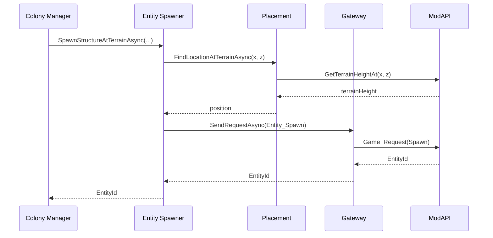

# Модуль: Entity Spawner

**Приоритет разработки:** 1 (Критический)  
**Зависимости:** Module_02 (Gateway), Module_06 (Placement)  
**Статус:** 🟡 В разработке

---

## 1. Назначение

Entity Spawner отвечает за **создание и удаление игровых сущностей** (структуры, корабли, NPC) через Empyrion ModAPI.

---

## 2. Интерфейсы

```csharp
public interface IEntitySpawner
{
    // Спавн структур
    Task<int> SpawnStructureAsync(string prefabName, Vector3 position, Vector3 rotation, int factionId);
    Task<int> SpawnStructureAtTerrainAsync(string playfield, string prefabName, float x, float z, int factionId, float heightOffset = 0.5f);
    
    // Спавн NPC
    Task<List<int>> SpawnNPCGroupAsync(string npcClassName, Vector3 position, int count, int factionId);
    Task<int> SpawnNPCAtTerrainAsync(string playfield, string npcClassName, float x, float z, string faction);
    
    // Удаление
    Task DestroyEntityAsync(int entityId);
    Task<int> DestroyEntitiesAsync(IEnumerable<int> entityIds);
    
    // Утилиты
    Task<bool> EntityExistsAsync(int entityId);
    Task<EntityInfo> GetEntityInfoAsync(int entityId);
}

public class EntityInfo
{
    public int EntityId { get; set; }
    public string EntityName { get; set; }
    public EntityType EntityType { get; set; }
    public Vector3 Position { get; set; }
    public int FactionId { get; set; }
    public string Playfield { get; set; }
    public DateTime SpawnedAt { get; set; }
}

public enum EntityType { Unknown, BA, CV, SV, HV, NPC, Player }

public class SpawnException : Exception
{
    public string PrefabName { get; set; }
    public Vector3 Position { get; set; }
}
```

---

## 3. Реализация (ключевые методы)

### 3.1 Спавн структуры

```csharp
public async Task<int> SpawnStructureAsync(string prefabName, Vector3 position, Vector3 rotation, int factionId)
{
    // Валидация
    ValidatePrefabName(prefabName);
    ValidatePosition(position);
    
    // Подготовка данных
    var spawnInfo = new EntitySpawnInfo
    {
        prefabName = prefabName,
        type = GetEntityTypeFromPrefab(prefabName),
        pos = new PVector3(position.X, position.Y, position.Z),
        rot = new PVector3(rotation.X, rotation.Y, rotation.Z),
        factionGroup = factionId,
        factionId = factionId
    };
    
    // Отправка через Gateway
    var entityId = await _gateway.SendRequestAsync<int>(
        CmdId.Request_Entity_Spawn,
        spawnInfo,
        timeoutMs: 10000  // Большие структуры долго спавнятся
    );
    
    if (entityId <= 0)
        throw new SpawnException($"Failed to spawn {prefabName}", prefabName, position);
    
    return entityId;
}
```

### 3.2 Спавн на рельефе (v1.15+)

```csharp
public async Task<int> SpawnStructureAtTerrainAsync(string playfield, string prefabName, float x, float z, int factionId, float heightOffset)
{
    // Получение точной высоты рельефа
    var terrainPosition = await _placementResolver.FindLocationAtTerrainAsync(playfield, x, z, heightOffset);
    
    // Спавн на найденной высоте
    return await SpawnStructureAsync(prefabName, terrainPosition, Vector3.Zero, factionId);
}
```

### 3.3 Спавн группы NPC

```csharp
public async Task<List<int>> SpawnNPCGroupAsync(string npcClassName, Vector3 position, int count, int factionId)
{
    var spawnedIds = new List<int>();
    
    for (int i = 0; i < count; i++)
    {
        // Смещение по кругу радиусом 3м
        var angle = (i / (float)count) * 2 * Mathf.PI;
        var offset = new Vector3(Mathf.Cos(angle) * 3f, 0, Mathf.Sin(angle) * 3f);
        var npcPosition = position + offset;
        
        var npcId = await SpawnNPCAtTerrainAsync(playfield, npcClassName, npcPosition.X, npcPosition.Z, GetFactionName(factionId));
        spawnedIds.Add(npcId);
        
        await Task.Delay(100);  // Задержка между спавнами
    }
    
    return spawnedIds;
}
```

### 3.4 Удаление сущности

```csharp
public async Task DestroyEntityAsync(int entityId)
{
    await _gateway.SendRequestAsync<object>(
        CmdId.Request_Entity_Destroy,
        new IdStructure { id = entityId },
        timeoutMs: 5000
    );
}
```

---

## 4. Диаграмма последовательности (спавн структуры)



---

## 5. Обработка ошибок

| Ошибка | Стратегия |
|--------|-----------|
| **TimeoutException** | Retry 1 раз → exception |
| **EntityId <= 0** | Throw SpawnException |
| **PrefabNotFound** | Log error + throw |
| **LocationOccupied** | PlacementResolver должен найти другое место |

---

## 6. Примеры использования

```csharp
// Спавн базы с точным определением высоты (v1.15+)
var entityId = await _spawner.SpawnStructureAtTerrainAsync(
    "Akua",
    "GLEX_Base_L1",
    x: 1000,
    z: -500,
    factionId: 2,
    heightOffset: 0.5f
);

// Спавн охранников
var guardIds = await _spawner.SpawnNPCGroupAsync(
    "ZiraxMinigunPatrol",
    basePosition,
    count: 4,
    factionId: 2
);

// Удаление старой базы
await _spawner.DestroyEntityAsync(oldBaseId);
```

---

## 7. Конфигурация

```json
{
  "EntitySpawner": {
    "ValidPrefabs": [
      "GLEX_DropShip_T1",
      "GLEX_ConstructionYard",
      "GLEX_Base_L1",
      "GLEX_Base_L2",
      "GLEX_Base_L3"
    ],
    "ValidNPCClasses": [
      "ZiraxMale",
      "ZiraxMinigunPatrol",
      "ZiraxRocketPatrol"
    ],
    "SpawnTimeout": 10000,
    "NPCSpawnDelay": 100
  }
}
```

---

## 8. Чеклист разработчика

**Этап 1: Базовый спавн (2 дня)**
- [ ] Реализовать `IEntitySpawner`
- [ ] `SpawnStructureAsync()` с валидацией
- [ ] Обработка ошибок
- [ ] Unit-тесты

**Этап 2: Спавн на рельефе (1 день)**
- [ ] `SpawnStructureAtTerrainAsync()`
- [ ] Интеграция с PlacementResolver
- [ ] Тесты на разном рельефе

**Этап 3: NPC (1 день)**
- [ ] `SpawnNPCGroupAsync()`
- [ ] Расстановка по кругу
- [ ] Тесты с разными классами NPC

**Этап 4: Удаление (0.5 дня)**
- [ ] `DestroyEntityAsync()`
- [ ] Batch `DestroyEntitiesAsync()`
- [ ] Обработка "сущность уже удалена"

---

## 9. Известные проблемы

### 9.1 Структуры спавнятся под землей

**Решение (v1.15+):** Использовать `GetTerrainHeightAt()` вместо эвристик

```csharp
float terrainHeight = playfield.GetTerrainHeightAt(x, z);
var spawnY = terrainHeight + heightOffset;
```

### 9.2 Timeout при спавне больших структур

**Решение:** Увеличить timeout для больших префабов

```csharp
var timeout = prefabName.Contains("Huge") ? 30000 : 10000;
```

### 9.3 Спавн не удается (EntityId=0)

**Причина:** Место занято, префаб не найден, лимит фракции

**Решение:** Детальное логирование и fallback

---

## 10. Производительность

**Метрики:**
- Спавн структуры: 2-5 сек (зависит от размера)
- Спавн NPC: 100-300 мс
- Удаление: 50-200 мс

**Рекомендации:**
- Не спавнить >10 сущностей одновременно
- Использовать задержки между спавнами
- Кэшировать EntityInfo

---

## 11. Связь с другими документами

- **[Module_02_EmpyrionGateway.md](Module_02_EmpyrionGateway.md)** — API запросы
- **[Module_06_Placement_Resolver.md](Module_06_Placement_Resolver.md)** — поиск мест
- **[Module_07_Colony_Evolution.md](Module_07_Colony_Evolution.md)** — использует EntitySpawner
- **[Module_13_Unit_Economy.md](Module_13_Unit_Economy.md)** — резервирование юнитов перед спавном ✨ НОВОЕ

---

**Последнее обновление:** 29.01.2026  
**Размер:** ~360 строк
