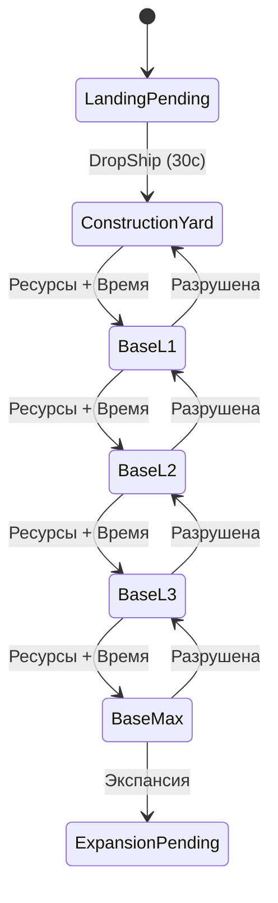
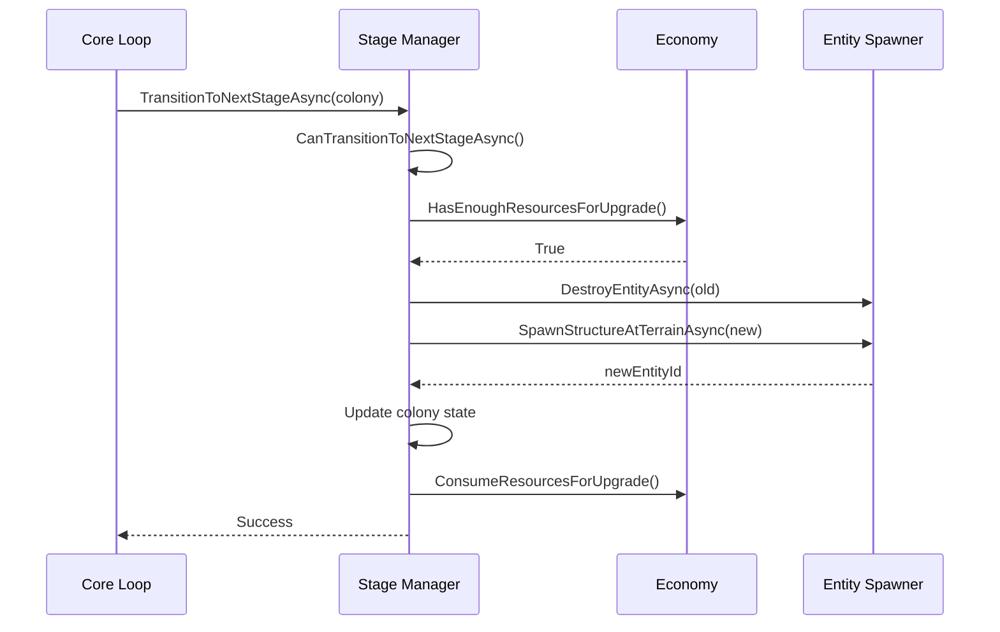

# Модуль: Colony Evolution (Stage Manager)

**Приоритет разработки:** 2 (Высокий)  
**Зависимости:** Module_04 (Entity Spawner), Module_03 (State Store), Module_11 (Economy)  
**Статус:** 🟡 В разработке

---

## 1. Назначение

Colony Evolution управляет **жизненным циклом колоний**: переходами между стадиями, откатами при разрушениях, защитой от авто-удаления структур.

---

## 2. Стадии колонии



| Стадия | Префаб | Мин. время | Ресурсы | Охрана |
|--------|--------|------------|---------|--------|
| **ConstructionYard** | `GLEX_ConstructionYard` | 10 мин | 0 | 2 |
| **BaseL1** | `GLEX_Base_L1` | 30 мин | 1000 | 4 |
| **BaseL2** | `GLEX_Base_L2` | 60 мин | 3000 | 8 |
| **BaseL3** | `GLEX_Base_L3` | 120 мин | 6000 | 12 |
| **BaseMax** | `GLEX_Base_Max` | — | — | 16 |

---

## 3. Интерфейсы

```csharp
public interface IStageManager
{
    // Проверка условий
    Task<bool> CanTransitionToNextStageAsync(Colony colony);
    ColonyStage? GetNextStage(ColonyStage currentStage);
    ColonyStage? GetPreviousStage(ColonyStage currentStage);
    
    // Переходы
    Task<bool> TransitionToNextStageAsync(Colony colony);
    Task TransitionToStageAsync(Colony colony, ColonyStage targetStage, bool forced = false);
    Task DowngradeColonyAsync(Colony colony, string reason);
    
    // Защита от авто-удаления
    Task MaintainColonyStructuresAsync(Colony colony);
    
    // Специальные операции
    Task InitializeColonyAsync(Colony colony);
    Task<Colony> StartExpansionAsync(Colony sourceColony, string targetPlayfield);
}

public enum ColonyStage
{
    LandingPending = 0,
    ConstructionYard = 1,
    BaseL1 = 2,
    BaseL2 = 3,
    BaseL3 = 4,
    BaseMax = 5,
    ExpansionPending = 6
}

public class StageConfiguration
{
    public ColonyStage Stage { get; set; }
    public string PrefabName { get; set; }
    public int RequiredResources { get; set; }
    public int ProductionRate { get; set; }
    public int MinTimeSeconds { get; set; }
    public int GuardCount { get; set; }
}
```

---

## 4. Реализация (ключевые методы)

### 4.1 Проверка условий перехода

```csharp
public async Task<bool> CanTransitionToNextStageAsync(Colony colony)
{
    var nextStage = GetNextStage(colony.Stage);
    if (nextStage == null) return false;
    
    var nextConfig = _stageConfigs[nextStage.Value];
    
    // УСЛОВИЕ 1: Достаточно ресурсов
    if (!_economySimulator.HasEnoughResourcesForUpgrade(colony, nextStage.Value))
        return false;
    
    // УСЛОВИЕ 2: Прошло минимальное время
    var currentConfig = _stageConfigs[colony.Stage];
    var timeOnStage = DateTime.UtcNow - colony.LastUpgradeTime;
    if (timeOnStage.TotalSeconds < currentConfig.MinTimeSeconds)
        return false;
    
    // УСЛОВИЕ 3: Главная структура существует
    if (colony.MainStructureId > 0 && !await _entitySpawner.EntityExistsAsync(colony.MainStructureId))
        return false;
    
    return true;
}
```

### 4.2 Переход на следующую стадию

```csharp
public async Task TransitionToStageAsync(Colony colony, ColonyStage targetStage, bool forced)
{
    var oldStage = colony.Stage;
    
    try
    {
        // Валидация (если не forced)
        if (!forced && !await CanTransitionToNextStageAsync(colony))
            throw new InvalidOperationException("Transition conditions not met");
        
        var targetConfig = _stageConfigs[targetStage];
        
        // ШАГ 1: Удаление старой структуры
        if (colony.MainStructureId > 0)
            await _entitySpawner.DestroyEntityAsync(colony.MainStructureId);
        
        // ШАГ 2: Спавн новой структуры
        var newEntityId = await _entitySpawner.SpawnStructureAtTerrainAsync(
            colony.Playfield,
            targetConfig.PrefabName,
            colony.Position.X,
            colony.Position.Z,
            colony.FactionId
        );
        
        // ШАГ 3: Обновление состояния
        colony.MainStructureId = newEntityId;
        colony.Stage = targetStage;
        colony.LastUpgradeTime = DateTime.UtcNow;
        
        if (targetStage > oldStage)
            _economySimulator.ConsumeResourcesForUpgrade(colony, targetStage);
        
        colony.Resources.ProductionRate = targetConfig.ProductionRate;
        
        // ШАГ 4: Спавн охранников
        await SpawnGuardsForStageAsync(colony, targetConfig);
        
        // ШАГ 5: Защита от авто-удаления
        await MaintainColonyStructuresAsync(colony);
        
        // ШАГ 6: Сохранение
        await _stateStore.SaveAsync(await _stateStore.LoadAsync());
        
        // ШАГ 7: Событие
        _eventBus.Publish(new StageTransitionEvent
        {
            Colony = colony,
            FromStage = oldStage,
            ToStage = targetStage,
            Timestamp = DateTime.UtcNow
        });
    }
    catch (Exception ex)
    {
        _logger.LogError(ex, $"Error transitioning colony {colony.Id}");
        colony.Stage = oldStage;  // Откат
        throw;
    }
}
```

### 4.3 Откат при разрушении

```csharp
public async Task DowngradeColonyAsync(Colony colony, string reason)
{
    var previousStage = GetPreviousStage(colony.Stage);
    
    if (previousStage == null)
    {
        _logger.LogWarning($"Colony {colony.Id} at minimum stage, cannot downgrade");
        return;
    }
    
    await TransitionToStageAsync(colony, previousStage.Value, forced: true);
}
```

### 4.4 Защита от авто-удаления

```csharp
public async Task MaintainColonyStructuresAsync(Colony colony)
{
    var timeSinceLastMaintenance = DateTime.UtcNow - colony.LastMaintenanceTime;
    if (timeSinceLastMaintenance.TotalHours < 1)
        return;
    
    // Touch главной структуры
    if (colony.MainStructureId > 0)
        await TouchStructureAsync(colony.MainStructureId);
    
    // Touch аванпостов
    foreach (var outpost in colony.ResourceNodes)
    {
        if (outpost.StructureId > 0)
            await TouchStructureAsync(outpost.StructureId);
    }
    
    colony.LastMaintenanceTime = DateTime.UtcNow;
}

private async Task TouchStructureAsync(int structureId)
{
    await _gateway.SendRequestAsync<object>(
        CmdId.Request_Structure_Touch,
        new IdStructure { id = structureId },
        timeoutMs: 3000
    );
}
```

### 4.5 Инициализация новой колонии

```csharp
public async Task InitializeColonyAsync(Colony colony)
{
    // ШАГ 1: Спавн DropShip высоко в небе
    var dropShipPosition = new Vector3(colony.Position.X, 500f, colony.Position.Z);
    var dropShipId = await _entitySpawner.SpawnStructureAsync(
        "GLEX_DropShip_T1",
        dropShipPosition,
        Vector3.Zero,
        colony.FactionId
    );
    
    // ШАГ 2: Ожидание "посадки"
    await Task.Delay(TimeSpan.FromSeconds(30));
    
    // ШАГ 3: Удаление DropShip
    await _entitySpawner.DestroyEntityAsync(dropShipId);
    
    // ШАГ 4: Переход на ConstructionYard
    await TransitionToStageAsync(colony, ColonyStage.ConstructionYard, forced: true);
}
```

---

## 5. Диаграммы последовательностей



---

## 6. Конфигурация

```json
{
  "Zirax": {
    "Stages": [
      {
        "Stage": "ConstructionYard",
        "PrefabName": "GLEX_ConstructionYard",
        "RequiredResources": 0,
        "ProductionRate": 100,
        "MinTimeSeconds": 600,
        "GuardCount": 2
      },
      {
        "Stage": "BaseL1",
        "PrefabName": "GLEX_Base_L1",
        "RequiredResources": 1000,
        "ProductionRate": 150,
        "MinTimeSeconds": 1800,
        "GuardCount": 4
      }
    ]
  },
  "Maintenance": {
    "StructureTouchIntervalHours": 1
  }
}
```

---

## 7. Чеклист разработчика

**Этап 1: State Machine (2 дня)**
- [ ] `IStageManager`, `GetNextStage()`, `GetPreviousStage()`
- [ ] Валидация переходов

**Этап 2: Проверка условий (1 день)**
- [ ] `CanTransitionToNextStageAsync()`
- [ ] Интеграция с Economy

**Этап 3: Переходы (2 дня)**
- [ ] `TransitionToStageAsync()`
- [ ] Удаление/спавн структур
- [ ] Обработка ошибок

**Этап 4: Защита от распада (1 день)**
- [ ] `MaintainColonyStructuresAsync()`
- [ ] Touch структур

**Этап 5: Специальные операции (1 день)**
- [ ] `InitializeColonyAsync()` (DropShip)
- [ ] `DowngradeColonyAsync()`

---

## 8. Известные проблемы

### 8.1 Структуры удаляются auto-cleanup'ом

**Решение:** Периодически "трогать" структуры (раз в час)

### 8.2 Rollback не работает при ошибке спавна

**Решение:**
```csharp
try { /* transition */ }
catch (Exception ex) {
    colony.Stage = oldStage;
    await _stateStore.SaveAsync(state);
    throw;
}
```

---

## 9. Связь с другими документами

- **[Module_04_Entity_Spawner.md](Module_04_Entity_Spawner.md)** — спавн/удаление структур
- **[Module_11_Economy_Simulator.md](Module_11_Economy_Simulator.md)** — проверка ресурсов

---

**Последнее обновление:** 28.01.2026  
**Размер:** ~420 строк
