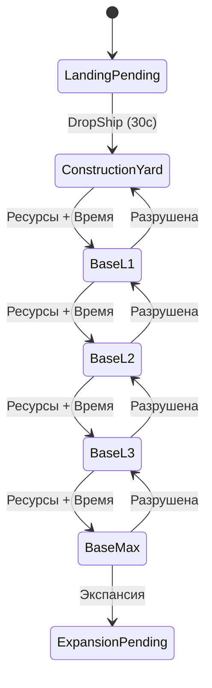
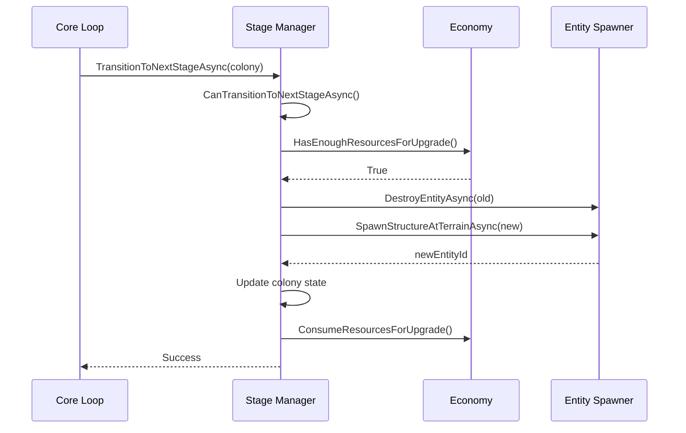

# Модуль: Colony Evolution (Stage Manager)

**Приоритет разработки:** 2 (Высокий)  
**Зависимости:** Module_04 (Entity Spawner), Module_03 (State Store), Module_11 (Economy), Module_12 (Hostility Tracker)  
**Статус:** 🟡 В разработке

---

## 1. Назначение

Colony Evolution управляет **жизненным циклом колоний**: переходами между стадиями, откатами при разрушениях, защитой от авто-удаления структур.

---

## 2. Стадии колонии



| Стадия | Префаб | Мин. время | Ресурсы | Охрана |
|--------|--------|------------|---------|--------|
| **ConstructionYard** | `GLEX_ConstructionYard` | 10 мин | 0 | 2 |
| **BaseL1** | `GLEX_Base_L1` | 30 мин | 1000 | 4 |
| **BaseL2** | `GLEX_Base_L2` | 60 мин | 3000 | 8 |
| **BaseL3** | `GLEX_Base_L3` | 120 мин | 6000 | 12 |
| **BaseMax** | `GLEX_Base_Max` | — | — | 16 |

---

## 3. Интерфейсы

```csharp
public interface IStageManager
{
    // Проверка условий
    Task<bool> CanTransitionToNextStageAsync(Colony colony);
    ColonyStage? GetNextStage(ColonyStage currentStage);
    ColonyStage? GetPreviousStage(ColonyStage currentStage);
    
    // Переходы
    Task<bool> TransitionToNextStageAsync(Colony colony);
    Task TransitionToStageAsync(Colony colony, ColonyStage targetStage, bool forced = false);
    Task DowngradeColonyAsync(Colony colony, string reason);
    
    // Защита от авто-удаления
    Task MaintainColonyStructuresAsync(Colony colony);
    
    // Специальные операции
    Task InitializeColonyAsync(Colony colony);
    Task<Colony> StartExpansionAsync(Colony sourceColony, string targetPlayfield);
    
    // Выбор цели экспансии
    Task<string> SelectExpansionTargetAsync(Colony sourceColony);
}

public enum ColonyStage
{
    LandingPending = 0,
    ConstructionYard = 1,
    BaseL1 = 2,
    BaseL2 = 3,
    BaseL3 = 4,
    BaseMax = 5,
    ExpansionPending = 6
}

public class StageConfiguration
{
    public ColonyStage Stage { get; set; }
    public string PrefabName { get; set; }
    public int RequiredResources { get; set; }
    public int ProductionRate { get; set; }
    public int MinTimeSeconds { get; set; }
    public int GuardCount { get; set; }
}
```

---

## 4. Реализация (ключевые методы)

### 4.1 Проверка условий перехода

```csharp
public async Task<bool> CanTransitionToNextStageAsync(Colony colony)
{
    var nextStage = GetNextStage(colony.Stage);
    if (nextStage == null) return false;
    
    var nextConfig = _stageConfigs[nextStage.Value];
    
    // УСЛОВИЕ 1: Достаточно ресурсов
    if (!_economySimulator.HasEnoughResourcesForUpgrade(colony, nextStage.Value))
        return false;
    
    // УСЛОВИЕ 2: Прошло минимальное время
    var currentConfig = _stageConfigs[colony.Stage];
    var timeOnStage = DateTime.UtcNow - colony.LastUpgradeTime;
    if (timeOnStage.TotalSeconds < currentConfig.MinTimeSeconds)
        return false;
    
    // УСЛОВИЕ 3: Главная структура существует
    if (colony.MainStructureId > 0 && !await _entitySpawner.EntityExistsAsync(colony.MainStructureId))
        return false;
    
    return true;
}
```

### 4.2 Переход на следующую стадию

```csharp
public async Task TransitionToStageAsync(Colony colony, ColonyStage targetStage, bool forced)
{
    var oldStage = colony.Stage;
    
    try
    {
        // Валидация (если не forced)
        if (!forced && !await CanTransitionToNextStageAsync(colony))
            throw new InvalidOperationException("Transition conditions not met");
        
        var targetConfig = _stageConfigs[targetStage];
        
        // ШАГ 1: Удаление старой структуры
        if (colony.MainStructureId > 0)
            await _entitySpawner.DestroyEntityAsync(colony.MainStructureId);
        
        // ШАГ 2: Спавн новой структуры
        var newEntityId = await _entitySpawner.SpawnStructureAtTerrainAsync(
            colony.Playfield,
            targetConfig.PrefabName,
            colony.Position.X,
            colony.Position.Z,
            colony.FactionId
        );
        
        // ШАГ 3: Обновление состояния
        colony.MainStructureId = newEntityId;
        colony.Stage = targetStage;
        colony.LastUpgradeTime = DateTime.UtcNow;
        
        if (targetStage > oldStage)
            _economySimulator.ConsumeResourcesForUpgrade(colony, targetStage);
        
        colony.Resources.ProductionRate = targetConfig.ProductionRate;
        
        // ШАГ 4: Спавн охранников
        await SpawnGuardsForStageAsync(colony, targetConfig);
        
        // ШАГ 5: Защита от авто-удаления
        await MaintainColonyStructuresAsync(colony);
        
        // ШАГ 6: Сохранение
        await _stateStore.SaveAsync(await _stateStore.LoadAsync());
        
        // ШАГ 7: Событие
        _eventBus.Publish(new StageTransitionEvent
        {
            Colony = colony,
            FromStage = oldStage,
            ToStage = targetStage,
            Timestamp = DateTime.UtcNow
        });
    }
    catch (Exception ex)
    {
        _logger.LogError(ex, $"Error transitioning colony {colony.Id}");
        colony.Stage = oldStage;  // Откат
        throw;
    }
}
```

### 4.3 Откат при разрушении

```csharp
public async Task DowngradeColonyAsync(Colony colony, string reason)
{
    var previousStage = GetPreviousStage(colony.Stage);
    
    if (previousStage == null)
    {
        _logger.LogWarning($"Colony {colony.Id} at minimum stage, cannot downgrade");
        return;
    }
    
    await TransitionToStageAsync(colony, previousStage.Value, forced: true);
}
```

### 4.4 Защита от авто-удаления

```csharp
public async Task MaintainColonyStructuresAsync(Colony colony)
{
    var timeSinceLastMaintenance = DateTime.UtcNow - colony.LastMaintenanceTime;
    if (timeSinceLastMaintenance.TotalHours < 1)
        return;
    
    // Touch главной структуры
    if (colony.MainStructureId > 0)
        await TouchStructureAsync(colony.MainStructureId);
    
    // Touch аванпостов
    foreach (var outpost in colony.ResourceNodes)
    {
        if (outpost.StructureId > 0)
            await TouchStructureAsync(outpost.StructureId);
    }
    
    colony.LastMaintenanceTime = DateTime.UtcNow;
}

private async Task TouchStructureAsync(int structureId)
{
    await _gateway.SendRequestAsync<object>(
        CmdId.Request_Structure_Touch,
        new IdStructure { id = structureId },
        timeoutMs: 3000
    );
}
```

### 4.5 Инициализация новой колонии

```csharp
public async Task InitializeColonyAsync(Colony colony)
{
    // ШАГ 1: Спавн DropShip высоко в небе
    var dropShipPosition = new Vector3(colony.Position.X, 500f, colony.Position.Z);
    var dropShipId = await _entitySpawner.SpawnStructureAsync(
        "GLEX_DropShip_T1",
        dropShipPosition,
        Vector3.Zero,
        colony.FactionId
    );
    
    // ШАГ 2: Ожидание "посадки"
    await Task.Delay(TimeSpan.FromSeconds(30));
    
    // ШАГ 3: Удаление DropShip
    await _entitySpawner.DestroyEntityAsync(dropShipId);
    
    // ШАГ 4: Переход на ConstructionYard
    await TransitionToStageAsync(colony, ColonyStage.ConstructionYard, forced: true);
}
```

---

## 5. Диаграммы последовательностей



---

## 6. Конфигурация

```json
{
  "Zirax": {
    "Stages": [
      {
        "Stage": "ConstructionYard",
        "PrefabName": "GLEX_ConstructionYard",
        "RequiredResources": 0,
        "ProductionRate": 100,
        "MinTimeSeconds": 600,
        "GuardCount": 2
      },
      {
        "Stage": "BaseL1",
        "PrefabName": "GLEX_Base_L1",
        "RequiredResources": 1000,
        "ProductionRate": 150,
        "MinTimeSeconds": 1800,
        "GuardCount": 4
      }
    ]
  },
  "Maintenance": {
    "StructureTouchIntervalHours": 1
  }
}
```

---

## 7. Чеклист разработчика

**Этап 1: State Machine (2 дня)**
- [ ] `IStageManager`, `GetNextStage()`, `GetPreviousStage()`
- [ ] Валидация переходов

**Этап 2: Проверка условий (1 день)**
- [ ] `CanTransitionToNextStageAsync()`
- [ ] Интеграция с Economy

**Этап 3: Переходы (2 дня)**
- [ ] `TransitionToStageAsync()`
- [ ] Удаление/спавн структур
- [ ] Обработка ошибок

**Этап 4: Защита от распада (1 день)**
- [ ] `MaintainColonyStructuresAsync()`
- [ ] Touch структур

**Этап 5: Специальные операции (1 день)**
- [ ] `InitializeColonyAsync()` (DropShip)
- [ ] `DowngradeColonyAsync()`

**Этап 6: Экспансия (2 дня)**
- [ ] `SelectExpansionTargetAsync()` с интеграцией Most Wanted
- [ ] `StartExpansionAsync()` на целевую планету
- [ ] Определение родной планеты игрока

---

## 8. Известные проблемы

### 8.1 Структуры удаляются auto-cleanup'ом

**Решение:** Периодически "трогать" структуры (раз в час)

### 8.2 Rollback не работает при ошибке спавна

**Решение:**
```csharp
try { /* transition */ }
catch (Exception ex) {
    colony.Stage = oldStage;
    await _stateStore.SaveAsync(state);
    throw;
}
```

---

## 9. Механика постепенной экспансии к родной планете врага

### 9.1 Интеграция с Most Wanted системой

**КРИТИЧЕСКИ ВАЖНО:** Когда колония достигает максимальной стадии и готова к экспансии, она направляется **поэтапно** к родной планете самого враждебного игрока, захватывая планеты на пути.

```csharp
/// <summary>
/// Выбор целевой планеты для экспансии с приоритетом Most Wanted.
/// Экспансия происходит ПОСТЕПЕННО, планета за планетой, в направлении родной планеты игрока.
/// </summary>
public async Task<string> SelectExpansionTargetAsync(Colony sourceColony)
{
    _logger.LogInformation($"Selecting expansion target for colony {sourceColony.Id}");
    
    // Получаем Most Wanted игрока для этой колонии
    var mostWanted = _hostilityTracker.GetMostWantedTarget(sourceColony);
    
    if (mostWanted != null && mostWanted.HostilityScore >= _config.MinHostilityForExpansion)
    {
        // Определяем родную планету игрока
        var targetPlanet = await DeterminePlayerHomePlanetAsync(mostWanted.PlayerId);
        
        if (!string.IsNullOrEmpty(targetPlanet))
        {
            // Рассчитываем путь от текущей колонии к родной планете игрока
            var pathToTarget = await CalculateExpansionPathAsync(sourceColony.Playfield, targetPlanet);
            
            if (pathToTarget.Count > 1)
            {
                // Берем следующую планету на пути (не прыгаем сразу на цель!)
                var nextPlanet = pathToTarget[1]; // [0] = текущая, [1] = следующая
                
                if (await IsValidExpansionTargetAsync(nextPlanet))
                {
                    var progressStep = GetColonyCountOnPath(pathToTarget);
                    var totalSteps = pathToTarget.Count - 1;
                    
                    _logger.LogWarning(
                        $"Colony {sourceColony.Id} expanding toward Most Wanted player {mostWanted.PlayerId}. " +
                        $"Next step: {nextPlanet} (progress: {progressStep}/{totalSteps} to {targetPlanet})"
                    );
                    
                    return nextPlanet; // Следующий шаг к цели
                }
            }
            else if (pathToTarget.Count == 1)
            {
                // Мы уже на последнем шаге - можем захватывать родную планету!
                if (await IsValidExpansionTargetAsync(targetPlanet))
                {
                    _logger.LogCritical(
                        $"Colony {sourceColony.Id} launching FINAL expansion to {targetPlanet}! " +
                        $"Home planet of Most Wanted player {mostWanted.PlayerId} " +
                        $"(rank: {mostWanted.Rank}, score: {mostWanted.HostilityScore}). " +
                        $"THE RECKONING IS UPON THEM!"
                    );
                    
                    return targetPlanet; // Финальный удар!
                }
            }
        }
    }
    
    // Fallback: стандартная логика выбора планеты из конфигурации
    _logger.LogInformation("No suitable Most Wanted target, using standard expansion logic");
    return SelectRandomExpansionTargetFromConfig();
}

/// <summary>
/// Определение родной планеты игрока (где у него больше всего структур)
/// </summary>
private async Task<string> DeterminePlayerHomePlanetAsync(int playerId)
{
    var playerStructures = await _structureTracker.GetPlayerStructuresAsync(playerId);
    
    if (!playerStructures.Any())
    {
        _logger.LogDebug($"Player {playerId} has no structures, cannot determine home planet");
        return null;
    }
    
    // Группируем по playfield и берем планету с наибольшим количеством структур
    var structuresByPlayfield = playerStructures
        .GroupBy(s => s.Playfield)
        .Select(g => new
        {
            Playfield = g.Key,
            Count = g.Count(),
            TotalBlocks = g.Sum(s => s.BlockCount ?? 0)
        })
        .OrderByDescending(x => x.Count)
        .ThenByDescending(x => x.TotalBlocks)
        .ToList();
    
    var homePlanet = structuresByPlayfield.First().Playfield;
    
    _logger.LogInformation(
        $"Determined home planet for player {playerId}: {homePlanet} " +
        $"({structuresByPlayfield.First().Count} structures)"
    );
    
    return homePlanet;
}

/// <summary>
/// Проверка, что планета доступна для экспансии
/// </summary>
private async Task<bool> IsValidExpansionTargetAsync(string playfield)
{
    // Проверка 1: На планете еще нет колонии
    var existingColony = _state.Colonies.FirstOrDefault(c => c.Playfield == playfield);
    if (existingColony != null)
    {
        _logger.LogDebug($"Playfield {playfield} already has colony {existingColony.Id}");
        return false;
    }
    
    // Проверка 2: Планета не в blacklist
    if (_config.ExpansionBlacklist.Contains(playfield))
    {
        _logger.LogDebug($"Playfield {playfield} is blacklisted for expansion");
        return false;
    }
    
    // Проверка 3: Планета существует (можно проверить через ModAPI)
    // TODO: Добавить проверку существования playfield
    
    return true;
}

/// <summary>
/// Расчет пути экспансии от источника к цели через граф планет солнечной системы
/// </summary>
private async Task<List<string>> CalculateExpansionPathAsync(string sourcePlanet, string targetPlanet)
{
    // Получаем граф связей планет (солнечные системы, варп-линии)
    var playfieldGraph = await _playfieldConnections.GetGraphAsync();
    
    // Используем алгоритм поиска кратчайшего пути (Dijkstra/A*)
    var path = FindShortestPath(sourcePlanet, targetPlanet, playfieldGraph);
    
    _logger.LogDebug(
        $"Calculated expansion path from {sourcePlanet} to {targetPlanet}: " +
        $"{string.Join(" -> ", path)} ({path.Count - 1} steps)"
    );
    
    return path;
}

/// <summary>
/// Алгоритм поиска кратчайшего пути между планетами (упрощенная реализация)
/// </summary>
private List<string> FindShortestPath(string start, string end, Dictionary<string, List<string>> graph)
{
    // Простой BFS (Breadth-First Search) для поиска кратчайшего пути
    var queue = new Queue<List<string>>();
    var visited = new HashSet<string>();
    
    queue.Enqueue(new List<string> { start });
    visited.Add(start);
    
    while (queue.Any())
    {
        var path = queue.Dequeue();
        var current = path.Last();
        
        if (current == end)
            return path; // Нашли путь!
        
        if (graph.TryGetValue(current, out var neighbors))
        {
            foreach (var neighbor in neighbors)
            {
                if (!visited.Contains(neighbor))
                {
                    visited.Add(neighbor);
                    var newPath = new List<string>(path) { neighbor };
                    queue.Enqueue(newPath);
                }
            }
        }
    }
    
    // Путь не найден - возвращаем прямой (для fallback)
    return new List<string> { start, end };
}

/// <summary>
/// Подсчет уже захваченных планет на пути к цели
/// </summary>
private int GetColonyCountOnPath(List<string> path)
{
    return path.Count(playfield => _state.Colonies.Any(c => c.Playfield == playfield));
}

/// <summary>
/// Fallback: выбор случайной планеты из конфигурации
/// </summary>
private string SelectRandomExpansionTargetFromConfig()
{
    var availableTargets = _config.ExpansionTargetPlayfields
        .Where(p => !_state.Colonies.Any(c => c.Playfield == p))
        .ToList();
    
    if (!availableTargets.Any())
    {
        _logger.LogWarning("No available expansion targets in configuration");
        return null;
    }
    
    var target = availableTargets[_random.Next(availableTargets.Count)];
    _logger.LogInformation($"Selected random expansion target: {target}");
    
    return target;
}
```

### 9.2 Пример сценария постепенной экспансии

**Исходная ситуация:**
- Колония Zirax на "Zeta Prime"
- Most Wanted игрок (5000+ очков) имеет базу на "Akua"
- Путь через солнечную систему: Zeta Prime → Omicron → Tallodar → Akua

**Развитие событий:**

**Экспансия 1 (через 2 часа после достижения BaseMax):**
- Колония на Zeta Prime строит экспедиционный CV
- CV направляется на Omicron (следующая планета на пути)
- Игрок видит сообщение: *"[Zirax Command] Our forces expand toward hostile territory."*

**Экспансия 2 (через 2 часа после захвата Omicron):**
- Колония на Omicron достигает BaseMax
- Следующая цель: Tallodar
- Игрок видит сообщение: *"[Zirax Command] Our expansion approaches your borders..."*
- **Эффект:** Игрок видит на карте две колонии, движущиеся к его планете

**Экспансия 3 (через 2 часа после захвата Tallodar):**
- Колония на Tallodar достигает BaseMax
- Между Tallodar и Akua нет других планет!
- Финальная экспансия активируется
- Игрок видит сообщение: *"[Zirax High Command] The reckoning is upon you. Your planet will be ours."*

**Игровой опыт:**
- ✅ Напряжение нарастает постепенно (6+ часов геймплея)
- ✅ Игрок видит приближение угрозы на карте
- ✅ Игрок может попытаться остановить экспансию (разрушая промежуточные колонии)
- ✅ Разрушение промежуточных колоний добавляет враждебность → еще больше мотивации к экспансии
- ✅ Создает драматическое напряжение и ощущение неизбежности

### 9.2 Процесс экспансии

```csharp
/// <summary>
/// Запуск экспансии на целевую планету
/// </summary>
public async Task<Colony> StartExpansionAsync(Colony sourceColony, string targetPlayfield)
{
    _logger.LogWarning(
        $"Colony {sourceColony.Id} starting expansion from {sourceColony.Playfield} " +
        $"to {targetPlayfield}"
    );
    
    // ШАГ 1: Создаем экспедиционный CV
    var cvPosition = new Vector3(
        sourceColony.Position.X,
        sourceColony.Position.Y + 200f, // Высоко в небе
        sourceColony.Position.Z
    );
    
    var expeditionCVId = await _entitySpawner.SpawnStructureAsync(
        "GLEX_Expedition_CV",
        cvPosition,
        Vector3.Zero,
        sourceColony.FactionId
    );
    
    _logger.LogInformation($"Spawned expedition CV {expeditionCVId} for expansion");
    
    // ШАГ 2: "Полет" CV (визуальная пауза)
    await Task.Delay(TimeSpan.FromSeconds(_config.ExpeditionFlightTimeSeconds));
    
    // ШАГ 3: Удаляем CV
    await _entitySpawner.DestroyEntityAsync(expeditionCVId);
    
    // ШАГ 4: Создаем новую колонию на целевой планете
    var newColony = new Colony
    {
        Id = GenerateColonyId(),
        Playfield = targetPlayfield,
        FactionId = sourceColony.FactionId,
        Stage = ColonyStage.LandingPending,
        Position = await _placementResolver.FindSuitableLocationAsync(
            new PlacementCriteria
            {
                Playfield = targetPlayfield,
                MinDistanceFromPlayers = 2000f,
                SearchRadius = 5000f
            }
        ),
        CreatedTime = DateTime.UtcNow,
        ParentColonyId = sourceColony.Id // Связь с родительской колонией
    };
    
    _state.Colonies.Add(newColony);
    await _stateStore.SaveAsync(_state);
    
    _logger.LogWarning(
        $"Created new colony {newColony.Id} on {targetPlayfield} " +
        $"(expansion from {sourceColony.Id})"
    );
    
    // ШАГ 5: Инициализируем новую колонию (DropShip доставка)
    await InitializeColonyAsync(newColony);
    
    // ШАГ 6: Уведомляем игроков (опционально)
    await NotifyExpansionAsync(sourceColony, newColony);
    
    return newColony;
}

/// <summary>
/// Уведомление игроков об экспансии
/// </summary>
private async Task NotifyExpansionAsync(Colony source, Colony target)
{
    // Проверяем, была ли экспансия направлена на родную планету игрока
    var mostWanted = _hostilityTracker.GetMostWantedTarget(source);
    
    if (mostWanted != null)
    {
        var homePlanet = await DeterminePlayerHomePlanetAsync(mostWanted.PlayerId);
        
        if (homePlanet == target.Playfield)
        {
            // Экспансия на родную планету врага - особое сообщение
            await _chatManager.SendMessageToPlayerAsync(
                mostWanted.PlayerId,
                $"[Zirax Command] Your actions have consequences. " +
                $"Zirax forces are establishing presence on {target.Playfield}. " +
                $"Prepare for war."
            );
            
            _logger.LogWarning(
                $"Notified Most Wanted player {mostWanted.PlayerId} about " +
                $"revenge expansion to their home planet {target.Playfield}"
            );
        }
    }
}
```

### 9.3 Конфигурация экспансии

```json
{
  "Expansion": {
    "Enabled": true,
    "MinHostilityForExpansion": 500,
    "ExpeditionFlightTimeSeconds": 60,
    "ExpansionTargetPlayfields": [
      "Akua",
      "Omicron",
      "Tallodar",
      "Oscutune"
    ],
    "ExpansionBlacklist": [
      "EdenSpace",
      "TraderStation"
    ]
  }
}
```

**Параметры:**
- `MinHostilityForExpansion`: Минимальный уровень враждебности для направленной экспансии (500)
- `ExpeditionFlightTimeSeconds`: Время "полета" экспедиционного CV (60 сек)
- `ExpansionTargetPlayfields`: Список допустимых планет для стандартной экспансии
- `ExpansionBlacklist`: Планеты, запрещенные для экспансии

---

## 10. Связь с другими документами

- **[Module_04_Entity_Spawner.md](Module_04_Entity_Spawner.md)** — спавн/удаление структур
- **[Module_11_Economy_Simulator.md](Module_11_Economy_Simulator.md)** — проверка ресурсов
- **[Module_12_Hostility_Tracker.md](Module_12_Hostility_Tracker.md)** — Most Wanted система для экспансии

---

**Последнее обновление:** 29.01.2026  
**Размер:** ~650 строк
