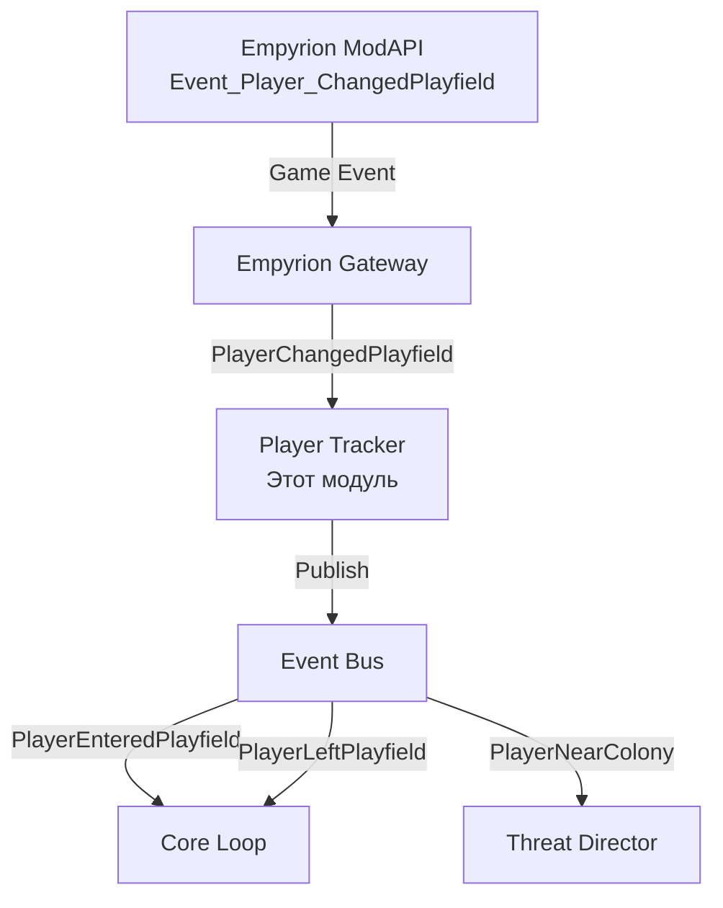

# Модуль: Player Tracker

**Приоритет разработки:** 3 (Средний)  
**Зависимости:** Module_02 (EmpyrionGateway)  
**Статус:** 🟡 В разработке

---

## 1. Назначение модуля

Player Tracker отслеживает присутствие игроков на playfield'ах и предоставляет эту информацию другим модулям для активации/деактивации игровой активности.

### Ключевая идея

**Колонии активны только когда есть игроки поблизости** — нет смысла симулировать патрули и логистику, если никто не видит.

---

## 2. Архитектурный контекст



---

## 3. Интерфейс

```csharp
/// <summary>
/// Трекер игроков на playfield'ах
/// </summary>
public interface IPlayerTracker
{
    // === Запросы данных ===
    
    /// <summary>
    /// Получение списка игроков на playfield
    /// </summary>
    List<PlayerInfo> GetPlayersOnPlayfield(string playfield);
    
    /// <summary>
    /// Проверка наличия игроков на playfield
    /// </summary>
    bool HasPlayersOnPlayfield(string playfield);
    
    /// <summary>
    /// Получение игроков рядом с позицией (в радиусе)
    /// </summary>
    List<PlayerInfo> GetPlayersNearPosition(string playfield, Vector3 position, float radius);
    
    /// <summary>
    /// Получение информации об игроке по ID
    /// </summary>
    PlayerInfo GetPlayer(int playerId);
    
    // === События ===
    
    /// <summary>
    /// Игрок вошел на playfield
    /// </summary>
    event EventHandler<PlayerChangedPlayfieldEventArgs> PlayerEntered;
    
    /// <summary>
    /// Игрок покинул playfield
    /// </summary>
    event EventHandler<PlayerChangedPlayfieldEventArgs> PlayerLeft;
    
    // === Управление ===
    
    /// <summary>
    /// Запуск трекера (подписка на события)
    /// </summary>
    void Start();
    
    /// <summary>
    /// Остановка трекера
    /// </summary>
    void Stop();
}
```

---

## 4. Модели данных

```csharp
/// <summary>
/// Информация об игроке
/// </summary>
public class PlayerInfo
{
    public int PlayerId { get; set; }
    public string PlayerName { get; set; }
    public string CurrentPlayfield { get; set; }
    public Vector3 Position { get; set; }
    public DateTime LastSeen { get; set; }
    public bool IsOnline { get; set; }
}

/// <summary>
/// Событие смены playfield игроком
/// </summary>
public class PlayerChangedPlayfieldEventArgs : EventArgs
{
    public int PlayerId { get; set; }
    public string PlayerName { get; set; }
    public string FromPlayfield { get; set; }
    public string ToPlayfield { get; set; }
    public DateTime Timestamp { get; set; }
}
```

---

## 5. Реализация (ключевые методы)

```csharp
public class PlayerTracker : IPlayerTracker
{
    private readonly ConcurrentDictionary<string, ConcurrentBag<PlayerInfo>> _playersByPlayfield;
    private readonly ConcurrentDictionary<int, PlayerInfo> _playersById;
    
    public event EventHandler<PlayerChangedPlayfieldEventArgs> PlayerEntered;
    public event EventHandler<PlayerChangedPlayfieldEventArgs> PlayerLeft;
    
    public void Start()
    {
        _gateway.GameEventReceived += OnGameEvent;
    }
    
    public List<PlayerInfo> GetPlayersOnPlayfield(string playfield)
    {
        return _playersByPlayfield.TryGetValue(playfield, out var players) 
            ? players.ToList() 
            : new List<PlayerInfo>();
    }
    
    public bool HasPlayersOnPlayfield(string playfield)
    {
        return _playersByPlayfield.ContainsKey(playfield) && _playersByPlayfield[playfield].Any();
    }
    
    public List<PlayerInfo> GetPlayersNearPosition(string playfield, Vector3 position, float radius)
    {
        return GetPlayersOnPlayfield(playfield)
            .Where(p => Vector3.Distance(p.Position, position) <= radius)
            .OrderBy(p => Vector3.Distance(p.Position, position))
            .ToList();
    }
    
    private void OnGameEvent(object sender, GameEventArgs e)
    {
        switch (e.EventId)
        {
            case CmdId.Event_Player_ChangedPlayfield:
                HandlePlayerChangedPlayfield(e);
                break;
            case CmdId.Event_Player_Connected:
                HandlePlayerConnected(e);
                break;
            case CmdId.Event_Player_Disconnected:
                HandlePlayerDisconnected(e);
                break;
        }
    }
    
    private void HandlePlayerChangedPlayfield(GameEventArgs e)
    {
        var data = (IdPlayfieldPositionRotation)e.Data;
        var oldPlayfield = GetCurrentPlayfield(data.id);
        
        // Удаление из старого playfield
        if (!string.IsNullOrEmpty(oldPlayfield))
        {
            RemovePlayerFromPlayfield(data.id, oldPlayfield);
            PlayerLeft?.Invoke(this, new PlayerChangedPlayfieldEventArgs { ... });
        }
        
        // Добавление на новый playfield
        var playerInfo = new PlayerInfo { PlayerId = data.id, CurrentPlayfield = data.playfield, ... };
        AddPlayerToPlayfield(playerInfo);
        PlayerEntered?.Invoke(this, new PlayerChangedPlayfieldEventArgs { ... });
    }
}
```

---

## 6. Использование в Core Loop

```csharp
public class SimulationEngine
{
    private readonly IPlayerTracker _playerTracker;
    
    public void OnSimulationTick(object state)
    {
        foreach (var colony in _state.Colonies)
        {
            // Активируем колонию только если есть игроки на playfield
            if (_playerTracker.HasPlayersOnPlayfield(colony.Playfield))
            {
                UpdateColony(colony, deltaTime);
                
                // Проверяем близость игроков к колонии
                var nearbyPlayers = _playerTracker.GetPlayersNearPosition(
                    colony.Playfield,
                    colony.Position,
                    radius: 1000f  // 1 км
                );
                
                if (nearbyPlayers.Any())
                {
                    // Активировать защиту
                    _threatDirector.UpdateThreatLevelAsync(colony);
                }
            }
            else
            {
                // Playfield пустой — ставим колонию на паузу
                colony.IsPaused = true;
            }
        }
    }
}
```

---

## 7. Тестирование

```csharp
[Fact]
public void GetPlayersOnPlayfield_ReturnsCorrectPlayers()
{
    // Arrange
    var tracker = new PlayerTracker(_gateway, _logger);
    tracker.Start();
    
    // Симулируем событие
    SimulatePlayerChangedPlayfield(playerId: 1, playfield: "Akua");
    SimulatePlayerChangedPlayfield(playerId: 2, playfield: "Akua");
    SimulatePlayerChangedPlayfield(playerId: 3, playfield: "Omicron");
    
    // Act
    var akuaPlayers = tracker.GetPlayersOnPlayfield("Akua");
    
    // Assert
    Assert.Equal(2, akuaPlayers.Count);
    Assert.Contains(akuaPlayers, p => p.PlayerId == 1);
    Assert.Contains(akuaPlayers, p => p.PlayerId == 2);
}

[Fact]
public void PlayerEntered_EventFired()
{
    // Arrange
    var tracker = new PlayerTracker(_gateway, _logger);
    tracker.Start();
    
    bool eventFired = false;
    tracker.PlayerEntered += (s, e) => { eventFired = true; };
    
    // Act
    SimulatePlayerChangedPlayfield(playerId: 1, playfield: "Akua");
    
    // Assert
    Assert.True(eventFired);
}
```

---

## 8. Чеклист разработчика

**Этап 1: Базовый трекинг (1 день)**
- [ ] Реализовать интерфейс `IPlayerTracker`
- [ ] Подписка на `Event_Player_ChangedPlayfield`
- [ ] Кэширование игроков по playfield
- [ ] Unit-тесты

**Этап 2: События (0.5 дня)**
- [ ] События `PlayerEntered` / `PlayerLeft`
- [ ] Интеграция с EventBus

**Этап 3: Дополнительные фичи (0.5 дня)**
- [ ] `GetPlayersNearPosition()` с радиусом
- [ ] Обработка `Player_Connected` / `Player_Disconnected`
- [ ] Оптимизация производительности

---

## 9. Связь с другими документами

- **[Module_01_Core_Loop.md](Module_01_Core_Loop.md)** — использует PlayerTracker для активации колоний
- **[Module_10_Threat_Director.md](Module_10_Threat_Director.md)** — реагирует на близость игроков

---

**Последнее обновление:** 28.01.2026
