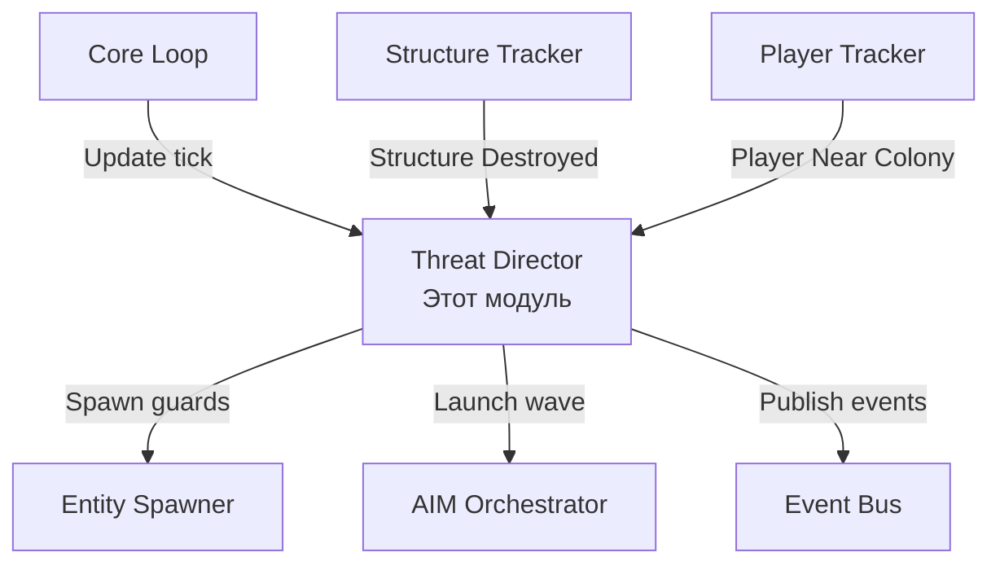

# Модуль: Threat Director

**Приоритет разработки:** 2 (Высокий)  
**Зависимости:** Module_04 (Entity Spawner), Module_05 (AIM Orchestrator), Module_08 (Player Tracker)  
**Статус:** 🟡 В разработке

---

## 1. Назначение модуля

Threat Director управляет **уровнем угрозы колоний** и активирует защитные механизмы: спавнит охранников, запускает волны атак, эскалирует защиту при разрушениях.

### Ключевая механика

**Адаптивная защита** — чем больше игрок атакует колонию, тем сильнее она защищается.

---

## 2. Архитектурный контекст



---

## 3. Уровни угрозы

### 3.1 Enum ThreatLevel

```csharp
public enum ThreatLevel
{
    None = 0,       // Нет угрозы (игроков нет на планете)
    Low = 1,        // Низкая (игроки далеко, >2км)
    Medium = 2,     // Средняя (игроки близко, <2км)
    High = 3,       // Высокая (игроки атакуют структуры)
    Critical = 4    // Критическая (база разрушена)
}
```

### 3.2 Реакции по уровням

| Уровень | Условия | Реакция |
|---------|---------|---------|
| **None** | Нет игроков на playfield | Деактивация патрулей |
| **Low** | Игроки >2км от базы | Базовые патрули (2-4 охранника) |
| **Medium** | Игроки 500м-2км от базы | Усиленные патрули (4-8 охранников) |
| **High** | Игроки атакуют (<500м) или урон по структурам | Волна атак (дроны) + подкрепление |
| **Critical** | База уничтожена | Массированная контратака + откат стадии |

---

## 4. Интерфейс

```csharp
/// <summary>
/// Директор управления угрозами
/// </summary>
public interface IThreatDirector
{
    // === Анализ угрозы ===
    
    /// <summary>
    /// Расчет текущего уровня угрозы для колонии
    /// </summary>
    Task<ThreatLevel> CalculateThreatLevelAsync(Colony colony);
    
    /// <summary>
    /// Обновление уровня угрозы и активация защиты
    /// Вызывается в Core Loop для активных колоний
    /// </summary>
    Task UpdateThreatLevelAsync(Colony colony);
    
    // === Реакция на события ===
    
    /// <summary>
    /// Реакция на разрушение структуры колонии
    /// </summary>
    Task RespondToDestructionAsync(Colony colony, DestructionEvent destructionEvent);
    
    /// <summary>
    /// Реакция на атаку юнитов колонии
    /// </summary>
    Task RespondToUnitAttackAsync(Colony colony, int attackedUnitId);
    
    // === Активация защиты ===
    
    /// <summary>
    /// Активация защитных механизмов согласно уровню угрозы
    /// </summary>
    Task ActivateDefensesAsync(Colony colony, ThreatLevel level);
    
    /// <summary>
    /// Запуск волны атак на вражескую структуру (v1.15+)
    /// </summary>
    Task<uint> LaunchWaveAttackAsync(Colony colony, int targetEntityId, int waveStrength);
    
    /// <summary>
    /// Спавн(направление к месту инцидента) дополнительных защитников из резерва колонии.
    /// </summary>
    Task SpawnDefendersAsync(Colony colony, Vector3 spawnPosition, int count);
}
```

---

## 5. Модели данных

```csharp
/// <summary>
/// Событие разрушения структуры
/// </summary>
public class DestructionEvent
{
    public int EntityId { get; set; }
    public string EntityName { get; set; }
    public DateTime Timestamp { get; set; }
    public int? AttackerPlayerId { get; set; }
}

/// <summary>
/// Данные о волне атаки (v1.15+)
/// </summary>
public class WaveAttackData
{
    public string WaveName { get; set; }
    public string TargetEntityId { get; set; }
    public string Faction { get; set; } = "Zirax";
    public int Cost { get; set; }  // Сложность волны
}
```

---

## 6. Реализация (ключевые методы)

```csharp
public class ThreatDirector : IThreatDirector
{
    private readonly ConcurrentDictionary<string, List<DestructionEvent>> _attackHistory;
    private readonly ConcurrentDictionary<string, DateTime> _lastWaveTime;
    private const int MinWaveIntervalSeconds = 300;
    
    public async Task<ThreatLevel> CalculateThreatLevelAsync(Colony colony)
    {
        var score = 0f;
        
        // Фактор 1: Близость игроков
        var nearbyPlayers = _playerTracker.GetPlayersNearPosition(colony.Playfield, colony.Position, 2000f);
        if (!nearbyPlayers.Any()) return ThreatLevel.None;
        
        var veryClose = nearbyPlayers.Count(p => Vector3.Distance(p.Position, colony.Position) < 500f);
        score += veryClose * 20f + (nearbyPlayers.Count - veryClose) * 5f;
        
        // Фактор 2: Недавние разрушения
        if (_attackHistory.TryGetValue(colony.Id, out var attacks))
            score += attacks.Count(a => (DateTime.UtcNow - a.Timestamp).TotalMinutes < 30) * 15f;
        
        // Фактор 3: Затухание угрозы
        var timeSinceLastAttack = (DateTime.UtcNow - colony.LastAttackTime).TotalMinutes;
        if (timeSinceLastAttack < 30)
            score += (30 - timeSinceLastAttack) * 0.5f;
        
        // Фактор 4: Ценность колонии
        score += (int)colony.Stage * 3f;
        
        // Преобразование в уровень
        if (score < 10) return ThreatLevel.None;
        if (score < 30) return ThreatLevel.Low;
        if (score < 60) return ThreatLevel.Medium;
        if (score < 100) return ThreatLevel.High;
        return ThreatLevel.Critical;
    }
    
    public async Task UpdateThreatLevelAsync(Colony colony)
    {
        var newLevel = await CalculateThreatLevelAsync(colony);
        if (newLevel != colony.ThreatLevel)
        {
            colony.ThreatLevel = newLevel;
            if (newLevel > colony.ThreatLevel)
                await ActivateDefensesAsync(colony, newLevel);
        }
    }
    
    public async Task RespondToDestructionAsync(Colony colony, DestructionEvent destructionEvent)
    {
        var attacks = _attackHistory.GetOrAdd(colony.Id, _ => new List<DestructionEvent>());
        attacks.Add(destructionEvent);
        
        colony.LastAttackTime = DateTime.UtcNow;
        colony.ThreatLevel = ThreatLevel.Critical;
        
        await ActivateDefensesAsync(colony, ThreatLevel.Critical);
    }
    
    public async Task ActivateDefensesAsync(Colony colony, ThreatLevel level)
    {
        switch (level)
        {
            case ThreatLevel.Medium:
                await SpawnDefendersAsync(colony, colony.Position, 4);
                break;
            case ThreatLevel.High:
                await SpawnDefendersAsync(colony, colony.Position, 6);
                var target = FindNearestPlayerStructure(colony);
                if (target != null) await LaunchWaveAttackAsync(colony, target.id, 50);
                break;
            case ThreatLevel.Critical:
                await SpawnDefendersAsync(colony, colony.Position, 10);
                target = FindNearestPlayerStructure(colony);
                if (target != null) await LaunchWaveAttackAsync(colony, target.id, 150);
                break;
        }
    }
    
    public async Task<uint> LaunchWaveAttackAsync(Colony colony, int targetEntityId, int waveStrength)
    {
        // Rate limit check
        if (_lastWaveTime.TryGetValue(colony.Id, out var lastTime))
        {
            if ((DateTime.UtcNow - lastTime).TotalSeconds < MinWaveIntervalSeconds)
                return 0;
        }
        
        var waveData = new WaveAttackData
        {
            WaveName = $"GLEX_Defense_{colony.Id}",
            TargetEntityId = targetEntityId.ToString(),
            Faction = "Zirax",
            Cost = waveStrength
        };
        
        var waveId = await _aimOrchestrator.CreateWaveAttackAsync(waveData);
        _lastWaveTime[colony.Id] = DateTime.UtcNow;
        return waveId;
    }
}
```

---

## 7. Использование в Core Loop

```csharp
public class SimulationEngine
{
    private readonly IThreatDirector _threatDirector;
    
    public void OnSimulationTick(object state)
    {
        foreach (var colony in _state.Colonies)
        {
            // Обновляем угрозу для активных колоний
            if (_playerTracker.HasPlayersOnPlayfield(colony.Playfield))
            {
                await _threatDirector.UpdateThreatLevelAsync(colony);
            }
        }
    }
}
```

---

## 8. Тестирование

```csharp
[Fact]
public async Task CalculateThreatLevel_NoPlayers_ReturnsNone()
{
    // Arrange
    var colony = CreateTestColony();
    var playerTrackerMock = new Mock<IPlayerTracker>();
    playerTrackerMock
        .Setup(p => p.GetPlayersNearPosition(It.IsAny<string>(), It.IsAny<Vector3>(), It.IsAny<float>()))
        .Returns(new List<PlayerInfo>());
    
    var director = new ThreatDirector(
        _spawner,
        _aim,
        playerTrackerMock.Object,
        _logger
    );
    
    // Act
    var level = await director.CalculateThreatLevelAsync(colony);
    
    // Assert
    Assert.Equal(ThreatLevel.None, level);
}

[Fact]
public async Task RespondToDestruction_EscalatesToCritical()
{
    // Arrange
    var colony = CreateTestColony();
    colony.ThreatLevel = ThreatLevel.Low;
    
    var director = CreateThreatDirector();
    
    // Act
    await director.RespondToDestructionAsync(colony, new DestructionEvent
    {
        EntityId = 123,
        EntityName = "TestBase",
        Timestamp = DateTime.UtcNow
    });
    
    // Assert
    Assert.Equal(ThreatLevel.Critical, colony.ThreatLevel);
}
```

---

## 9. Чеклист разработчика

**Этап 1: Расчет угрозы (2 дня)**
- [ ] Реализовать `CalculateThreatLevelAsync()`
- [ ] Факторы: игроки, разрушения, время
- [ ] Unit-тесты для всех уровней

**Этап 2: Активация защиты (2 дня)**
- [ ] Реализовать `ActivateDefensesAsync()`
- [ ] Спавн защитников
- [ ] Интеграция с EntitySpawner

**Этап 3: Волны атак (1 день)**
- [ ] Реализовать `LaunchWaveAttackAsync()` с IPda API
- [ ] Rate limiting
- [ ] Тесты на реальном сервере

**Этап 4: Реакция на события (1 день)**
- [ ] `RespondToDestructionAsync()`
- [ ] `RespondToUnitAttackAsync()`
- [ ] Интеграция со StructureTracker

---

## 10. Известные проблемы

### 10.1 Проблема: Спам волн атак

**Решение:** Rate limiting (минимум 5 минут между волнами)

### 10.2 Проблема: NPC не атакуют после спавна

**Решение:** Использовать IPda.CreateWaveAttack() вместо простого спавна (v1.15+)

---

## 11. Связь с другими документами

- **[Module_04_Entity_Spawner.md](Module_04_Entity_Spawner.md)** — спавн защитников
- **[Module_05_AIM_Orchestrator.md](Module_05_AIM_Orchestrator.md)** — волны атак
- **[Module_08_Player_Tracker.md](Module_08_Player_Tracker.md)** — близость игроков

---

**Последнее обновление:** 28.01.2026
