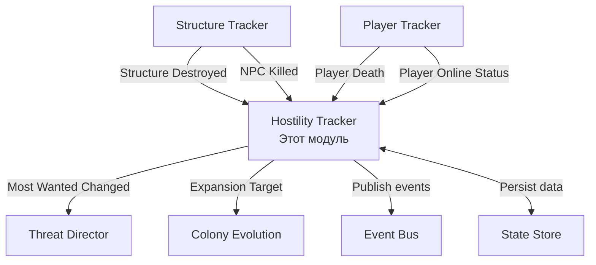

# Модуль: Hostility Tracker

**Приоритет разработки:** 2 (Высокий)  
**Зависимости:** Module_08 (Player Tracker), Module_09 (Structure Tracker)  
**Статус:** 🔴 Не начат

---

## 1. Назначение модуля

Hostility Tracker отслеживает враждебные действия игроков по отношению к колониям Zirax и управляет системой **"Most Wanted"** — охотой на наиболее опасных противников колонии.

### Ключевая механика

**"Охота на врага колонии"** — колония ведет учет всех враждебных действий каждого игрока, определяет самого опасного противника и направляет против него специальные силы возмездия.

---

## 2. Архитектурный контекст



---

## 3. Система подсчета враждебности

### 3.1 Таблица очков враждебности

| Действие игрока | Очки | Категория |
|----------------|------|-----------|
| Убийство охранника NPC | +10 | Низкая |
| Убийство строителя NPC | +15 | Низкая |
| Уничтожение ConstructionYard | +100 | Средняя |
| Уничтожение Base L1 | +200 | Средняя |
| Уничтожение Base L2 | +400 | Высокая |
| Уничтожение Base L3 | +800 | Высокая |
| Уничтожение Base Max | +1500 | Критическая |
| Уничтожение ресурсного аванпоста | +150 | Средняя |
| Уничтожение логистического корабля | +200 | Средняя |
| Уничтожение дронбазы | +300 | Высокая |
| Уничтожение портала | +500 | Критическая |
| Уничтожение верфи | +600 | Критическая |

### 3.2 Затухание враждебности

**ВАЖНО:** Затухание происходит ТОЛЬКО при убийстве игрока юнитами колонии.

```csharp
public void OnPlayerKilledByColony(int playerId, int killerNpcId, string colonyId)
{
    // Снижение на 5% только при убийстве юнитами колонии
    data.HostilityScore = (int)(data.HostilityScore * 0.95f);
}
```

**Механика:**
- Обычное время НЕ снижает враждебность
- Смерть от других причин (падение, голод, PvP) НЕ снижает враждебность
- Только убийство юнитами колонии (NPC, дроны, турели) уменьшает враждебность на 5%
- Это стимулирует игроков сражаться с колонией, а не избегать её

---

## 4. Ранги "Most Wanted"

| Ранг | Score | Название | Эффект |
|------|-------|----------|--------|
| 0 | 0-99 | Неизвестный | Нет особой реакции |
| 1 | 100-499 | Нарушитель | +25% патрулей вокруг игрока |
| 2 | 500-999 | Враг колонии | Периодические волны атак (каждые 15 мин) |
| 3 | 1000-1999 | Опасный террорист | Элитные охотничьие отряды (каждые 10 мин) |
| 4 | 2000-4999 | Заклятый враг | Assassination Squad - спецотряд с целью убийства |
| 5 | 5000+ | Геноцидер | Непрерывная массированная охота, CV-носитель |

```csharp
public enum WantedRank
{
    Unknown = 0,        // 0-99 очков
    Offender = 1,       // 100-499 очков
    Enemy = 2,          // 500-999 очков
    Terrorist = 3,      // 1000-1999 очков
    Nemesis = 4,        // 2000-4999 очков
    Genocider = 5       // 5000+ очков
}
```

---

## 5. Приоритизация цели охоты

**КРИТИЧЕСКИ ВАЖНО:** Охота ведется на наиболее враждебного **ОНЛАЙН** игрока.

```csharp
public PlayerHostilityInfo GetMostWantedTarget(Colony colony)
{
    var allHostilePlayers = GetHostilePlayersForColony(colony.Id)
        .OrderByDescending(p => p.HostilityScore).ToList();
    
    if (!allHostilePlayers.Any()) return null;
    
    // Приоритет: враждебный ОНЛАЙН игрок
    var onlinePlayers = allHostilePlayers
        .Where(p => _playerTracker.IsPlayerOnline(p.PlayerId)).ToList();
    
    if (onlinePlayers.Any())
        return onlinePlayers.First(); // Охота активна
    
    return allHostilePlayers.First(); // Топовый оффлайн (только для экспансии)
}
```

**Логика:**
1. Если есть онлайн игроки с враждебностью > 0 → охотимся на самого враждебного онлайн
2. Если все враждебные игроки оффлайн → сохраняем топового для экспансии
3. Охота активируется только при наличии онлайн цели

**Примеры:**
- Игрок A: 3000 очков (оффлайн), Игрок B: 800 очков (онлайн) → **Цель: B** (онлайн приоритет)
- Игрок A: 5000 очков (онлайн), Игрок B: 4500 очков (онлайн) → **Цель: A** (самый враждебный онлайн)
- Все оффлайн → **Охота приостановлена**, экспансия на планету топового

---

## 6. Интерфейс

```csharp
public interface IHostilityTracker
{
    // Добавление враждебности
    void AddHostility(int playerId, string colonyId, HostilityReason reason, int amount);
    void RecordNPCKill(int playerId, string colonyId, string npcType);
    void RecordStructureDestruction(int playerId, string colonyId, ColonyStage structureStage);
    
    // Запросы данных
    int GetHostilityScore(int playerId, string colonyId);
    int GetTotalHostilityScore(int playerId);
    WantedRank GetWantedRank(int playerId, string colonyId);
    PlayerHostilityInfo GetMostWantedTarget(Colony colony);
    List<PlayerHostilityInfo> GetTopEnemies(string colonyId, int count = 3);
    List<PlayerHostilityInfo> GetHostilePlayersForColony(string colonyId);
    
    // Снижение враждебности
    void OnPlayerKilledByColony(int playerId, int killerNpcId, string colonyId); // -5%
    
    // События
    event EventHandler<MostWantedChangedEventArgs> MostWantedChanged;
    event EventHandler<RankChangedEventArgs> RankChanged;
}
```

---

## 7. Модели данных

```csharp
public class PlayerHostilityInfo
{
    public int PlayerId { get; set; }
    public string PlayerName { get; set; }
    public int HostilityScore { get; set; }
    public WantedRank Rank { get; set; }
    public DateTime LastActionTime { get; set; }
    public int KillCount { get; set; }
    public int StructuresDestroyed { get; set; }
    public bool IsOnline { get; set; }
    public string HomePlanetPlayfield { get; set; }  // Для экспансии
}

public enum HostilityReason
{
    NPCKilled,
    StructureDestroyed,
    LogisticShipDestroyed,
    DroneBaseDestroyed,
    PortalDestroyed,
    ShipyardDestroyed
}

public class MostWantedChangedEventArgs : EventArgs
{
    public string ColonyId { get; set; }
    public PlayerHostilityInfo PreviousTarget { get; set; }
    public PlayerHostilityInfo NewTarget { get; set; }
    public DateTime Timestamp { get; set; }
}

public class RankChangedEventArgs : EventArgs
{
    public int PlayerId { get; set; }
    public string ColonyId { get; set; }
    public WantedRank OldRank { get; set; }
    public WantedRank NewRank { get; set; }
    public int HostilityScore { get; set; }
}
```

---

## 8. Реализация (ключевые методы)

### 8.1 Добавление враждебности

```csharp
public void AddHostility(int playerId, string colonyId, HostilityReason reason, int amount)
{
    var key = $"{playerId}:{colonyId}";
    var data = _hostilityData.GetOrAdd(key, _ => new PlayerHostilityData
    {
        PlayerId = playerId,
        ColonyId = colonyId,
        HostilityScore = 0
    });
    
    var oldRank = CalculateRank(data.HostilityScore);
    data.HostilityScore += amount;
    data.LastActionTime = DateTime.UtcNow;
    var newRank = CalculateRank(data.HostilityScore);
    
    if (newRank != oldRank)
        RankChanged?.Invoke(this, new RankChangedEventArgs { ... });
    
    CheckMostWantedChange(colonyId);
}

public void RecordStructureDestruction(int playerId, string colonyId, ColonyStage stage)
{
    var amount = stage switch
    {
        ColonyStage.ConstructionYard => 100,
        ColonyStage.BaseL1 => 200,
        ColonyStage.BaseL2 => 400,
        ColonyStage.BaseL3 => 800,
        ColonyStage.BaseMax => 1500,
        _ => 50
    };
    
    AddHostility(playerId, colonyId, HostilityReason.StructureDestroyed, amount);
}

private WantedRank CalculateRank(int score)
{
    if (score < 100) return WantedRank.Unknown;
    if (score < 500) return WantedRank.Offender;
    if (score < 1000) return WantedRank.Enemy;
    if (score < 2000) return WantedRank.Terrorist;
    if (score < 5000) return WantedRank.Nemesis;
    return WantedRank.Genocider;
}
```

### 8.2 Снижение враждебности при убийстве юнитами колонии

```csharp
public void OnPlayerKilledByColony(int playerId, int killerNpcId, string colonyId)
{
    var key = $"{playerId}:{colonyId}";
    
    if (_hostilityData.TryGetValue(key, out var data))
    {
        var oldScore = data.HostilityScore;
        data.HostilityScore = (int)(oldScore * 0.95f); // -5%
        
        _logger.LogInformation(
            $"Player {playerId} killed by colony {colonyId} NPC {killerNpcId}. " +
            $"Hostility reduced: {oldScore} -> {data.HostilityScore} (-5%)"
        );
        
        var oldRank = CalculateRank(oldScore);
        var newRank = CalculateRank(data.HostilityScore);
        
        if (newRank != oldRank)
            RankChanged?.Invoke(this, new RankChangedEventArgs { ... });
        
        CheckMostWantedChange(colonyId);
    }
    
    SaveStateAsync().Wait();
}
```

**Примечание:** Смерть игрока от других причин (падение, голод, другие игроки, дикие NPC) НЕ снижает враждебность. Только убийство юнитами конкретной колонии снижает враждебность к этой колонии.

---

## 9. Интеграция с Threat Director

```csharp
// В ThreatDirector.UpdateThreatLevelAsync()
var mostWanted = _hostilityTracker.GetMostWantedTarget(colony);

if (mostWanted != null && mostWanted.IsOnline && mostWanted.Rank >= WantedRank.Terrorist)
{
    // Режим охоты активирован
    return ThreatLevel.Hunt;
}

// Модификатор угрозы от ранга
var rankModifier = mostWanted?.Rank switch
{
    WantedRank.Offender => 1.25f,
    WantedRank.Enemy => 1.5f,
    WantedRank.Terrorist => 2.0f,
    WantedRank.Nemesis => 3.0f,
    WantedRank.Genocider => 5.0f,
    _ => 1.0f
};
```

---

## 10. Интеграция с Colony Evolution

**Экспансия направляется ПОЭТАПНО к родной планете Most Wanted игрока.**

### Концепция постепенного приближения

Колония НЕ прыгает сразу на родную планету игрока. Вместо этого она захватывает планеты **в направлении** цели, постепенно приближаясь планета за планетой, система за системой.

**Эффект:** Игрок видит, как колонии Zirax медленно, но неумолимо приближаются к его базе. Это создает ощущение надвигающейся угрозы.

```csharp
public async Task<string> SelectExpansionTargetAsync(Colony sourceColony)
{
    var mostWanted = _hostilityTracker.GetMostWantedTarget(sourceColony);
    
    if (mostWanted != null && !string.IsNullOrEmpty(mostWanted.HomePlanetPlayfield))
    {
        var targetPlanet = mostWanted.HomePlanetPlayfield;
        
        // Получаем путь от текущей колонии к родной планете игрока
        var pathToTarget = CalculateExpansionPath(sourceColony.Playfield, targetPlanet);
        
        if (pathToTarget.Count > 1)
        {
            // Берем следующую планету на пути
            var nextPlanet = pathToTarget[1]; // [0] = текущая, [1] = следующая
            
            if (IsValidExpansionTarget(nextPlanet))
            {
                _logger.LogWarning(
                    $"Colony {sourceColony.Id} expanding toward Most Wanted player {mostWanted.PlayerId} home. " +
                    $"Next target: {nextPlanet} (step {GetColonyCountOnPath(pathToTarget)}/{pathToTarget.Count-1} to {targetPlanet})"
                );
                
                return nextPlanet; // Следующий шаг к цели
            }
        }
        else if (pathToTarget.Count == 1 && pathToTarget[0] == targetPlanet)
        {
            // Мы уже рядом, можем захватывать родную планету
            if (IsValidExpansionTarget(targetPlanet))
            {
                _logger.LogCritical(
                    $"Colony {sourceColony.Id} targeting FINAL expansion to {targetPlanet} " +
                    $"(home planet of Most Wanted player {mostWanted.PlayerId}). " +
                    $"The reckoning is upon them!"
                );
                
                return targetPlanet; // Финальный удар!
            }
        }
    }
    
    return SelectRandomExpansionTarget(); // Fallback
}

/// <summary>
/// Расчет пути экспансии от источника к цели через систему планет
/// </summary>
private List<string> CalculateExpansionPath(string sourcePlanet, string targetPlanet)
{
    // Получаем карту связей планет (солнечная система, соседние системы)
    var solarSystemMap = _playfieldGraph.GetSolarSystemConnections();
    
    // Алгоритм поиска кратчайшего пути (Dijkstra/A*)
    var path = FindShortestPath(sourcePlanet, targetPlanet, solarSystemMap);
    
    return path;
}

/// <summary>
/// Подсчет уже захваченных планет на пути к цели
/// </summary>
private int GetColonyCountOnPath(List<string> path)
{
    return path.Count(playfield => _state.Colonies.Any(c => c.Playfield == playfield));
}

// Определение родной планеты = планета с максимумом структур игрока
public string DeterminePlayerHomePlanet(int playerId)
{
    return _structureTracker.GetPlayerStructures(playerId)
        .GroupBy(s => s.Playfield)
        .OrderByDescending(g => g.Count())
        .First().Key;
}
```

### Пример сценария постепенной экспансии

**Исходная ситуация:**
- Колония Zirax на планете "Zeta"
- Most Wanted игрок имеет базу на "Akua"
- Путь: Zeta → Omicron → Tallodar → Akua

**Развитие событий:**
1. **Экспансия 1:** Zeta → Omicron (игрок видит сообщение: "Zirax expanding toward your territory")
2. **Экспансия 2:** Omicron → Tallodar (игрок: "They're getting closer...")
3. **Экспансия 3:** Tallodar → **Akua** (игрок: "THE RECKONING IS UPON YOU!")

**Игровой опыт:**
- Игрок видит расширение колоний на карте
- Может попытаться разрушить промежуточные колонии (но это добавляет враждебность!)
- Может эвакуироваться с родной планеты заранее
- Создает драматическое напряжение и ощущение надвигающейся угрозы

---

## 11. Хранение данных (state.json)

```json
{
  "playerHostility": {
    "123:colony_001": {
      "playerId": 123,
      "playerName": "BadPlayer",
      "colonyId": "colony_001",
      "hostilityScore": 2500,
      "rank": 4,
      "lastActionTime": "2026-01-29T12:00:00Z",
      "killCount": 45,
      "structuresDestroyed": 3,
      "homePlanetPlayfield": "Akua"
    }
  }
}
```

---

## 12. Тестирование

```csharp
[Fact]
public void AddHostility_IncreasesScore()
{
    var tracker = new HostilityTracker(_playerTracker, _stateStore, _logger);
    tracker.AddHostility(123, "colony_001", HostilityReason.NPCKilled, 10);
    Assert.Equal(10, tracker.GetHostilityScore(123, "colony_001"));
}

[Fact]
public void OnPlayerKilledByColony_ReducesScoreBy5Percent()
{
    var tracker = new HostilityTracker(_playerTracker, _stateStore, _logger);
    tracker.AddHostility(123, "colony_001", HostilityReason.StructureDestroyed, 1000);
    tracker.OnPlayerKilledByColony(123, killerNpcId: 999, "colony_001");
    Assert.Equal(950, tracker.GetHostilityScore(123, "colony_001")); // 1000 * 0.95
}

[Fact]
public void PlayerDiedFromOtherCauses_DoesNotReduceScore()
{
    var tracker = new HostilityTracker(_playerTracker, _stateStore, _logger);
    tracker.AddHostility(123, "colony_001", HostilityReason.StructureDestroyed, 1000);
    // Игрок умер от падения/голода/PvP - НЕ вызываем OnPlayerKilledByColony
    Assert.Equal(1000, tracker.GetHostilityScore(123, "colony_001")); // Без изменений
}

[Fact]
public void GetMostWantedTarget_PrioritizesOnlinePlayer()
{
    var tracker = new HostilityTracker(_playerTracker, _stateStore, _logger);
    tracker.AddHostility(123, "colony_001", HostilityReason.StructureDestroyed, 5000); // Топ оффлайн
    tracker.AddHostility(456, "colony_001", HostilityReason.NPCKilled, 800); // Слабый онлайн
    
    _playerTrackerMock.Setup(p => p.IsPlayerOnline(123)).Returns(false);
    _playerTrackerMock.Setup(p => p.IsPlayerOnline(456)).Returns(true);
    
    var target = tracker.GetMostWantedTarget(colony);
    Assert.Equal(456, target.PlayerId); // Онлайн игрок приоритетнее
}
```

---

## 13. Чеклист разработчика

**Этап 1: Базовая структура (2 дня)**
- [ ] Реализовать интерфейс `IHostilityTracker`
- [ ] Модели данных: `PlayerHostilityInfo`, `WantedRank`
- [ ] Методы добавления враждебности
- [ ] Unit-тесты

**Этап 2: Система рангов (1 день)**
- [ ] Расчет ранга по очкам
- [ ] События `RankChanged`
- [ ] Логирование изменений

**Этап 3: Most Wanted система (2 дня)**
- [ ] Метод `GetMostWantedTarget()` с приоритетом онлайн
- [ ] Событие `MostWantedChanged`
- [ ] Интеграция с PlayerTracker (онлайн статус)

**Этап 4: Снижение враждебности (1 день)**
- [ ] Обработка убийства игрока юнитами колонии (`OnPlayerKilledByColony`)
- [ ] Определение убийцы (NPC колонии vs другие причины смерти)
- [ ] Снижение на 5% только при убийстве юнитами
- [ ] Тесты на затухание

**Этап 5: Персистентность (1 день)**
- [ ] Сохранение в state.json
- [ ] Загрузка при старте
- [ ] Миграции данных

**Этап 6: Интеграция (2-3 дня)**
- [ ] Интеграция с Threat Director
- [ ] Интеграция с Colony Evolution (постепенная экспансия)
- [ ] Алгоритм поиска пути между планетами (граф солнечной системы)
- [ ] Определение родной планеты игрока
- [ ] Integration-тесты

---

## 14. Конфигурация

```json
{
  "HostilityTracker": {
    "DeathPenaltyPercent": 5,
    "MinimumScoreForHunt": 100,
    "EnableExpansionToEnemyPlanet": true,
    "HostilityScores": {
      "NPCKilled_Guard": 10,
      "NPCKilled_Builder": 15,
      "StructureDestroyed_ConstructionYard": 100,
      "StructureDestroyed_BaseL1": 200,
      "StructureDestroyed_BaseL2": 400,
      "StructureDestroyed_BaseL3": 800,
      "StructureDestroyed_BaseMax": 1500,
      "StructureDestroyed_ResourceOutpost": 150,
      "StructureDestroyed_LogisticShip": 200,
      "StructureDestroyed_DroneBase": 300,
      "StructureDestroyed_Portal": 500,
      "StructureDestroyed_Shipyard": 600
    }
  }
}
```

---

## 15. Связь с другими документами

- **[Module_08_Player_Tracker.md](Module_08_Player_Tracker.md)** — отслеживание онлайн статуса
- **[Module_09_Structure_Tracker.md](Module_09_Structure_Tracker.md)** — детектирование разрушений
- **[Module_10_Threat_Director.md](Module_10_Threat_Director.md)** — активация охоты
- **[Module_07_Colony_Evolution.md](Module_07_Colony_Evolution.md)** — целевая экспансия

---

**Последнее обновление:** 29.01.2026  
**Версия:** 1.0  
**Размер:** ~500 строк (оптимизирован)
