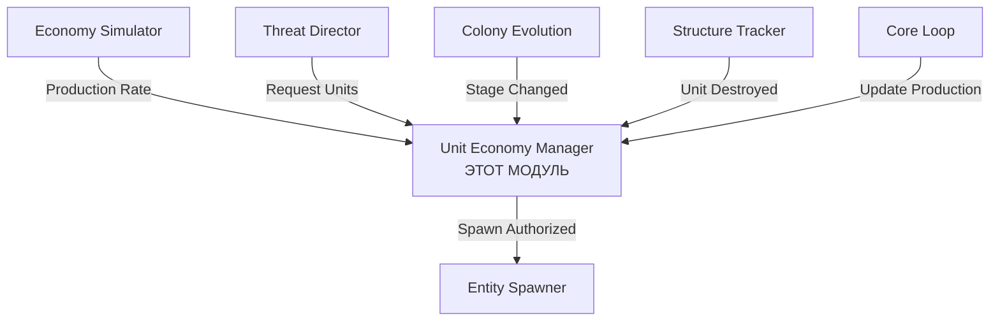

# Модуль: Unit Economy Manager

**Приоритет разработки:** 2 (Высокий)  
**Зависимости:** Module_11 (Economy Simulator), Module_04 (Entity Spawner), Module_10 (Threat Director)  
**Статус:** 🔴 Не начат

---

## 1. Назначение модуля

Unit Economy Manager управляет **производством, доступностью и учетом боевых единиц** колоний. Обеспечивает конечность ресурсов для создания юнитов и реалистичное ослабление колонии при потерях.

### Ключевая механика

**"Ощутимая конечность юнитов"** — игрок видит последствия своих действий: уничтожение юнитов и аванпостов реально ослабляет колонию на продолжительное время.

### Проблема, которую решает

**Без модуля:**
- ❌ Юниты спавнятся бесплатно и бесконечно
- ❌ Разрушение аванпостов не влияет на доступность юнитов
- ❌ База может бесконечно спавнить защитников

**С модулем:**
- ✅ Ограниченный резерв юнитов (гарнизон)
- ✅ Производство требует времени
- ✅ Разрушение аванпостов снижает скорость производства
- ✅ База может быть "обескровлена" и не сможет защищаться

---

## 2. Архитектурный контекст



---

## 3. Модели данных

```csharp
/// <summary>
/// Пул доступных юнитов для колонии
/// </summary>
public class UnitPool
{
    public int AvailableGuards { get; set; }          // Доступные охранники
    public int MaxGuards { get; set; }                // Максимум гарнизона
    public int AvailablePatrolVessels { get; set; }   // Доступные корабли
    public int MaxPatrolVessels { get; set; }
    public int AvailableWarships { get; set; }        // Боевые корабли (CV)
    public int MaxWarships { get; set; }
    public int AvailableDrones { get; set; }          // Дроны для волн
    public int MaxDrones { get; set; }
    
    public float ProductionRate { get; set; }         // Скорость производства (юнитов/час)
    public DateTime LastProductionTime { get; set; }
    public float ProductionProgress { get; set; }     // Накопленный прогресс (дробная часть)
    
    public List<ActiveUnit> ActiveUnits { get; set; } = new(); // Активные юниты в мире
}

/// <summary>
/// Активный юнит в игровом мире
/// </summary>
public class ActiveUnit
{
    public int EntityId { get; set; }
    public UnitType Type { get; set; }
    public DateTime SpawnedAt { get; set; }
    public string AssignedRole { get; set; } // "Guard", "Patrol", "Hunter", "Wave"
}

public enum UnitType
{
    Guard,           // Охранник (NPC)
    PatrolVessel,    // Патрульный корабль (SV/HV)
    Warship,         // Боевой корабль (CV)
    Drone,           // Дрон
    EliteHunter      // Элитный охотник
}
```

---

## 4. Интерфейс

```csharp
public interface IUnitEconomyManager
{
    // === Проверка доступности ===
    bool CanSpawnUnit(Colony colony, UnitType type, int count = 1);
    int GetAvailableCount(Colony colony, UnitType type);
    UnitPool GetUnitPool(Colony colony);
    
    // === Производство и потребление ===
    bool ReserveUnits(Colony colony, UnitType type, int count);
    void ProduceUnits(Colony colony, float deltaTime);
    void RegisterActiveUnit(Colony colony, int entityId, UnitType type, string role);
    void RecordUnitLoss(Colony colony, int entityId);
    
    // === Управление производством ===
    float CalculateProductionRate(Colony colony);
    void RecalculateCapacity(Colony colony);
    void InitializeUnitPool(Colony colony);
    
    // === Влияние разрушений ===
    void OnResourceOutpostDestroyed(Colony colony, string outpostId);
    void OnShipyardDestroyed(Colony colony);
    void OnDroneBaseDestroyed(Colony colony);
    void OnColonyUnderAttack(Colony colony, bool isUnderAttack);
}
```

---

## 5. Ключевые методы

### 5.1 Проверка доступности

```csharp
public bool CanSpawnUnit(Colony colony, UnitType type, int count = 1)
{
    var available = GetAvailableCount(colony, type);
    return available >= count;
}

public int GetAvailableCount(Colony colony, UnitType type)
{
    return type switch
    {
        UnitType.Guard => colony.UnitPool.AvailableGuards,
        UnitType.PatrolVessel => colony.UnitPool.AvailablePatrolVessels,
        UnitType.Warship => colony.UnitPool.AvailableWarships,
        UnitType.Drone => colony.UnitPool.AvailableDrones,
        _ => 0
    };
}
```

### 5.2 Резервирование юнитов

```csharp
public bool ReserveUnits(Colony colony, UnitType type, int count)
{
    if (!CanSpawnUnit(colony, type, count)) return false;
    
    // Уменьшаем доступное количество
    switch (type)
    {
        case UnitType.Guard: colony.UnitPool.AvailableGuards -= count; break;
        case UnitType.PatrolVessel: colony.UnitPool.AvailablePatrolVessels -= count; break;
        case UnitType.Warship: colony.UnitPool.AvailableWarships -= count; break;
        case UnitType.Drone: colony.UnitPool.AvailableDrones -= count; break;
    }
    
    return true;
}
```

### 5.3 Производство юнитов

```csharp
public void ProduceUnits(Colony colony, float deltaTime)
{
    var productionRate = CalculateProductionRate(colony);
    var productionPerSecond = productionRate / 3600f;
    
    colony.UnitPool.ProductionProgress += productionPerSecond * deltaTime;
    
    if (colony.UnitPool.ProductionProgress >= 1.0f)
    {
        var unitsProduced = (int)colony.UnitPool.ProductionProgress;
        colony.UnitPool.ProductionProgress -= unitsProduced;
        
        DistributeProducedUnits(colony, unitsProduced);
        colony.UnitPool.LastProductionTime = DateTime.UtcNow;
    }
}

private void DistributeProducedUnits(Colony colony, int totalUnits)
{
    // Приоритет: Guards > Drones > Vessels > Warships
    var remaining = totalUnits;
    
    // Пополняем Guards
    var guardsNeeded = colony.UnitPool.MaxGuards - colony.UnitPool.AvailableGuards;
    if (guardsNeeded > 0 && remaining > 0)
    {
        var toAdd = Math.Min(guardsNeeded, remaining);
        colony.UnitPool.AvailableGuards += toAdd;
        remaining -= toAdd;
    }
    
    // Пополняем Drones, Vessels, Warships аналогично...
}
```

### 5.4 Расчет скорости производства

```csharp
/// <summary>
/// Формула: ProductionRate = BaseRate × (1 + OutpostCount × 0.25) × 
///          ShipyardBonus × DroneBaseBonus × AttackPenalty
/// </summary>
public float CalculateProductionRate(Colony colony)
{
    var baseRate = GetBaseProductionRate(colony.Stage);
    var outpostBonus = 1.0f + (colony.ResourceNodes?.Count ?? 0) * 0.25f;
    var shipyardBonus = colony.HasShipyard ? 1.5f : 1.0f;
    var droneBaseBonus = colony.HasDroneBase ? 2.0f : 1.0f;
    var attackPenalty = colony.ThreatLevel >= ThreatLevel.High ? 0.7f : 1.0f;
    
    return baseRate * outpostBonus * shipyardBonus * droneBaseBonus * attackPenalty;
}
```

### 5.5 Учет потерь

```csharp
public void RecordUnitLoss(Colony colony, int entityId)
{
    var unit = colony.UnitPool.ActiveUnits.FirstOrDefault(u => u.EntityId == entityId);
    if (unit == null) return;
    
    colony.UnitPool.ActiveUnits.Remove(unit);
    
    _logger.LogWarning(
        $"Colony {colony.Id}: Lost unit {entityId} ({unit.Type}). " +
        $"Active units remaining: {colony.UnitPool.ActiveUnits.Count}"
    );
    
    // Юнит НЕ возвращается в пул! Нужно ждать производства новых.
}
```

### 5.6 Обработка разрушений

```csharp
public void OnResourceOutpostDestroyed(Colony colony, string outpostId)
{
    colony.ResourceNodes.Remove(colony.ResourceNodes.First(o => o.Id == outpostId));
    colony.UnitPool.ProductionRate = CalculateProductionRate(colony);
    
    _logger.LogWarning(
        $"Colony {colony.Id}: Outpost destroyed! " +
        $"Production rate decreased to {colony.UnitPool.ProductionRate:F2}/hour"
    );
}

public void OnShipyardDestroyed(Colony colony)
{
    colony.HasShipyard = false;
    colony.UnitPool.ProductionRate = CalculateProductionRate(colony);
    
    _logger.LogCritical($"Colony {colony.Id}: SHIPYARD DESTROYED! Cannot produce Warships.");
}
```

---

## 6. Интеграция с Threat Director

```csharp
// В ThreatDirector.SpawnDefendersAsync()
public async Task SpawnDefendersAsync(Colony colony, Vector3 position, int requestedCount)
{
    // ШАГ 1: Проверка доступности
    if (!_unitEconomy.CanSpawnUnit(colony, UnitType.Guard, requestedCount))
    {
        var available = _unitEconomy.GetAvailableCount(colony, UnitType.Guard);
        requestedCount = Math.Min(requestedCount, available);
        
        if (requestedCount == 0)
        {
            _logger.LogError($"Colony {colony.Id} has NO guards available!");
            return;
        }
    }
    
    // ШАГ 2: Резервирование
    if (!_unitEconomy.ReserveUnits(colony, UnitType.Guard, requestedCount))
        return;
    
    // ШАГ 3: Спавн
    var spawnedIds = await _entitySpawner.SpawnNPCGroupAsync(
        "ZiraxMinigunPatrol", position, requestedCount, colony.FactionId);
    
    // ШАГ 4: Регистрация
    foreach (var entityId in spawnedIds)
        _unitEconomy.RegisterActiveUnit(colony, entityId, UnitType.Guard, "Defender");
}
```

---

## 7. Интеграция с Core Loop

```csharp
// В SimulationEngine.OnSimulationTick()
public void OnSimulationTick(object state)
{
    var deltaTime = 1.0f;
    
    foreach (var colony in _state.Colonies)
    {
        _economySimulator.UpdateProduction(colony, deltaTime);
        _unitEconomy.ProduceUnits(colony, deltaTime);  // НОВОЕ
        
        if (_playerTracker.HasPlayersOnPlayfield(colony.Playfield))
            await _threatDirector.UpdateThreatLevelAsync(colony);
    }
}
```

---

## 8. Конфигурация

```json
{
  "UnitEconomy": {
    "Enabled": true,
    "StageCapacity": {
      "ConstructionYard": {
        "MaxGuards": 2,
        "MaxDrones": 5,
        "ProductionRatePerHour": 1.0
      },
      "BaseL1": {
        "MaxGuards": 6,
        "MaxPatrolVessels": 1,
        "MaxDrones": 10,
        "ProductionRatePerHour": 2.0
      },
      "BaseL2": {
        "MaxGuards": 10,
        "MaxPatrolVessels": 2,
        "MaxWarships": 1,
        "MaxDrones": 20,
        "ProductionRatePerHour": 3.5
      },
      "BaseL3": {
        "MaxGuards": 15,
        "MaxPatrolVessels": 3,
        "MaxWarships": 2,
        "MaxDrones": 30,
        "ProductionRatePerHour": 5.0
      },
      "BaseMax": {
        "MaxGuards": 20,
        "MaxPatrolVessels": 4,
        "MaxWarships": 3,
        "MaxDrones": 50,
        "ProductionRatePerHour": 8.0
      }
    },
    "ProductionModifiers": {
      "ResourceOutpostBonus": 0.25,
      "ShipyardBonus": 0.5,
      "DroneBaseBonus": 1.0,
      "UnderAttackPenalty": -0.3
    }
  }
}
```

---

## 9. Игровые сценарии

### Сценарий 1: Массированная атака

**Без Unit Economy:**
- Игрок убивает 10 охранников → база спавнит 10 новых
- ❌ Бесконечная мясорубка

**С Unit Economy:**
- Игрок убивает 10 охранников (осталось 4 в резерве)
- База спавнит 4 охранника (резерв исчерпан!)
- Игрок убивает еще 4 → база **не может** спавнить больше
- ✅ Через 30 минут появятся 2 новых охранника
- ✅ Игрок ощущает победу!

### Сценарий 2: Стратегическое ослабление

**План игрока:**
1. Уничтожить 3 аванпоста → ProductionRate падает с 7.8 до 3.5/час (-55%)
2. Уничтожить верфь → нет новых кораблей
3. Истребить гарнизон → база беззащитна на 2+ часа
4. ✅ Захватить базу без сопротивления

---

## 10. Балансировка

| Стадия | Max Guards | Production Rate | Время восполнения |
|--------|------------|-----------------|-------------------|
| ConstructionYard | 2 | 1.0/час | 2 часа |
| BaseL1 | 6 | 2.0/час | 3 часа |
| BaseL2 | 10 | 3.5/час | 2.9 часа |
| BaseL3 | 15 | 5.0/час | 3 часа |
| BaseMax | 20 | 8.0/час | 2.5 часа |

**С бонусами (2 аванпоста + верфь):**
- BaseL2: 3.5 × 1.5 × 1.5 = 7.875/час → 1.3 часа
- BaseMax: 8.0 × 1.5 × 1.5 = 18/час → 1.1 часа

---

## 11. Обновление state.json

```json
{
  "Colonies": [
    {
      "Id": "colony_akua_001",
      "UnitPool": {
        "AvailableGuards": 4,
        "MaxGuards": 10,
        "AvailablePatrolVessels": 1,
        "MaxPatrolVessels": 2,
        "AvailableWarships": 0,
        "MaxWarships": 1,
        "AvailableDrones": 15,
        "MaxDrones": 20,
        "ProductionRate": 4.5,
        "LastProductionTime": "2026-01-29T14:30:00Z",
        "ProductionProgress": 0.3,
        "ActiveUnits": [
          {
            "EntityId": 50020,
            "Type": "Guard",
            "SpawnedAt": "2026-01-29T14:00:00Z",
            "AssignedRole": "BaseDefense"
          }
        ]
      }
    }
  ]
}
```

---

## 12. Чеклист разработчика

**Этап 1-3: Базовая структура и производство (4 дня)**
- [ ] Модели данных и интерфейс
- [ ] `ProduceUnits()`, `CalculateProductionRate()`
- [ ] `CanSpawnUnit()`, `ReserveUnits()`, `RegisterActiveUnit()`

**Этап 4-5: Учет потерь и разрушений (3 дня)**
- [ ] `RecordUnitLoss()`
- [ ] `OnResourceOutpostDestroyed()`, `OnShipyardDestroyed()`
- [ ] Интеграция со Structure Tracker

**Этап 6-7: Интеграция и персистентность (3 дня)**
- [ ] `RecalculateCapacity()`, `InitializeUnitPool()`
- [ ] Интеграция с Threat Director и Core Loop
- [ ] Расширить state.json схему

**Этап 8-9: Конфигурация и тестирование (4 дня)**
- [ ] Добавить секцию UnitEconomy в Configuration.json
- [ ] Unit-тесты и integration-тесты
- [ ] Игровое тестирование и балансировка

**Итого:** ~14 дней разработки

---

## 13. Связь с другими документами

- **[Module_11_Economy_Simulator.md](Module_11_Economy_Simulator.md)** — базовая экономика ресурсов
- **[Module_10_Threat_Director.md](Module_10_Threat_Director.md)** — использование юнитов для защиты
- **[Module_04_Entity_Spawner.md](Module_04_Entity_Spawner.md)** — спавн юнитов
- **[Module_07_Colony_Evolution.md](Module_07_Colony_Evolution.md)** — изменение вместимости при апгрейде
- **[05_Схема_данных.md](../05_Схема_данных.md)** — структура UnitPool в state.json

---

**Последнее обновление:** 29.01.2026  
**Размер:** ~500 строк
