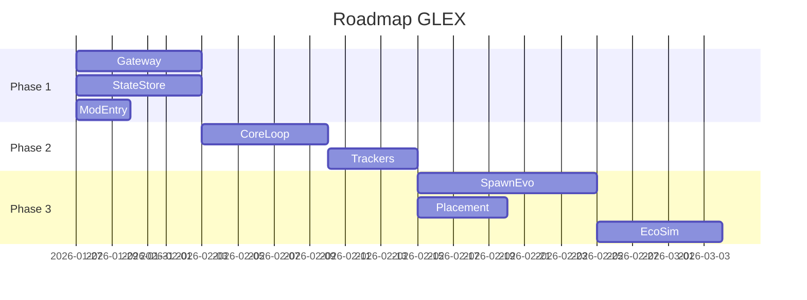

# Active Context — GalacticExpansion (GLEX)

## Текущее состояние проекта

**Дата обновления:** 28.01.2026  
**Фаза:** Документация обновлена с учетом новых возможностей API v1.15, готов к началу разработки

---

## Недавние изменения

### 28.01.2026 — Обновление с учетом декомпиляции API v1.15

**Найдены критически важные новые возможности:**
- ✅ Прямое управление движением НПС (`IEntity.Move`, `MoveForward`, `MoveStop`)
- ✅ Точное определение высоты рельефа (`IPlayfield.GetTerrainHeightAt`)
- ✅ Защита структур от распада (`Request_Structure_Touch`)
- ✅ Программное создание волн атак (`IPda.CreateWaveAttack`)
- ✅ Расширенный спавн с фракциями (`IPda.SpawnEntityAtPosition`)

**Обновлены документы:**
- ✅ `techContext.md` — добавлены новые возможности API
- ✅ `01_Техническое_задание.md` — обновлены ограничения
- ✅ `02_Архитектурный_план.md` — обновлены модули
- ✅ `Module_02_EmpyrionGateway.md` — новые интерфейсы
- ✅ `Module_04_Spawning_Evolution.md` — методы точного спавна
- ✅ `Module_05_AIM_Orchestrator.md` — прямое управление НПС
- ✅ `Module_06_Placement_Resolver.md` — точная высота рельефа
- ✅ `API_v1.15_Новые_возможности.md` — подробная документация новых API

### 24.01.2026 — Завершена полная документация проекта

Создан комплект из 10 основных документов + 6 описаний модулей:

**Основные документы:**
1. ✅ `01_Техническое_задание.md` — детальные функциональные требования (FR-001 до FR-011)
2. ✅ `02_Архитектурный_план.md` — C4-диаграммы, паттерны взаимодействия
3. ✅ `03_Технический_проект.md` — классы, алгоритмы, sequence-диаграммы
4. ✅ `04_Modular_Development_Plan.md` — поэтапный план разработки (5 phases, 12 недель)
5. ✅ `05_Схема_данных.md` — структура state.json, миграции
6. ✅ `06_ConfigReference.md` — полный справочник параметров конфигурации
7. ✅ `07_Operations_Runbook.md` — руководство по установке и эксплуатации
8. ✅ `08_Security_AbuseCases.md` — анализ угроз и защита
9. ✅ `09_Testing_Strategy.md` — unit/integration/E2E тестирование
10. ✅ `10_UI_UX_Design_Guide.md` — chat-команды и логирование

**Описания модулей:**
- ✅ Module_01_Core_Loop.md
- ✅ Module_02_EmpyrionGateway.md
- ✅ Module_03_StateStore.md
- ✅ Module_04_Spawning_Evolution.md
- ✅ Module_05_AIM_Orchestrator.md
- ✅ Module_06_Placement_Resolver.md

---

## Следующие шаги

### Phase 1: Foundation (Недели 1-2)

**Приоритет: Критический**

Создать базовую инфраструктуру:
1. **Empyrion Gateway** — адаптер для ModAPI (1 неделя)
2. **State Store** — персистентность state.json (1 неделя)
3. **Mod Entry Point** — точка входа, DI, логирование (3 дня)

**Цель Phase 1:** Мод загружается на сервере, может отправлять запросы к API, сохранять и загружать состояние.

### Рекомендуемый порядок разработки



---

## Активные решения

### Архитектурные решения

1. **Модульный монолит:** Единая DLL с четкими модулями (возможность future выделения)
2. **Event-Driven:** Модули общаются через EventBus (слабая связь)
3. **Async/Await:** Все API-запросы асинхронные
4. **Атомарная запись:** state.json пишется через temp file → rename

### Технические решения

1. **Rate Limiting:** Token Bucket алгоритм для защиты от спама
2. **Circuit Breaker:** Защита от недоступности ModAPI
3. **Sequence Manager:** Сопоставление async запросов и ответов через SeqNr
4. **FSM для стадий:** Конечный автомат для управления lifecycle колоний

### Решения по безопасности

1. **Whitelist AIM-команд:** Только `aim aga`, `aim tdw`, `aim adb`
2. **Санитизация:** Все входные данные валидируются
3. **Логирование:** Все security events записываются в лог

---

## Важные паттерны проекта

### Dependency Injection

Все зависимости через интерфейсы:
```csharp
public class SimulationEngine(
    IStateStore store,
    IEventBus bus,
    IModuleRegistry registry
) { }
```

### Repository Pattern

```csharp
interface IStateStore {
    Task<SimulationState> LoadAsync();
    Task SaveAsync(SimulationState state);
}
```

### Command Pattern для AIM

```csharp
interface IAIMOrchestrator {
    Task ExecuteGuardAreaAsync(int playerId, int range);
}
```

---

## Learnings и insights

### Что узнали в процессе планирования

1. **ModAPI ограничен:** Нет прямого управления AI, нет API для поверхности, нет доступа к депозитам
2. **Асинхронность критична:** ModAPI callback-based, нужна обертка в async/await
3. **Персистентность важна:** state.json — единственный источник truth, нужна защита от коррупции
4. **Производительность:** Simulation tick должен быть < 100ms
5. **Безопасность:** AIM-команды — потенциальная уязвимость, нужен strict whitelist

### Решенные проблемы дизайна

**Проблема:** Как симулировать добычу ресурсов без доступа к депозитам?  
**Решение:** Виртуальные ресурсы + ресурсные аванпосты (геймплейная имитация)

**Проблема:** Как управлять AI-патрулями без прямого API?  
**Решение:** Использовать встроенный AIM через консольные команды

**Проблема:** Как определить высоту поверхности для спавна?  
**Решение:** Эвристика (средняя высота + fallback стратегии)

**Проблема:** Как избежать коррупции state.json при крашах?  
**Решение:** Атомарная запись (write temp → rename) + автоматические бэкапы

---

## Открытые вопросы

### Требуют решения до начала разработки

1. **Prefabs:** Кто будет создавать префабы для структур? (GLEX_Base_L1, etc.)
   - **Решение:** Можно использовать существующие Zirax POI с модификациями

2. **Тестирование на реальном сервере:** Когда будет доступен test dedicated server?
   - **Решение:** Можно тестировать локально в single-player режиме с dedicated server

3. **Версионирование:** Какая стратегия для pre-release версий?
   - **Решение:** Использовать SemVer с pre-release tags (1.0.0-alpha.1, 1.0.0-beta.1)

---

## Конфигурационные preferences

### Рекомендуемые значения для MVP

```json
{
  "LogLevel": "Information",
  "HomePlayfield": "Akua",
  "Limits": {
    "MaxColoniesPerPlayfield": 1,
    "MaxGuardsNearColony": 10,
    "MaxDroneWavesPerHour": 4
  },
  "Simulation": {
    "TickIntervalMs": 1000,
    "SaveIntervalMinutes": 1
  }
}
```

---

## Контактная информация для разработки

**Документация:** `docs/architecture/`  
**Примеры модов:** `docs/examples/`  
**Memory Bank:** `memory-bank/`  

**Ключевые файлы для старта разработки:**
- `docs/architecture/04_Modular_Development_Plan.md` — план разработки
- `docs/architecture/03_Технический_проект.md` — детальная реализация
- `docs/architecture/modules/` — описания модулей

---

## Метрики успеха для Phase 1

- [ ] Мод загружается на dedicated server без ошибок
- [ ] Gateway отправляет запрос и получает ответ от ModAPI
- [ ] StateStore корректно сохраняет и загружает state.json
- [ ] Логи показывают нормальную работу
- [ ] Unit-тесты для Gateway и StateStore проходят (> 70% coverage)

**Ожидаемая дата завершения Phase 1:** 03.02.2026
