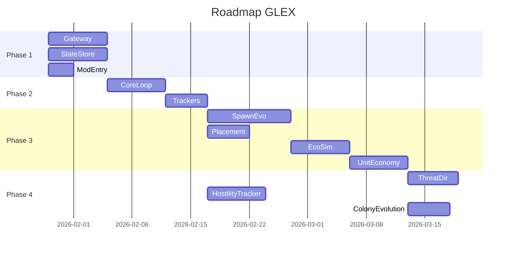

# Active Context — GalacticExpansion (GLEX)

## Текущее состояние проекта

**Дата обновления:** 29.01.2026  
**Фаза:** Документация обновлена с учетом новых возможностей API v1.15 + добавлена система "Most Wanted" + система Unit Economy, готов к началу разработки

---

## Недавние изменения

### 29.01.2026 — Добавлена система Unit Economy Manager (Учет и производство юнитов)

**Создан новый модуль Unit Economy Manager:**
- ✅ `Module_13_Unit_Economy.md` — управление производством и доступностью боевых единиц
- ✅ Модели данных: UnitPool, ActiveUnit, UnitType
- ✅ Производство юнитов с течением времени (настраиваемая скорость)
- ✅ Резервирование юнитов перед спавном через Threat Director
- ✅ Регистрация активных юнитов и учет потерь
- ✅ Расчет ProductionRate с модификаторами (аванпосты, верфь, дронбаза, атака)
- ✅ Пересчет вместимости при изменении стадии базы

**Обновлены модули:**
- ✅ `02_Архитектурный_план.md` — добавлен Unit Economy в диаграмму контейнеров
- ✅ `05_Схема_данных.md` — добавлены UnitPool и ActiveUnit в JSON схему state.json
- ✅ `06_ConfigReference.md` — секция 2.9 UnitEconomy с параметрами и формулами
- ✅ `Configuration.json` — секция UnitEconomy с лимитами для всех стадий
- ✅ `Module_10_Threat_Director.md` — интеграция проверки доступности юнитов
- ✅ `Module_11_Economy_Simulator.md` — связь с производством юнитов
- ✅ `Module_04_Entity_Spawner.md` — упоминание резервирования

**Ключевые механики:**
1. **Ограниченный резерв:** Каждая база имеет максимум юнитов (например, 10 охранников)
2. **Производство с течением времени:** Юниты производятся со скоростью (например, 3.5/час)
3. **Влияние разрушений:** Уничтожение аванпостов снижает ProductionRate на 25% каждый
4. **Стратегическая глубина:** Игрок может "обескровить" базу, истощив её резервы
5. **Реалистичное восстановление:** После потерь база не может мгновенно восполнить гарнизон

**Формула производства:**
```
ProductionRate = BaseRate × (1 + OutpostCount × 0.25) × 
                 (1 + ShipyardBonus) × (1 + DroneBaseBonus) × 
                 (1 + AttackPenalty)

Пример:
BaseL2: 3.5/час + 2 аванпоста + верфь = 3.5 × 1.5 × 1.5 = 7.875/час
```

**Игровой сценарий:**
```
1. Игрок атакует базу и убивает 10 охранников
2. База спавнит последних 4 из резерва → резерв исчерпан!
3. Игрок убивает еще 4 → база НЕ МОЖЕТ спавнить больше
4. Сообщение: "[Zirax] Defenses weakened. Reinforcements in 30 min."
5. Через 30 минут появятся только 2 новых охранника (при rate=4/час)
6. ✅ Победа ощутима! База реально ослаблена.
```

### 29.01.2026 — Добавлена система "Most Wanted" (Охота на врага колонии)

**Создан новый модуль Hostility Tracker:**
- ✅ `Module_12_Hostility_Tracker.md` — система отслеживания враждебности игроков
- ✅ Ранги враждебности: Unknown → Offender → Enemy → Terrorist → Nemesis → Genocider
- ✅ Приоритизация ОНЛАЙН игроков для охоты
- ✅ Затухание враждебности ТОЛЬКО при смерти игрока (5%)
- ✅ Целевая экспансия в направлении родной планеты Most Wanted врага
- ✅ Интеграция с Threat Director (режим "Hunt")
- ✅ Интеграция с Colony Evolution (направленная экспансия)

**Обновлены модули:**
- ✅ `Module_10_Threat_Director.md` — добавлен режим охоты (ThreatLevel.Hunt)
- ✅ `Module_07_Colony_Evolution.md` — механика экспансии на родную планету врага
- ✅ `Module_08_Player_Tracker.md` — добавлена проверка онлайн статуса
- ✅ `02_Архитектурный_план.md` — добавлен Hostility Tracker в архитектуру
- ✅ `README.md` — обновлен список модулей

**Ключевые механики:**
1. **Приоритет онлайн:** Охота ведется на самого враждебного ОНЛАЙН игрока
2. **Затухание при смерти:** Враждебность -5% только при смерти, время НЕ снижает
3. **Целевая экспансия:** Колонии расширяются в направлении родной планеты топового врага
4. **Адаптивная защита:** Чем выше ранг, тем сильнее реакция колонии

### 28.01.2026 — Обновление с учетом декомпиляции API v1.15

**Найдены критически важные новые возможности:**
- ✅ Прямое управление движением НПС (`IEntity.Move`, `MoveForward`, `MoveStop`)
- ✅ Точное определение высоты рельефа (`IPlayfield.GetTerrainHeightAt`)
- ✅ Защита структур от распада (`Request_Structure_Touch`)
- ✅ Программное создание волн атак (`IPda.CreateWaveAttack`)
- ✅ Расширенный спавн с фракциями (`IPda.SpawnEntityAtPosition`)

**Обновлены документы:**
- ✅ `techContext.md` — добавлены новые возможности API
- ✅ `01_Техническое_задание.md` — обновлены ограничения
- ✅ `02_Архитектурный_план.md` — обновлены модули
- ✅ `Module_02_EmpyrionGateway.md` — новые интерфейсы
- ✅ `Module_04_Spawning_Evolution.md` — методы точного спавна
- ✅ `Module_05_AIM_Orchestrator.md` — прямое управление НПС
- ✅ `Module_06_Placement_Resolver.md` — точная высота рельефа
- ✅ `API_v1.15_Новые_возможности.md` — подробная документация новых API

### 24.01.2026 — Завершена полная документация проекта

Создан комплект из 10 основных документов + 6 описаний модулей:

**Основные документы:**
1. ✅ `01_Техническое_задание.md` — детальные функциональные требования (FR-001 до FR-011)
2. ✅ `02_Архитектурный_план.md` — C4-диаграммы, паттерны взаимодействия
3. ✅ `03_Технический_проект.md` — классы, алгоритмы, sequence-диаграммы
4. ✅ `04_Modular_Development_Plan.md` — поэтапный план разработки (5 phases, 12 недель)
5. ✅ `05_Схема_данных.md` — структура state.json, миграции
6. ✅ `06_ConfigReference.md` — полный справочник параметров конфигурации
7. ✅ `07_Operations_Runbook.md` — руководство по установке и эксплуатации
8. ✅ `08_Security_AbuseCases.md` — анализ угроз и защита
9. ✅ `09_Testing_Strategy.md` — unit/integration/E2E тестирование
10. ✅ `10_UI_UX_Design_Guide.md` — chat-команды и логирование

**Описания модулей:**
- ✅ Module_01_Core_Loop.md
- ✅ Module_02_EmpyrionGateway.md
- ✅ Module_03_StateStore.md
- ✅ Module_04_Spawning_Evolution.md
- ✅ Module_05_AIM_Orchestrator.md
- ✅ Module_06_Placement_Resolver.md
- ✅ Module_07_Colony_Evolution.md (обновлен 29.01.2026)
- ✅ Module_08_Player_Tracker.md (обновлен 29.01.2026)
- ✅ Module_09_Structure_Tracker.md
- ✅ Module_10_Threat_Director.md (обновлен 29.01.2026)
- ✅ Module_11_Economy_Simulator.md (обновлен 29.01.2026)
- ✅ Module_12_Hostility_Tracker.md (НОВЫЙ 29.01.2026)
- ✅ Module_13_Unit_Economy.md (НОВЫЙ 29.01.2026)

---

## Следующие шаги

### Phase 1: Foundation (Недели 1-2)

**Приоритет: Критический**

Создать базовую инфраструктуру:
1. **Empyrion Gateway** — адаптер для ModAPI (1 неделя)
2. **State Store** — персистентность state.json (1 неделя)
3. **Mod Entry Point** — точка входа, DI, логирование (3 дня)

**Цель Phase 1:** Мод загружается на сервере, может отправлять запросы к API, сохранять и загружать состояние.

### Рекомендуемый порядок разработки



---

## Активные решения

### Архитектурные решения

1. **Модульный монолит:** Единая DLL с четкими модулями (возможность future выделения)
2. **Event-Driven:** Модули общаются через EventBus (слабая связь)
3. **Async/Await:** Все API-запросы асинхронные
4. **Атомарная запись:** state.json пишется через temp file → rename

### Технические решения

1. **Rate Limiting:** Token Bucket алгоритм для защиты от спама
2. **Circuit Breaker:** Защита от недоступности ModAPI
3. **Sequence Manager:** Сопоставление async запросов и ответов через SeqNr
4. **FSM для стадий:** Конечный автомат для управления lifecycle колоний

### Решения по безопасности

1. **Whitelist AIM-команд:** Только `aim aga`, `aim tdw`, `aim adb`
2. **Санитизация:** Все входные данные валидируются
3. **Логирование:** Все security events записываются в лог

---

## Важные паттерны проекта

### Dependency Injection

Все зависимости через интерфейсы:
```csharp
public class SimulationEngine(
    IStateStore store,
    IEventBus bus,
    IModuleRegistry registry
) { }
```

### Repository Pattern

```csharp
interface IStateStore {
    Task<SimulationState> LoadAsync();
    Task SaveAsync(SimulationState state);
}
```

### Command Pattern для AIM

```csharp
interface IAIMOrchestrator {
    Task ExecuteGuardAreaAsync(int playerId, int range);
}
```

---

## Learnings и insights

### Что узнали в процессе планирования

1. **ModAPI ограничен:** Нет прямого управления AI, нет API для поверхности, нет доступа к депозитам
2. **Асинхронность критична:** ModAPI callback-based, нужна обертка в async/await
3. **Персистентность важна:** state.json — единственный источник truth, нужна защита от коррупции
4. **Производительность:** Simulation tick должен быть < 100ms
5. **Безопасность:** AIM-команды — потенциальная уязвимость, нужен strict whitelist

### Решенные проблемы дизайна

**Проблема:** Как симулировать добычу ресурсов без доступа к депозитам?  
**Решение:** Виртуальные ресурсы + ресурсные аванпосты (геймплейная имитация)

**Проблема:** Как управлять AI-патрулями без прямого API?  
**Решение:** Использовать встроенный AIM через консольные команды

**Проблема:** Как определить высоту поверхности для спавна?  
**Решение:** Эвристика (средняя высота + fallback стратегии)

**Проблема:** Как избежать коррупции state.json при крашах?  
**Решение:** Атомарная запись (write temp → rename) + автоматические бэкапы

---

## Открытые вопросы

### Требуют решения до начала разработки

1. **Prefabs:** Кто будет создавать префабы для структур? (GLEX_Base_L1, etc.)
   - **Решение:** Можно использовать существующие Zirax POI с модификациями

2. **Тестирование на реальном сервере:** Когда будет доступен test dedicated server?
   - **Решение:** Можно тестировать локально в single-player режиме с dedicated server

3. **Версионирование:** Какая стратегия для pre-release версий?
   - **Решение:** Использовать SemVer с pre-release tags (1.0.0-alpha.1, 1.0.0-beta.1)

---

## Конфигурационные preferences

### Рекомендуемые значения для MVP

```json
{
  "LogLevel": "Information",
  "HomePlayfield": "Akua",
  "Limits": {
    "MaxColoniesPerPlayfield": 1,
    "MaxGuardsNearColony": 10,
    "MaxDroneWavesPerHour": 4
  },
  "Simulation": {
    "TickIntervalMs": 1000,
    "SaveIntervalMinutes": 1
  }
}
```

---

## Контактная информация для разработки

**Документация:** `docs/architecture/`  
**Примеры модов:** `docs/examples/`  
**Memory Bank:** `memory-bank/`  

**Ключевые файлы для старта разработки:**
- `docs/architecture/04_Modular_Development_Plan.md` — план разработки
- `docs/architecture/03_Технический_проект.md` — детальная реализация
- `docs/architecture/modules/` — описания модулей

---

## Метрики успеха для Phase 1

- [ ] Мод загружается на dedicated server без ошибок
- [ ] Gateway отправляет запрос и получает ответ от ModAPI
- [ ] StateStore корректно сохраняет и загружает state.json
- [ ] Логи показывают нормальную работу
- [ ] Unit-тесты для Gateway и StateStore проходят (> 70% coverage)

**Ожидаемая дата завершения Phase 1:** 05.02.2026

---

## Новые функциональные возможности (29.01.2026)

### Система "Most Wanted" — Охота на врага колонии

**Концепция:**  
Колония Zirax отслеживает все враждебные действия игроков и объявляет охоту на самого опасного противника, направляя против него элитные силы и специальные отряды возмездия.

**Ключевые принципы:**
1. **Онлайн приоритет:** Охота ведется на наиболее враждебного ОНЛАЙН игрока (не на оффлайн топа)
2. **Затухание при убийстве:** Враждебность снижается на 5% ТОЛЬКО при убийстве игрока юнитами колонии (не от любой смерти)
3. **Постепенная экспансия:** Колонии расширяются планета за планетой К родной планете топового врага (не прямой прыжок)
4. **Нет снижения за ущерб:** Разрушение объектов колонии НЕ снижает враждебность

**Ранги враждебности:**
- Ранг 0 (0-99): Неизвестный — нет реакции
- Ранг 1 (100-499): Нарушитель — +25% патрулей
- Ранг 2 (500-999): Враг колонии — волны каждые 15 мин
- Ранг 3 (1000-1999): Опасный террорист — охотничьи отряды каждые 10 мин
- Ранг 4 (2000-4999): Заклятый враг — Assassination Squad
- Ранг 5 (5000+): Геноцидер — CV-носитель + массированная охота

**Механики охоты:**
- Элитные охотничьи отряды (не атакуют структуры, только игрока)
- Forward Operating Base (FOB) рядом с базой игрока
- Assassination Squad с тактикой окружения
- CV-носитель с непрерывным спавном дронов
- Орбитальные бомбардировки баз игрока

**Постепенная экспансия к родной планете:**
- При достижении BaseMax колония выбирает направление экспансии
- Приоритет: движение К родной планете Most Wanted игрока (через граф планет)
- Захват планет на пути: планета за планетой, система за системой
- Создает эффект надвигающейся угрозы (6+ часов геймплея)
- Fallback: случайная планета из конфигурации
- Игрок видит прогресс: "Zirax expansion approaches... (step 2/5 to your homeworld)"
- Финальное сообщение: "THE RECKONING IS UPON YOU!"
